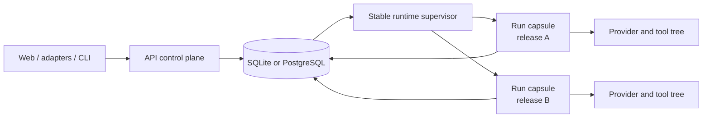

# Architecture Spine — Durable Workflow Runtime

## Design Paradigm

**Ports-and-adapters with supervised process-per-run execution capsules and a database coordination plane.** The API is a replaceable control plane. One small PM2-managed supervisor owns dispatch and process lifecycle. Each managed run executes in a release-pinned worker capsule. The database is the durable authority for commands, ownership epochs, checkpoints, and projection; local IPC and database notifications only reduce latency.



Build dependency direction remains `paths → git → providers → isolation → workflows → core → runtime`. Adapters, server, and CLI may compose the lower packages. Web remains an HTTP/OpenAPI client and never imports runtime or workflow-engine code. Neither workflows nor core depends on the supervisor process.

## Inherited Invariants

Parent identifiers remain read-only.

| Inherited             | From parent         | Binds here                                                                                                                                                                                     |
| --------------------- | ------------------- | ---------------------------------------------------------------------------------------------------------------------------------------------------------------------------------------------- |
| Steering/AD-1         | Live Agent Steering | Queue, Withdraw, Stop, and Send now act on a live provider session; Cancel remains teardown.                                                                                                   |
| Steering/AD-2         | Live Agent Steering | Stop ends one provider turn, not the node or session; node-level Cancel stays distinct.                                                                                                        |
| Steering/AD-3         | Live Agent Steering | Queue and Send now are ordinary prompts; only soft-inject is provider-capability gated. Its process-local Queue storage is superseded below.                                                   |
| Steering/AD-4         | Live Agent Steering | Multiple turns reuse one session; interrupted partial output never advances the DAG. Involuntary worker-loss recovery extends continuity without changing the 30-minute operator-idle failure. |
| Steering/AD-6         | Live Agent Steering | The executor alone writes attributed operator transcript rows; `message_id` is reconciliation identity.                                                                                        |
| Steering/AD-7..AD-8   | Live Agent Steering | Steering invents no turn boundary and claims no delivery state beyond provider evidence.                                                                                                       |
| Steering/AD-9         | Live Agent Steering | `generating` and `idle-after-interrupt` remain the only steering substates of a running node. Its live-only projection mechanism is superseded below.                                          |
| Steering/AD-10        | Live Agent Steering | Agent Node Room/readable transcript owns operator-row meaning.                                                                                                                                 |
| Steering/AD-11..AD-12 | Live Agent Steering | Authorization, race folding, terminal reconciliation, attribution, and read-time display names remain unchanged. AD-11's process-local receipt/storage mechanism is superseded below.          |

**Narrow mechanism supersession for managed executions:**

- Steering/AD-3: accepted Queue content remains durable through an evidence-backed terminal command outcome; claim is only a routing lease. The worker's local registry owns live delivery, while prompt meaning and timing do not change.
- Steering/AD-5: the live handle remains worker-local, but authenticated commands and checkpoints cross the process boundary through the durable coordination plane. Managed execution no longer returns `not_steerable_here` merely because the API is elsewhere.
- Steering/AD-9: the two-value steering substate is written as an epoch-fenced managed-node projection so a replacement API can observe it and strict recovery can reconstruct idle-await. It is not a workflow lifecycle status.
- Steering/AD-11: receipt order and command identity become durable before worker delivery. Authorization, active-state race behavior, attribution, and `Never sent` reconciliation do not change; soft-inject's active turn handle remains worker-local. Managed runtime unavailability adds only the typed state rules in AD-2.

These supersessions do not modify the independently versioned Agent Node Room feature. Steering/AD-5 remains fully true for legacy or externally owned execution.

## Invariants & Rules

### AD-1 — Managed runs execute outside the API in owned capsules

- **Binds:** CAP-1, CAP-2; dispatch, supervisor, worker bootstrap.
- **Prevents:** an API deploy terminating workflows; one shared executor crash taking down every run; an unowned process tree.
- **Rule:** Every managed run has one worker process, one immutable `release_id`, one execution epoch, and one verified containment identity. Admission reserves `starting + epoch + launch_nonce`; the supervisor spawns an inert contained worker, CAS-registers its exact identity and negotiated capabilities, then the worker CAS-transitions to `active` before any provider/tool/external effect. An unregistered child is reaped by exact containment identity. After an unexpected supervisor restart, the replacement reopens and verifies each containment unit and restores routing to a live worker under the same epoch; inconclusive reattachment preserves the claim and enters recovery-required, never takeover. All user-facing web, adapter, webhook, and CLI starts enter this managed boundary; explicitly unmanaged internal/test execution receives none of its durability claims. A normal `./scripts/deploy-pm2.sh` restart replaces the API but neither restarts the supervisor nor signals active capsules.

### AD-2 — The database is the durable command authority

- **Binds:** CAP-2, CAP-6; Queue, Withdraw, Stop, Send now, Cancel, dispatch.
- **Prevents:** accepted commands disappearing with the API; socket/DB split-brain; Redis becoming required for SQLite installs.
- **Rule:** A caller receives an accepted receipt only after the database assigns a unique, gap-tolerant, monotonically increasing per-run command sequence and commits the authenticated actor, `message_id`, payload, target epoch, negotiated capability snapshot, and state. Claim is a lease, never a durability transfer: the record remains authoritative until `applied`, `withdrawn`, `never_sent`, `rejected`, or `effect_uncertain`. A later sequence may apply once every earlier sequence has been durably folded into command/queue state; it need not wait for an earlier provider effect to become terminal. Guidance delivery stays FIFO; Withdraw resolves its queued target; Stop/keepalive act on the current turn; Send now flushes eligible guidance in sequence; Cancel preempts through its fence and terminally reconciles lower pending guidance. Control precedence changes timing, never guidance order. Provider handoff is `accepted → claimed → delivery_started → evidence-backed terminal`; only proven-unapplied commands may retry/rebind, while handoff without outcome becomes `effect_uncertain`. Transcript rows require delivery evidence. One poller routes commands; notifications/IPC only wake it.

  Managed availability is explicit: active nodes use inherited control rules; `reconnecting/rediscovering_live_owner` may durably accept compatible commands for the same epoch but reports an effect only after that owner revalidates the current substate; replacement recovery accepts only Withdraw, Cancel, and typed recovery actions until active; recovery-required accepts Withdraw, Cancel, and typed recovery actions; cancelling accepts only idempotent repeat Cancel; starting has no steerable node; terminal returns finished. Stale epoch or unsupported protocol returns a typed refusal without an accepted row. These are the only managed-runtime exceptions to Steering/AD-11's “only finished refuses” rule.

### AD-3 — Execution ownership is fenced at every mutation

- **Binds:** CAP-3; workflow store, worker, supervisor recovery.
- **Prevents:** two executors advancing one run; a stale worker writing after takeover; a supervisor becoming an event proxy bottleneck.
- **Rule:** Workers write events, checkpoints, command receipts, node transitions, transcript rows, and normal lifecycle transitions directly through short database transactions conditioned on `run_id + execution_epoch`. Every provider/tool/script/external-effect dispatch first verifies the epoch and durably records an intent/start identity; authoritative outcome closes that identity, and unmatched starts block automatic replay. One atomic node-finalization transaction is the sole completed-node authority and binds occurrence, retry epoch, execution epoch, validated output reference, status, and downstream readiness; audit events are emitted after it. At each provider turn boundary, checkpoint, steering substate/end cause, inactivity input, and last-applied command sequence publish under one monotonic `turn_revision`. Managed workers use observable fenced writes rather than the legacy best-effort event API; `stale` stops the worker and remains distinct from retryable store failure. The supervisor alone owns OS-evidence post-mortem decisions.

### AD-4 — Cancel means verified containment quiescence

- **Binds:** CAP-3, CAP-5, CAP-7; every provider and executable spawn path.
- **Prevents:** orphan provider/tool processes; duplicate old/new trees; killing an unrelated process through PID reuse or broad name matching.
- **Rule:** Accepting Cancel atomically commits its command and installs `cancel_fence_seq` plus runtime `cancelling`; no higher-sequence command or new provider/tool dispatch may be accepted or applied, repeat Cancel is idempotent, and pending guidance is reconciled deterministically. The supervisor then requests cooperative abort, terminates the execution-owned containment unit with graceful-then-forced escalation, and verifies it empty before writing lifecycle `cancelled`. Worker death and tree quiescence are separate facts. Failed recovery, node-timeout escalation, orderly runtime shutdown, and post-crash reconciliation use the same cleanup invariant before replacement or terminalization. Ambiguous identity or surviving descendants yields a non-terminal recovery/cleanup-required projection and blocks replacement. Only an exact boot/process-start/epoch identity may be signalled.

### AD-5 — Containment is capability-honest

- **Binds:** CAP-1, CAP-5; provider adapters, bash/script/until_bash, git/test/tool descendants.
- **Prevents:** a host-mode cleanup guarantee that self-daemonizing tools can evade.
- **Rule:** Host capsules use a dedicated POSIX process group or a verified Windows tree-containment backend whose durable boot-scoped identity a replacement supervisor can reopen. Every host spawn path must inherit containment and may not detach. POSIX and Windows host admission remains disabled until the selected backend passes child/grandchild, PID-reuse, TERM/KILL, supervisor-reopen, and empty-unit fixtures; `Bun.spawn({ detached: true })` creates a POSIX group but is not quiescence proof. A provider/tool capable of escaping the certified boundary requires container hard containment and otherwise fails admission. A node timeout that cannot prove its subtree quiet terminates the whole capsule.

### AD-6 — Recovery is strict and agent-node scoped

- **Binds:** CAP-4, CAP-5; provider adapters, node recovery checkpoint, replacement worker.
- **Prevents:** replaying completed nodes; reporting a cold session as restored; rerunning an uncertain script/tool effect; conflating cross-run persisted sessions with crash recovery.
- **Rule:** Admission freezes the original user/credential reference, codebase/folder, isolation/branch identity, declared inputs, environment overlay, provider/model, release, and `{canonical_definition_hash, normalization_version, hash_algorithm}`. The executor generates one serialization-stable occurrence ID from the full parent/sub-run/loop/fan-out path; every node record, command target, event, projection, and checkpoint uses it and recovery never reconstructs it from counts. As soon as a provider exposes continuity, the worker persists a run-scoped checkpoint keyed by `run_id + occurrence_id + retry_epoch + execution_epoch`, including provider/session identity and frozen-context reference. After authoritative owner death and cleanup, one epoch claim may reconstruct that context, require the versioned canonical hash, skip only atomically finalized nodes, and issue a versioned `RecoveryTurnRequest` for that session and last durable turn/effect boundary. It never resends the original node prompt or queued guidance, and strict adapters cannot use their general cold-fallback path. Missing/mismatched context/definition/session, `cold`, `unsupported`, `rejected`, `unverified`, or uncertain effect stops in `recovery_required`; the failed capsule is quiesced before publication. There is no full workflow snapshot or automatic replay of an uncertain bash/script node.

### AD-7 — Lifecycle and runtime condition are separate state axes

- **Binds:** CAP-7; persistence, API projection, CLI/web state.
- **Prevents:** transient runtime conditions breaking the established run-status contract and mixed-version clients; `cancelled` being claimed before cleanup.
- **Rule:** `workflow_runs.status` remains `pending | running | paused | completed | failed | cancelled`; the runtime record owns `starting | active | cancelling | reconnecting | recovery_required | terminal`. Legal managed pairs are `pending+starting|cancelling`, `running+active|cancelling|reconnecting`, `paused+active|recovery_required|cancelling`, and any lifecycle terminal status with `terminal`; `paused+active` with a typed gate reason preserves ordinary Approval/AskHuman while the capsule remains owned. Transitions affecting both axes, reason, and epoch are one transaction owned by the worker for normal execution or supervisor for OS-evidence post-mortem paths. Illegal pairs fail closed, never timer-repair. `reconnecting` reasons distinguish live-owner rediscovery from proven-death replacement and project as the contract concepts `reconnecting` and `recovering`. The node projection stores the canonical occurrence, exact steering substate, end cause, command sequence/turn revision, and durable `last_authorized_operator_activity_at`; recovery downtime counts toward the inherited 30-minute inactivity bound. Recovery-required exposes typed evidence and only three consequence-labelled actions: continue the known provider session when eligible, restart from the supported checkpoint with explicit duplication-risk confirmation, or terminate through an existing authorized action. Continue/restart use the existing starter-or-admin retry/resume grant; terminate uses the invoked terminal action's grant; authorization succeeds before sequence allocation. The broader any-authenticated grant remains exclusive to inherited live steering.

### AD-8 — Deploys roll immutable workers under one stable supervisor

- **Binds:** CAP-1, CAP-2; PM2 layout, release storage, deployment script.
- **Prevents:** mutable source updates changing an active run; `pm2 restart` killing worker descendants; deleting code still used by a run.
- **Rule:** The one operator command remains `./scripts/deploy-pm2.sh`. It installs an immutable release, advances `current_release` for new workers, and restarts only the API. Selecting a release and acquiring its first durable reference is one transaction; reference holders include admitted/pending, starting/active/cancelling, recoverable/recovery-required runs, and pending supervisor upgrade. GC uses an atomic zero-reference claim/recheck. A supervisor upgrade atomically fences new dispatch claims, then rechecks zero starting/live workers and candidate compatibility with every referenced worker protocol before switching; dispatch resumes under the new supervisor generation. Admission remains durable and unbounded during this brief launch fence. Incompatible recoverable work stays explicit, never silently rebound to current code. API/worker contracts are versioned and incompatible mutation fails closed.

### AD-9 — Resource policy adds no artificial workflow limit

- **Binds:** dispatch and operations.
- **Prevents:** stories quietly reintroducing a slot queue or claiming a CPU guarantee the design does not provide.
- **Rule:** Every admitted managed workflow receives a capsule; the runtime sets no maximum active-run or global activity-permit limit. Existing DAG-layer and `fan_out.max_parallel` behavior remains. Provider token availability is the operator's expected practical limiter. Metrics must expose worker/process load, but the feature promises containment and cleanup—not a hard CPU, memory, or process-count bound.

### AD-10 — The worker boundary is versioned and serializable

- **Binds:** CAP-1, CAP-2, CAP-4; dispatch, worker bootstrap, platform output.
- **Prevents:** attempting to pass adapter instances, closures, or resolver objects across a process boundary; runtime importing server/adapters; worker builds reconstructing launch context differently.
- **Rule:** Supervisor and worker exchange a versioned launch envelope containing only validated serializable identities and frozen references: run, epoch, launch nonce, release, workflow source/hash, actor, execution context, isolation, input, and protocol. The inert-worker readiness handshake durably publishes an epoch-bound negotiated command/recovery capability set; mutation acceptance uses exactly that snapshot, while observation has a separately versioned minimum. The worker reconstructs provider/config/isolation ports locally and uses a worker-side `IWorkflowPlatform` backed by existing database event/transcript/outbox seams. No adapter instance, function, SDK handle, or resolver crosses the boundary.

## Consistency Conventions

| Concern            | Convention                                                                                                                                                    |
| ------------------ | ------------------------------------------------------------------------------------------------------------------------------------------------------------- |
| Ownership identity | `host_boot_id + native_process_id + immutable_start_token + execution_epoch`; PID alone is never authority.                                                   |
| Recovery proof     | Exact supervisor exit record, changed trusted boot identity, or trusted OS absence of the exact identity; heartbeat age is observation only.                  |
| Commands           | Durable per-run sequence; claim is a lease; delivery handoff and epoch-rebind follow AD-2's evidence state machine.                                           |
| Session checkpoint | Run-scoped record keyed by canonical occurrence and retry epoch, written as soon as exposed; never reuse cross-run `workflow_node_sessions`.                  |
| Execution context  | Frozen admission record for original user/credential reference, project, isolation/branch, inputs, environment, provider/model, release, and definition hash. |
| Turn boundary      | One `turn_revision` atomically publishes session checkpoint, steering substate/end cause, inactivity input, and applied-command cursor.                       |
| Completion         | One fenced node-finalization transaction is recovery authority; audit events alone never prove completion.                                                    |
| Secrets            | Session identifiers use credential-grade storage and masked logging; command payloads never enter broad logs.                                                 |
| Definition drift   | Store canonical hash + normalization/hash versions, not a full snapshot; mismatch or unavailable version fails closed.                                        |
| Process cleanup    | Cooperative abort → TERM/grace → KILL → exact quiescence probe; no cwd/name reaper.                                                                           |
| Schema             | Additive-only in SQLite and PostgreSQL; new `NOT NULL` columns carry defaults.                                                                                |

## Stack

| Name                             | Version / binding                                                                                                                                                                                                                                                     |
| -------------------------------- | --------------------------------------------------------------------------------------------------------------------------------------------------------------------------------------------------------------------------------------------------------------------- |
| Bun                              | Declared compatibility `^1.3.5`; CI/Docker baseline `1.3.11`; observed host `1.3.14`. Each immutable release records and launches or validates an exact Bun executable/build identity.                                                                                |
| PM2                              | Production observation `6.0.14`; deployment records the exact version, supports only tested majors, and uses documented ecosystem/`--only` behavior with no v6-private dependency.                                                                                    |
| `@anthropic-ai/claude-agent-sdk` | Repository pin `0.3.209` provides a resume seam; automatic recovery requires a new strict adapter path and normalized outcomes from the provider recovery matrix.                                                                                                     |
| `@openai/codex-sdk`              | Lockfile `0.144.5` provides `resumeThread`; automatic recovery must bypass the existing general fresh-thread fallback and use the strict adapter contract.                                                                                                            |
| SQLite / PostgreSQL              | Existing adapters; shared durable coordination plane; no broker. SQLite admission runtime-queries the embedded version and requires `>=3.51.3` or a verified fixed backport before multi-process WAL writers start; release manifest records Bun + SQLite identities. |

## Structural Seed

```text
packages/
  runtime/                                  # containment owner, stable supervisor + versioned worker entrypoints
  workflows/                                # executor, checkpoints and epoch-aware engine contracts
  core/src/db/                              # additive runtime/command/recovery persistence
scripts/
  deploy-pm2.sh                             # one-command release install + API-only restart
~/.archon/releases/<release_id>/            # immutable worker artifacts; implementation-owned layout
```

## Capability → Architecture Map

| Capability                               | Lives in                                                       | Governed by               |
| ---------------------------------------- | -------------------------------------------------------------- | ------------------------- |
| CAP-1 Survive control-plane restart      | deploy script, supervisor, worker artifact                     | AD-1, AD-8, AD-10         |
| CAP-2 Reconnect observation and steering | durable inbox, supervisor routing, DB projection               | AD-2, AD-7, AD-10         |
| CAP-3 Fence execution ownership          | runtime execution record, epoch-conditioned store              | AD-3, AD-4                |
| CAP-4 Continue from provider checkpoint  | node recovery checkpoint, provider adapter, replacement worker | AD-6                      |
| CAP-5 Prevent unsafe replay              | effect evidence, containment cleanup, recovery gate            | AD-4, AD-5, AD-6          |
| CAP-6 Preserve accepted guidance         | durable command state machine, `message_id` dedupe             | AD-2, Steering/AD-6/AD-11 |
| CAP-7 Make recovery operable             | combined lifecycle/runtime projection and reason codes         | AD-7                      |

## Deferred

| Item                                                | Revisit when                                                                        |
| --------------------------------------------------- | ----------------------------------------------------------------------------------- |
| Global active-run or activity limits                | Production measurements show provider quotas are not an adequate practical limiter. |
| Full canonical workflow snapshots                   | Hash mismatch blocks recoveries often enough to justify the storage/security cost.  |
| Multi-host scheduling or tenant isolation           | The single-install, single-host deployment model changes.                           |
| Hot supervisor replacement while workers are active | Waiting for an idle supervisor measurably blocks security or operational upgrades.  |
| Host execution for self-daemonizing tools           | A verified OS containment backend can bind them without a container.                |
| Transcript tail-first loading                       | Track separately; it changes message pagination/rendering, not runtime ownership.   |
