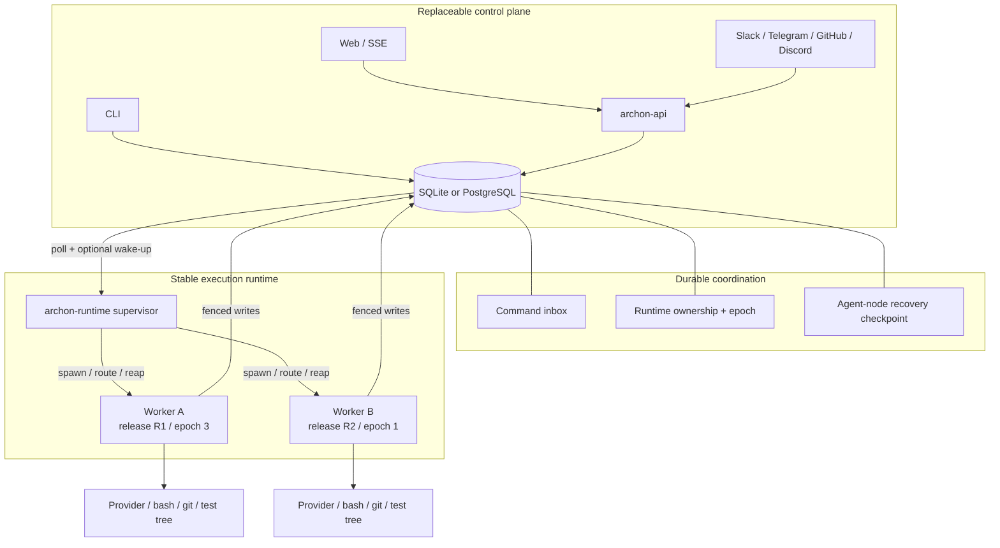
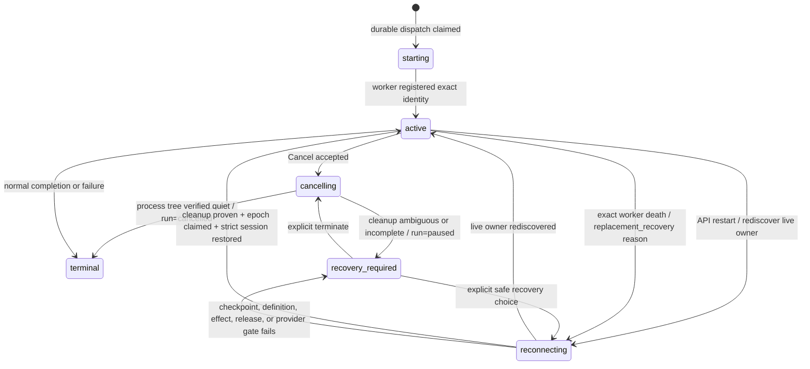
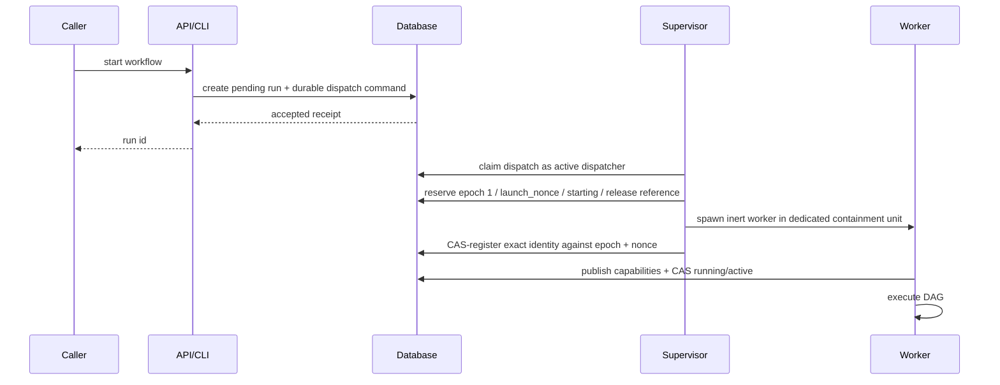
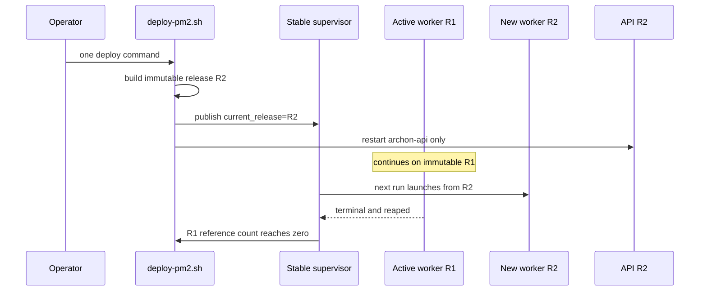
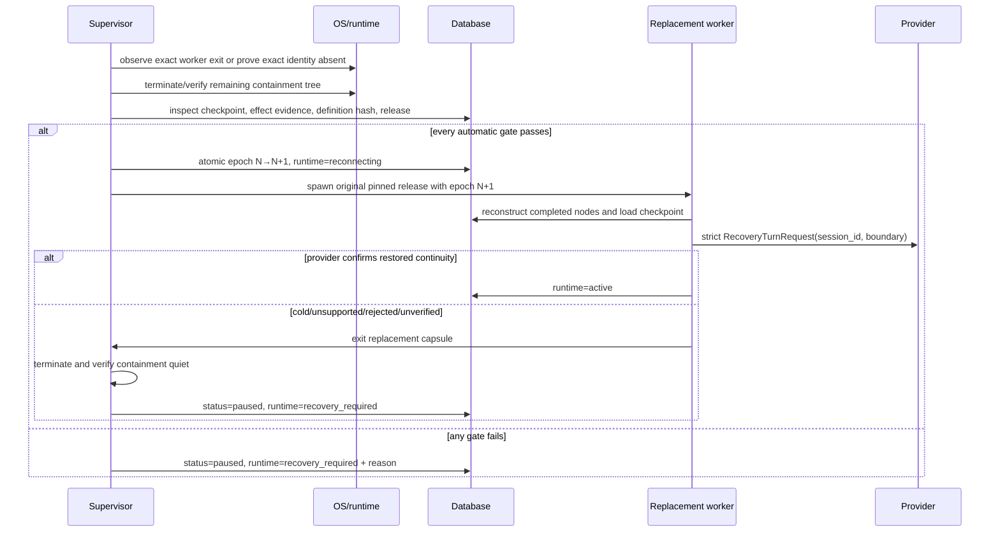

# Durable Workflow Runtime — Solution Design

## Architecture foundations

### 1. Outcome and safety boundary

Durable Workflow Runtime separates workflow execution from the API server without changing Agent Node Room's established steering semantics. A normal `./scripts/deploy-pm2.sh` deploy may replace the API and install new worker code while an active workflow continues in its original worker process. If the worker process is lost, Archon recovers only an agent node that has a verified provider session checkpoint and no uncertain effects.

The runtime makes four hard promises:

1. An API restart does not own, signal, or duplicate a managed workflow worker.
2. At most one execution epoch may mutate a run.
3. `cancelled` means the owned process tree is verified quiet.
4. Recovery never silently substitutes a fresh provider session or replays an uncertain effect.

It deliberately does **not** promise a CPU cap, multi-host scheduling, rollback of external effects, or recovery from a changed workflow definition. There is no artificial active-workflow limit and no full workflow snapshot.

Implementers should read §§3–11 and §§17–18; technical reviewers should focus on §§5–12 and §§15–19; production operators can start with §§10 and 13–15.

### 2. Current failure modes

Today, web dispatch calls the workflow executor fire-and-forget inside the API process. `scripts/deploy-pm2.sh` restarts one PM2 app, so an API deploy also terminates the executor. The shutdown path closes adapters and the database pool without handing an active run to another owner.

Steering has the same process boundary: the server route mutates a process-local `SteeringRegistry`. A run executing elsewhere returns `not_steerable_here`, and accepted in-memory guidance disappears with that process.

Process cleanup is incomplete at the same seam. Provider CLIs and bash/script nodes can create grandchildren while most abort paths control only the direct child. Stopping the workflow row does not prove those descendants stopped. In production this produced orphan process trees and severe host load.

The new runtime fixes the shared ownership boundary instead of adding a host-wide reaper. It never kills by cwd, command name, or an unverified PID.

### 3. Target topology



There is one logical active dispatcher: the stable supervisor. Worker releases can overlap, but supervisor generations do not overlap during ordinary deploys. If the supervisor binary changes, the deploy records `upgrade_pending`; the supervisor is restarted only after its active-worker count reaches zero.

#### Component responsibilities

| Component         | Owns                                                                                                                              | Must not own                                                                       |
| ----------------- | --------------------------------------------------------------------------------------------------------------------------------- | ---------------------------------------------------------------------------------- |
| API/control plane | Authentication, validation, durable command acceptance, read projection, SSE/API transport                                        | Worker process handles, provider sessions, cancellation truth                      |
| Stable supervisor | Queue polling, worker launch, IPC routing, exact process identity, containment termination, release references, post-mortem state | DAG semantics, provider prompts, transcript meaning                                |
| Run worker        | DAG execution, provider calls, direct epoch-fenced persistence, checkpoints, cooperative abort                                    | Dispatch leadership, another run's process tree, terminal Cancel after it has died |
| Workflow engine   | Execution semantics, completed-node reconstruction, effect evidence, provider recovery outcomes                                   | PM2 and release deployment policy                                                  |
| Provider adapter  | Session ID discovery, strict resume request/outcome, cooperative turn abort                                                       | Declaring cold fallback to be restored; escaping containment                       |
| Database          | Command, ownership, checkpoint, event and projection authority                                                                    | Liveness inference from time alone                                                 |
| Web/CLI           | Render combined lifecycle/runtime projection; explicit recovery actions                                                           | Reconstructing ownership or parsing human prose as a state protocol                |

### 4. Package and process boundaries

The feature adds a process boundary, so it warrants one narrow runtime package rather than placing lifecycle policy inside the server:

```text
@archon/paths
@archon/git → @archon/providers → @archon/isolation → @archon/workflows
      ↓
@archon/core
  additive persistence and store adapters
      ↓
@archon/runtime
  supervisor and worker entrypoints
      ↓
@archon/adapters / @archon/server / @archon/cli

@archon/web --generated OpenAPI/HTTP--> @archon/server
```

`@archon/workflows` remains independent of PM2. It receives epoch-aware store functions, command input, abort signals, and checkpoint callbacks through existing dependency interfaces. `@archon/runtime` composes those ports for a separate process. User-facing web, adapter, webhook, and CLI starts use the managed boundary. Low-level in-process engine tests and explicitly unmanaged internal execution remain available without representing those executions as supervisor-managed.

Exact process identity, containment termination, and quiescence probes belong to `@archon/runtime`. Lower packages remain independent of runtime: their spawn ports accept a narrow no-detach/containment policy, while the outer worker capsule supplies and enforces the boundary. No component discovers cleanup targets by name or cwd.

#### Serializable launch and output seam

The supervisor launches a worker with a versioned, validated envelope containing only serializable identities and frozen references: run ID, execution epoch, launch nonce, release ID, workflow source and versioned canonical hash, acting user, execution-context reference, isolation identity, declared input, and protocol version. It never passes adapter instances, closures, SDK handles, or resolver objects.

The spawned worker is inert. The supervisor CAS-registers its exact process/containment identity against the epoch and nonce; the worker then publishes its negotiated command/recovery capabilities and CAS-transitions to `active`. Only after that transition may it call a provider, tool, script, or external effect. An unregistered worker is reaped by the supervisor's exact containment identity.

The active worker reconstructs provider, configuration, isolation, and store dependencies inside its own process. A worker-side `IWorkflowPlatform` implementation publishes through the existing database event, transcript, and outbox seams. This keeps runtime below server/adapters and prevents each worker implementation from inventing a different cross-process output protocol.

### 5. Durable records and ownership

All schema changes are additive in both SQLite and PostgreSQL. Names below express ownership; implementation may refine column names without changing the contracts.

#### 5.1 Runtime ownership record

One current record per managed run:

| Field                                 | Purpose                                                                                                                                                    |
| ------------------------------------- | ---------------------------------------------------------------------------------------------------------------------------------------------------------- |
| `workflow_run_id`                     | Primary identity and FK to the existing run.                                                                                                               |
| `execution_epoch`                     | Monotonically increasing fencing token.                                                                                                                    |
| `launch_nonce`                        | Binds one inert spawn/registration attempt to the reserved epoch.                                                                                          |
| `runtime_state`                       | `starting`, `active`, `cancelling`, `reconnecting`, `recovery_required`, or `terminal`.                                                                    |
| `reason_code` / `reason_detail`       | Typed operator-facing explanation; detail must be secret-safe.                                                                                             |
| `release_id`                          | Immutable worker artifact used for this epoch.                                                                                                             |
| `protocol_version`                    | API/supervisor/worker negotiation.                                                                                                                         |
| `capability_snapshot`                 | Epoch-bound command/recovery capabilities published at readiness.                                                                                          |
| `host_boot_id`                        | Trusted host incarnation.                                                                                                                                  |
| `worker_pid` / native instance id     | OS target; never sufficient alone.                                                                                                                         |
| `worker_start_token`                  | Immutable OS/runtime start identity protecting against PID reuse.                                                                                          |
| `containment_kind` / `containment_id` | Process group, Windows backend, or container identity.                                                                                                     |
| `workflow_definition_hash`            | Canonical hash plus normalization and hash-algorithm versions accepted at original start.                                                                  |
| `execution_context_ref`               | Immutable reference to the original actor/credential, project, isolation/branch, declared input, environment overlay, provider/model, and release choices. |
| timestamps                            | Start, state transition, exit observation and last observation. Timestamps never prove death.                                                              |

The epoch is claimed with one compare-and-set transaction. All authoritative worker mutations include the epoch in their `WHERE` condition. Managed workers use observable fenced write operations rather than the legacy best-effort event API: `stale` stops the worker, while a retryable database failure remains distinguishable.

#### 5.2 Durable command inbox

Commands cover dispatch, Queue, Withdraw, Stop, Send now, keepalive, Cancel, and explicit recovery actions. A record includes:

- command/message ID with a uniqueness constraint;
- database-assigned, unique, gap-tolerant, monotonically increasing per-run command sequence;
- run and optional node identity;
- authenticated operator identity;
- server-assigned receipt order;
- accepted epoch and current target epoch;
- typed command and validated payload;
- `accepted`, `claimed`, `delivery_started`, `applied`, `withdrawn`, `never_sent`, `rejected`, or `effect_uncertain` state;
- claim/apply timestamps and typed result.

Transport is at-least-once and behavior is idempotent by command ID. Claim is a lease, not a transfer to volatile ownership: payload, actor, sequence, message ID, target epoch, and state remain durable until an evidence-backed terminal outcome. Claim, IPC delivery, worker application, transcript association, and reconciliation use the same sequence. A later command may apply after every prior sequence is durably folded into command/queue state even if an earlier provider effect remains pending: guidance delivery stays FIFO, Withdraw resolves its target, Stop/keepalive act on the current turn, Send now flushes eligible guidance in sequence, and Cancel preempts through its fence. Control precedence changes timing, never guidance order.

The worker writes `delivery_started` before crossing a provider boundary. Only provider-specific authoritative delivery evidence produces `applied` and the operator transcript row. A recovery transaction can retarget only `accepted` commands with no claim/handoff evidence. `claimed` or `delivery_started` without authoritative outcome becomes `effect_uncertain`; the runtime never resends it automatically.

Cancel is a lifecycle fence, not another provider message. Once accepted, it prevents delivery of later or still-pending guidance. Undelivered guidance follows the inherited terminal `Never sent` reconciliation.

Managed command availability is fixed:

| Runtime condition                       | Allowed behavior                                                                                                                     |
| --------------------------------------- | ------------------------------------------------------------------------------------------------------------------------------------ |
| `active`                                | Inherited Agent Node Room rules.                                                                                                     |
| `reconnecting` / live-owner rediscovery | Compatible commands may be committed for the same epoch; Queue waits durably, and other effects require owner/substate revalidation. |
| replacement recovery                    | Withdraw, Cancel, and typed recovery actions only until active.                                                                      |
| `recovery_required`                     | Withdraw, Cancel, and typed recovery actions only.                                                                                   |
| `cancelling`                            | Repeat Cancel is idempotent; new guidance is refused and pending guidance reconciles.                                                |
| `starting` / terminal                   | No steerable node; return a typed state/finished result.                                                                             |

Stale-epoch or unsupported-protocol commands return a typed refusal without creating an accepted row.

#### 5.3 Agent-node recovery checkpoint

This is separate from `workflow_node_sessions`, which remains the successful cross-run `persist_session` store.

The recovery record is keyed by:

```text
workflow_run_id + occurrence_id + retry_epoch + execution_epoch
```

The executor creates `occurrence_id` from the complete stable parent/sub-run/loop/fan-out path and persists it on every node transition, event, command target, projection, and checkpoint. Recovery reads this identity; it never derives it from event counts. The checkpoint holds the canonical provider, encrypted session/thread identity, versioned workflow-definition hash, frozen execution-context reference, provider checkpoint version, effect evidence, continuity outcome, and timestamps. The worker writes the session ID immediately when exposed, not only after node completion.

Session identifiers are treated as credential-grade data. Broad workflow events, logs, health endpoints, and API projections contain only existence, provider, outcome, and masked preview—not the raw value.

#### 5.4 Managed-node steering projection

An epoch-fenced projection records the active occurrence, exact `generating | idle-after-interrupt` substate, interrupt/end cause, last applied command sequence, monotonic `turn_revision`, and durable `last_authorized_operator_activity_at`. At a turn boundary, those fields and the corresponding provider checkpoint commit under the same revision; recovery ignores incomplete newer revisions. It does not persist a provider handle or active soft-inject turn handle; those remain worker-local.

After an API restart, the projection makes valid control actions observable without guessing from transcript prose. After proven worker loss, strict recovery can reconstruct idle-await on the same saved provider session. Recovery downtime counts as inactivity; remaining time derives from the persisted activity time, with clock regression clamped and surfaced rather than silently extending the bound.

#### 5.5 Effect and node-finalization authority

Immediately before each provider, tool, script, or external-effect dispatch, the worker rechecks the epoch and writes an effect intent/start identity. An authoritative result closes it. An unmatched start is uncertain effect evidence and blocks automatic replay.

One atomic node-finalization transaction is the sole authority that a node occurrence completed. It binds occurrence ID, retry epoch, execution epoch, validated output/result reference, completion status, and downstream readiness. `node_completed` and other audit events are emitted from or after that commit; an event alone never tells recovery to skip a node.

#### 5.6 Existing workflow state remains stable

`workflow_runs.status` remains:

```text
pending | running | paused | completed | failed | cancelled
```

Transient runtime state is joined at read time. Older clients continue to understand lifecycle state; newer clients can distinguish reconnecting, recovery-required, and cancelling.

For managed runs, legal pairs are `pending+starting|cancelling`, `running+active|cancelling|reconnecting`, `paused+active|recovery_required|cancelling`, and `completed|failed|cancelled + terminal`. `paused+active` with a typed gate reason preserves existing Approval/AskHuman behavior while the capsule remains owned. A worker owns normal transitions; the supervisor owns transitions requiring OS death/quiescence evidence. Any transition that changes both axes, reason, or epoch uses one transaction. Illegal pairs fail closed and are not repaired from elapsed time.

## Runtime behavior

### 6. State model



Projection examples:

| Lifecycle status       | Runtime state                               | User meaning                                                                     |
| ---------------------- | ------------------------------------------- | -------------------------------------------------------------------------------- |
| `running`              | `active`                                    | Executing normally.                                                              |
| `running`              | `cancelling`                                | Cancellation requested; tree cleanup not yet proven.                             |
| `running`              | `reconnecting` + `rediscovering_live_owner` | Control plane is locating the same still-live worker; epoch does not change.     |
| `running`              | `reconnecting` + `replacement_recovery`     | Previous owner is proven dead; strict recovery under a new epoch is in progress. |
| `paused`               | `recovery_required`                         | Automation stopped safely; operator choice or environmental repair is required.  |
| `cancelled`            | `terminal`                                  | No process in the verified containment unit remains.                             |
| `completed` / `failed` | `terminal`                                  | Normal engine outcome with capsule reaped.                                       |

`cleanup-required` and provider-specific recovery labels are projection labels derived from typed `reason_code`; they do not expand the persisted lifecycle enum.

The persisted `reconnecting` value has two typed reasons. `rediscovering_live_owner` maps to the recovery contract's `reconnecting` concept and never changes epoch. `replacement_recovery` maps to `recovering` and is legal only after positive death evidence, cleanup, and an atomic new-epoch claim. This preserves the observable distinction without expanding `workflow_runs.status`.

### 7. Primary sequences

#### 7.1 Start a managed workflow



The supervisor does not wait for capacity because the design has no artificial workflow limit. The durable dispatch record still prevents start loss if the supervisor is briefly unavailable.

#### 7.2 Normal deploy and server code update



The deploy must not use an ecosystem-wide restart that includes `archon-runtime`. Initial installation ensures both PM2 apps exist; subsequent normal deploys target only `archon-api`. `--reload-workflows` remains a non-restart refresh and does not invoke recovery.

If supervisor code changed, deploy records the desired supervisor release. The current supervisor continues until no active workers remain, then exits for PM2 to start the desired release. This waiting state is observable as `upgrade_pending`.

#### 7.3 Cross-process Queue, Withdraw, Stop, and Send now

1. API authenticates and validates against the combined lifecycle/runtime projection.
2. It commits the epoch-bound command and receipt order before returning success.
3. Optional notification wakes the supervisor; polling guarantees eventual observation.
4. Supervisor claims the command and sends it to the owning worker over local IPC.
5. Worker deduplicates, rechecks epoch and live node phase, then applies the inherited steering rule.
6. Worker persists result/receipt and, when delivery occurs, remains the sole writer of the attributed transcript row.

An API restart between steps 2 and 3 loses only the wake-up. The command remains accepted. A worker loss before application leaves an unclaimed command eligible for epoch retargeting. A loss after a possibly external effect but before durable evidence yields `effect_uncertain`, never blind replay.

#### 7.4 Cancel a workflow

```mermaid
sequenceDiagram
  participant A as API/CLI
  participant D as Database
  participant S as Supervisor
  participant W as Worker capsule
  participant T as Descendant tree

  A->>D: atomically commit Cancel + cancel_fence_seq + cancelling
  D-->>A: accepted; projection=cancelling
  S->>W: cooperative cancel
  W->>T: abort active provider/node and stop new work
  S->>W: TERM verified containment
  S->>S: bounded grace
  S->>W: KILL survivors if needed
  S->>S: verify exact containment is empty
  alt verified empty
    S->>D: fenced status=cancelled, runtime=terminal
  else ambiguous or survivor
    S->>D: status=paused, runtime=recovery_required, reason=cleanup_unverified
  end
```

The supervisor may write the final cancellation because the worker is expected to be dead at that point. It applies the same epoch compare-and-set check and verifies the exact process identity. No system-wide scan is allowed.

The acceptance transaction blocks every higher-sequence command and every later provider/tool dispatch. Repeat Cancel is idempotent against the same fence. Lower-sequence pending guidance is either completed before the fence or reconciled `never_sent`; it cannot cross the fence afterward.

#### 7.5 Node timeout

The worker first invokes the cooperative-abort mechanism for the node or provider and targets any tracked node subtree for cleanup. If it can prove that subtree quiet, normal timeout semantics continue. If cleanup is ambiguous or descendants survive, the timeout escalates to termination of the entire run capsule. Safety outranks running later `always_run` work inside a contaminated capsule. The supervisor records the post-mortem outcome only after whole-capsule quiescence.

#### 7.6 Worker loss and automatic strict recovery



Positive owner-death evidence is any one of:

- a supervisor exit record for the exact registered process identity;
- a changed trusted host boot identity;
- a trusted OS/runtime probe confirming that exact identity no longer exists.

Heartbeat age, `last_activity_at`, PID alone, permission failure, or an unavailable probe is ambiguous and cannot authorize takeover.

#### 7.7 Host reboot

A new trusted boot ID proves every process registered under the prior boot cannot still run. The supervisor may evaluate strict recovery without signalling stale PIDs. Each eligible run claims a new epoch independently and resumes from its original release and agent-node checkpoint. Runs without a safe checkpoint remain paused and actionable.

#### 7.8 Unexpected supervisor restart

PM2 restarting the supervisor is not worker-death evidence. The replacement loads durable ownership, reopens each boot-scoped containment identity, verifies worker PID/start token/epoch, and re-establishes authenticated local routing under the same epoch. It does not signal or respawn a verified-live worker. If the containment backend cannot be reopened or identity remains inconclusive, the owner claim is preserved and the run becomes recovery-required; elapsed time never authorizes takeover.

### 8. KISS recovery contract

Recovery is intentionally narrower than general durable replay.

#### Automatic gate

Every condition must be true:

1. Prior owner death is authoritative.
2. Prior containment is proven quiet.
3. The original immutable worker release is available and protocol-compatible.
4. The frozen original actor/credential, project, isolation/branch, declared input, environment overlay, and provider/model context can be reconstructed exactly.
5. Reloading the workflow produces the stored normalized-definition hash.
6. Durable events identify completed nodes and exactly one recoverable node occurrence and retry epoch.
7. A run-scoped provider session/thread ID exists.
8. Effect evidence contains no unmatched external tool start or other uncertain action.
9. Provider adapter supports strict resume and confirms `restored`.

The worker then skips only nodes proven by the atomic finalization record and resumes only the active agent-node occurrence. `RecoveryTurnRequest` carries the saved session and last durable turn/effect boundary plus a canonical workflow-owned continuation instruction. It never resends the original node prompt or queued operator guidance. Partial assistant text is audit data, never completed node output.

#### Fail-closed outcomes

| Outcome                      | Automatic behavior                                           |
| ---------------------------- | ------------------------------------------------------------ |
| `restored`                   | Continue in the new epoch.                                   |
| `cold`                       | Pause; never describe as resumed.                            |
| `unsupported`                | Pause; provider cannot meet the contract.                    |
| `rejected`                   | Pause; session is known but provider refused it.             |
| `unverified`                 | Pause; adapter cannot prove continuity.                      |
| definition mismatch/missing  | Pause; no full snapshot exists by design.                    |
| effect uncertain             | Pause; never replay automatically.                           |
| interrupted bash/script node | Pause when outcome is uncertain; there is no session resume. |

Operator choices remain explicit and consequence-labelled: continue the known provider session when possible, restart from a known checkpoint with duplication risk acknowledged, or terminate. Continue/restart uses the existing starter-or-admin retry/resume grant; terminate uses the existing terminal action's grant. Authorization completes before command sequence allocation. The broad any-authenticated grant remains limited to inherited live steering. Natural-language prose is not parsed as the wire format; API/CLI/button actions submit typed commands.

### 9. Process containment and cleanup

#### Host-native capsule

- POSIX: worker starts as the leader of a dedicated process group. Provider CLIs, bash, script, git, tests, and ordinary grandchildren inherit that group.
- Windows: use a verified tree-containment backend whose boot-scoped identity a replacement supervisor can reopen. A Job Object is the desired hard boundary; `taskkill /T` remains a cleanup fallback only when its identity and behavior are verified.
- The stored identity combines host boot ID, native process ID, immutable start token, epoch, and containment ID.
- Cancellation signals the verified unit, never a name pattern or stale PID.

The outer capsule is the final safety net, so an SDK that hides its direct child PID is still contained when its child inherits the worker group. Provider-specific abort hooks remain valuable for graceful completion and accurate transcript state; they are not the final ownership boundary.

Host admission on each OS remains disabled until the selected backend passes real child/grandchild, PID-reuse, TERM/KILL, supervisor-reopen, and empty-containment fixtures. `Bun.spawn({ detached: true })` can establish a POSIX process group; it does not prove exact identity or quiescence by itself. If a Windows containment object cannot be reopened after supervisor loss, Windows host mode fails admission and uses container hard containment instead.

#### Container hard containment

A provider or tool that can escape the host process group through `setsid`, double-forking, a daemon leader, or equivalent behavior is not host-certified. It must execute inside the existing container isolation boundary so container termination reaps the complete namespace. If that backend is unavailable, admission fails with a clear capability error.

#### Verification, not assumption

Quiescence is a separate probe after signals. TERM success, worker exit, or a missing direct PID does not prove the group/container is empty. Failure to verify produces a recovery-required reason and prevents replacement from overlapping the prior tree.

Orderly worker or runtime shutdown uses the same cooperative abort, TERM/grace, KILL, and quiescence sequence. An unexpected supervisor exit cannot declare cleanup; after PM2 restarts it, the new supervisor reconciles exact identities and containment before any takeover or terminal transition.

## Operations

### 10. Deployment and release management

#### PM2 layout

The ecosystem becomes two independently targeted apps:

| PM2 app          | Normal deploy behavior                                |
| ---------------- | ----------------------------------------------------- |
| `archon-api`     | Restart after the new release passes build/preflight. |
| `archon-runtime` | Ensure running; do not restart while it owns workers. |

The exact names may remain configurable, but the script must resolve and target them explicitly. `pm2 restart <ecosystem>` without `--only` is not a valid normal deploy action because it restarts every declared app.

Deployment diagnostics record the exact PM2 version and admit only majors covered by the production-layout acceptance test. The observed production baseline is PM2 6.0.14; supporting another major requires the same API-only restart and supervisor-survival proof, not reliance on private PM2 behavior.

#### Runtime/database preflight

The release manifest separates the declared Bun compatibility range, the tested build baseline, and the exact runtime executable/build used by workers. Before publishing `current_release`, preflight launches or validates that exact Bun identity.

For SQLite, preflight queries `sqlite_version()` through the release's actual `bun:sqlite` driver. Multi-process managed execution requires SQLite 3.51.3 or newer, or an explicitly verified fixed backport, because older affected WAL builds are unsafe for the new multi-process writer topology. A failed check blocks managed admission rather than silently switching databases. PostgreSQL remains supported through the existing adapter and needs no external broker.

#### Immutable release lifecycle

1. Build into a new release directory identified by commit/build hash.
2. Validate manifest, exact Bun/runtime build, embedded SQLite version, protocol version, entrypoints and required assets.
3. Atomically publish `current_release` and acquire the first durable reference for each admitted dispatch that selects it.
4. Restart and health-check the API from the new release.
5. Leave active ownership rows and their release directories untouched.
6. Garbage-collect only after an atomic zero-reference claim/recheck.

Reference holders include admitted/pending dispatch, starting/active/cancelling ownership, recoverable or recovery-required work, and pending supervisor upgrade. The artifact layout is implementation-owned, but active workers may not import lazily from a mutable checkout. A release manifest records build ID, exact Bun executable/build identity, embedded SQLite version, runtime protocol, schema compatibility, and executable entrypoint.

#### Rollback

Rollback atomically points `current_release` to the last healthy release and restarts the API. Existing workers remain on whichever immutable releases they started with. Additive-only schema makes old and new workers coexist. A rollback must not delete the failed release until no active worker references it.

### 11. Mixed-version contract

Every supervisor/worker handshake reports protocol version, release ID, process identity, and supported command/recovery capabilities.

- Observation remains available whenever stored shapes are readable.
- The readiness handshake stores capabilities for the current epoch. The API returns accepted only when that exact snapshot supports the command schema/version; otherwise it returns a typed incompatibility without an accepted row.
- An old worker may complete normally under a new API.
- A new API may persist a command for an old worker only when the negotiated command version is supported.
- A replacement worker uses the run's pinned release for strict recovery, not automatically the newest code.
- Schema additions always carry backward-compatible defaults; old writers remain valid.

Before a pending supervisor upgrade switches versions, it atomically fences new dispatch claims, then rechecks that no worker is starting/live and that the candidate can observe and launch every still-referenced worker protocol. After the switch, dispatch resumes under the new supervisor generation. Admission remains durable and unbounded during this brief launch fence. `recovery_required` work remains visible, but an incompatible future action returns a typed result rather than silently selecting new code.

### 12. Security and trust boundaries

- API and CLI authenticate before creating lifecycle or steering commands.
- Durable commands retain operator attribution and caller-stamped idempotency identity.
- Worker IPC is local and bound to the registered supervisor and worker identities. IPC optimizes delivery; it does not confer authority.
- Database epoch and ownership checks remain mandatory even after successful IPC authentication.
- Session/thread IDs use credential-grade storage and are never returned raw from general run, health, event, or log APIs.
- Provider credentials remain resolved for the original run user. Recovery cannot silently substitute another user or current global defaults.
- Command prose and provider payloads are not logged. Logs use IDs, counts, states and reason codes.
- Process signalling checks exact identity immediately before the signal to reduce PID-reuse races.
- Container-required providers fail closed rather than receiving broader host permissions.

### 13. Observability

#### Health and metrics

`GET /api/health` and `archon doctor` should surface only non-secret operational fields:

- API release and protocol;
- supervisor online/offline, version, exact-identity verification status;
- `current_release` and `upgrade_pending`;
- counts by runtime state and worker release;
- counts of reconnecting, recovery-required and cleanup-unverified runs;
- command inbox depth and oldest accepted age;
- release references eligible/ineligible for garbage collection;
- containment backend availability.

Because the design has no concurrency cap, report the active worker count and observed process and host load. Do not describe these metrics as quotas or guarantees.

#### Structured logs

Minimum events:

- dispatch accepted/claimed;
- epoch claimed/rejected;
- worker spawned/registered/exited;
- command accepted/claimed/applied/reconciled;
- checkpoint session available (masked);
- cancellation requested/TERM/KILL/quiescence result;
- owner-death proof type;
- recovery gate result and provider continuity outcome;
- release published/referenced/reclaimed;
- supervisor upgrade pending/applied.

Every event carries run ID, node ID where applicable, epoch, release ID and reason code. Never log raw command prose, provider session ID, credentials, or secret environment values.

### 14. Operator runbook

#### Normal deployment

Run only:

```bash
./scripts/deploy-pm2.sh
```

Success means the API becomes healthy on the new release, the supervisor remains healthy, existing workers retain their original PIDs/epochs/releases, and new workers use the new release.

#### A run shows reconnecting

1. Inspect the runtime reason and recorded death proof.
2. Confirm containment cleanup is verified.
3. Wait for strict provider outcome.
4. If it becomes recovery-required, choose only one of the typed actions shown by the UI/CLI.

Do not manually change the run row to `running`; that bypasses epoch fencing.

#### A run shows cleanup required

1. Inspect exact registered process/containment identity and boot ID.
2. Do not use broad `pkill` or cwd matching.
3. Use the scoped cleanup action, which re-verifies identity before signalling.
4. Resume/recover only after the system records quiescence.

#### Supervisor upgrade pending

An `upgrade_pending` state is expected while workers are active. A normal deployment is complete even if the supervisor remains on its compatible previous build. PM2 restarts the supervisor automatically after the last worker exits. Forcing a supervisor restart is a maintenance action with worker-loss and recovery consequences; it is not part of a normal deployment.

### 15. Failure handling

| Failure                                              | Required behavior                                                                                                                        |
| ---------------------------------------------------- | ---------------------------------------------------------------------------------------------------------------------------------------- |
| API exits during provider turn                       | Worker continues; replacement API rebuilds projection from DB.                                                                           |
| Wake-up notification is lost                         | Supervisor polling finds the durable command.                                                                                            |
| Supervisor exits                                     | PM2 restarts it; the restarted supervisor reconciles child-process exit records and containment state by exact identity before recovery. |
| Worker exits but descendants survive                 | Cleanup first; no epoch replacement until quiescent.                                                                                     |
| PID has been reused                                  | Start-token/boot/epoch mismatch prevents signalling and takeover.                                                                        |
| Worker writes after epoch transfer                   | Fenced mutation affects zero rows; worker stops.                                                                                         |
| Definition changed                                   | Pause in recovery-required; do not load the new graph automatically.                                                                     |
| Provider resumes cold                                | Pause and report `cold`; do not send a new prompt.                                                                                       |
| General provider adapter would fall back fresh       | Strict recovery path rejects the fallback and returns a typed non-restored outcome before a substantive turn.                            |
| Strict-resume worker fails or is rejected            | Quiesce the replacement capsule, then pause recovery-required; do not leave provider/tool descendants alive.                             |
| Session checkpoint missing                           | Pause; do not guess from transcript prose.                                                                                               |
| Unmatched tool start                                 | Mark effect uncertain; no automatic replay.                                                                                              |
| Container-required provider has no container         | Fail admission before executing it.                                                                                                      |
| Release artifact missing                             | Recovery-required; never substitute `current_release`.                                                                                   |
| Command accepted then API dies                       | Supervisor processes the committed row.                                                                                                  |
| Command may have reached provider before worker loss | Do not resend automatically; reconcile or require operator action.                                                                       |
| Release GC races an active run                       | Durable reference blocks deletion; GC is retryable hygiene only.                                                                         |

## Delivery and assurance

### 16. Additive schema and compatibility rules

- Add new runtime ownership, command inbox and recovery checkpoint tables to both dialects.
- New `NOT NULL` fields always have safe defaults for older writers.
- New indexes and PostgreSQL column comments stay in the trailing schema section required by project migration ordering.
- Do not rename, retype or drop shipped workflow columns.
- Keep application readers tolerant of NULL/default values from pre-feature rows.
- Legacy non-terminal rows with no ownership record are surfaced as unmanaged/ambiguous; the runtime does not auto-claim them.
- Existing `workflow_node_sessions` is unchanged and never serves as the crash-recovery authority.
- Schema and application protocol versions support diagnostics and negotiation; they do not authorize timer-based lifecycle changes.

### 17. Rollout order

This is dependency order, not an epic/story decomposition:

1. Add typed runtime, command-sequence/handoff, effect, node-finalization, checkpoint, and epoch-fenced store operations in both database adapters.
2. Add exact host/process identity and reopenable process-tree containment with platform proof fixtures.
3. Add the inert-worker launch nonce/readiness protocol, versioned envelope, and worker-side platform/store composition; move managed web, adapter, webhook, and CLI dispatch behind it.
4. Add the stable supervisor, re-adoption path, PM2 split, immutable release manifest, SQLite runtime preflight, and API-only normal deploy.
5. Move steering commands from process-local reachability to the durable inbox while preserving inherited order, receipts, state availability, and transcript semantics.
6. Require containment certification for every provider and executable spawn path; require container isolation for any path that can escape host containment.
7. Add atomic Cancel fencing, escalation, and quiescence-based terminalization.
8. Persist canonical occurrence/turn checkpoints and implement `RecoveryTurnRequest` plus strict provider outcomes without the general cold fallback.
9. Add legal state-pair projection, typed operator actions, health/doctor output, capability negotiation, and release-reference GC.
10. Enable automatic recovery only after the verification matrix passes for both SQLite and PostgreSQL.

During rollout, unmanaged execution remains explicit. It may retain `not_steerable_here`; it must never be silently presented as durable.

### 18. Verification matrix

| Scenario                                                                                    | Required evidence                                                                                                               |
| ------------------------------------------------------------------------------------------- | ------------------------------------------------------------------------------------------------------------------------------- | ------------------------------------------------------------------------ |
| Full `deploy-pm2.sh` during deterministic fake-provider stream on the production PM2 layout | API PID/release changes; worker PID, epoch, release and node continue; no duplicate node.                                       |
| Replacement API observes a worker from the previous build                                   | Compatible observation/steering works; incompatible mutations fail closed without stopping the worker.                          |
| `deploy-pm2.sh --reload-workflows` during an active run                                     | API and worker identities do not change; no reconnect/recovery transition occurs.                                               |
| API crash after command acceptance                                                          | Command eventually applies exactly once by ID and receipt order.                                                                |
| Concurrent command acceptance/routing                                                       | Database sequence is the single receipt authority; typed control precedence changes timing without reordering guidance.         |
| Queued guidance followed by Withdraw/Stop/Send now/Cancel                                   | Control dependency folds against durable queue state without head-of-line deadlock; guidance delivery order remains unchanged.  |
| Worker dies after `delivery_started` without provider evidence                              | Command becomes `effect_uncertain`; no transcript receipt or automatic resend is fabricated.                                    |
| Queue/Withdraw/Stop/Send now across API restart                                             | Inherited behavior and attribution remain unchanged.                                                                            |
| API restart with queued guidance                                                            | Ordered accepted messages remain visible and each is delivered or reconciled exactly once.                                      |
| API restart during `idle-after-interrupt`                                                   | Session, exact steering substate, queue, and inactivity deadline semantics survive; Stop does not become Cancel.                |
| Cancel with child and grandchild                                                            | TERM then forced escalation as needed; complete containment becomes empty before `cancelled`.                                   |
| Command arrives after accepted Cancel                                                       | Cancel fence rejects the higher sequence and no provider/tool effect starts.                                                    |
| Cancel during starting or recovery-required                                                 | Legal `pending                                                                                                                  | paused + cancelling`projection; quiescence precedes`cancelled+terminal`. |
| TERM-ignoring descendant                                                                    | KILL clears the unit; no residue.                                                                                               |
| Self-daemonizing tool                                                                       | Host admission rejected or container termination proves namespace empty.                                                        |
| Node timeout with cleanup failure                                                           | Whole capsule terminates; no orphan survives.                                                                                   |
| Worker loss before a session checkpoint                                                     | Recovery-required; no session is guessed and no incomplete node is replayed.                                                    |
| Supervisor dies after spawn but before worker registration                                  | Inert worker performs no effect and is exactly reaped/reconciled by launch nonce and containment identity.                      |
| Worker crash with clean agent checkpoint                                                    | One new epoch; completed nodes skipped; provider reports `restored`.                                                            |
| Crash across node finalization                                                              | Recovery follows the atomic finalization record; event/output write ordering cannot cause replay or a missing downstream input. |
| Crash across lifecycle/runtime transition                                                   | Readers observe only legal state pairs because both axes, reason, and epoch commit together.                                    |
| Provider returns cold/unsupported/rejected/unverified                                       | Run pauses recovery-required; no new turn executes.                                                                             |
| Worker crash with unmatched tool start                                                      | Automatic recovery blocked as effect-uncertain.                                                                                 |
| Workflow YAML changed after start                                                           | Definition hash mismatch blocks recovery.                                                                                       |
| Bash/script interrupted                                                                     | No automatic replay when outcome is uncertain.                                                                                  |
| Supervisor crash                                                                            | PM2 restarts; exact process evidence and cleanup precede any recovery.                                                          |
| API/supervisor restart while exact worker remains live                                      | Existing worker is rediscovered; no epoch change or duplicate provider turn occurs.                                             |
| Application restart without host reboot                                                     | Trusted boot identity remains stable and cannot manufacture death evidence.                                                     |
| Stale heartbeat while worker may run                                                        | No takeover or terminal lifecycle mutation occurs.                                                                              |
| Host reboot                                                                                 | Changed boot identity proves old owner death; eligible runs recover independently.                                              |
| PID reuse simulation                                                                        | Old ownership identity cannot signal or fence the new unrelated PID.                                                            |
| Exact-process probe denied/unavailable                                                      | Ownership stays ambiguous regardless of elapsed time; no takeover occurs.                                                       |
| Two recovery coordinators race                                                              | One epoch claim wins; the loser starts no worker or provider turn.                                                              |
| Stale owner writes after takeover                                                           | Every managed state/event/checkpoint/transcript/control write is rejected.                                                      |
| Mixed API/worker releases                                                                   | Observation works; supported commands work; incompatible mutations fail closed.                                                 |
| Cross-provider session ID                                                                   | Rejected before any provider execution.                                                                                         |
| Nested loop/fan-out/child occurrences                                                       | Canonical full-path occurrence IDs remain unique and stable across recovery; no event-count reconstruction.                     |
| Crash during turn-boundary publication                                                      | Recovery consumes one complete `turn_revision` or pauses; it never mixes substate, checkpoint, or command cursor revisions.     |
| User/ENV/provider defaults changed after start                                              | Recovery reconstructs the frozen execution context and original acting identity.                                                |
| Direct AI, AI loop, provider loop group, and child workflow                                 | Each shape uses the same owner, occurrence/retry checkpoint, completed-node skip, and uncertain-effect rules.                   |
| Approval or AskHuman pending during API restart                                             | Durable gate remains pending; restart neither resumes nor terminalizes it.                                                      |
| Recovery action from member vs starter/admin                                                | Broad steering grant does not authorize recovery; existing run-mutation grant is enforced before command creation.              |
| Release garbage collection                                                                  | Active/pending references prevent deletion; unreferenced release can be removed idempotently.                                   |
| Dispatch races release GC                                                                   | Release selection acquires its reference atomically; GC cannot delete between selection and spawn/recovery.                     |
| Old worker lacks new command capability                                                     | API returns typed incompatibility without creating an accepted row.                                                             |
| Equivalent definition under different loader/default ordering                               | Versioned canonicalization yields the same bytes/hash; unavailable normalization version fails closed.                          |
| SQLite and PostgreSQL                                                                       | Same state/command/epoch semantics and additive schema parity.                                                                  |
| SQLite managed-runtime preflight                                                            | Actual `bun:sqlite` reports 3.51.3+ or a verified fixed backport; affected WAL runtime blocks admission.                        |
| Windows host                                                                                | Verified containment backend cleans descendants; otherwise affected provider fails admission.                                   |
| Supervisor restart on every host backend                                                    | Replacement reopens containment and reattaches the live worker under the same epoch, or fails closed without takeover.          |
| Dispatch races pending supervisor upgrade                                                   | Upgrade fence prevents a new starting/live worker between idle recheck and supervisor-generation switch.                        |
| No workflow limit                                                                           | Multiple starts are admitted; metrics report observed load without presenting it as a quota or CPU-cap guarantee.               |

Tests should use deterministic provider conformance fakes that cover early session ID, warm resume, cold fallback, rejection, and unverified resume; CI must not depend on a public provider network. Use short real subprocess fixtures only for containment proofs; other OS/process operations use injectable killers and identity probes. At least one browser test must reconnect an Agent Node Room to a still-running worker and exercise inherited controls. Repository validation remains `bun run validate`; PostgreSQL schema changes additionally require `bun run check:schema-upgrades` against a live PostgreSQL instance.

### 19. Risks, mitigations and deferred work

| Risk                                                             | Mitigation / status                                                                                     |
| ---------------------------------------------------------------- | ------------------------------------------------------------------------------------------------------- |
| No workflow/activity cap allows high peak load                   | Explicit user decision; expose metrics and revisit only with production evidence.                       |
| Mutable project/user workflow blocks recovery                    | Definition hash fails closed; full snapshots are deferred.                                              |
| Long-running workers delay supervisor upgrade                    | Observable `upgrade_pending`; hot supervisor replacement is deferred.                                   |
| Hidden provider spawn behavior                                   | Outer capsule is the safety net; escape-capable adapters require container certification.               |
| SQLite writer contention from many workers                       | Short transactions, indexed claims, one supervisor poller; no correctness dependency on low contention. |
| Session identifiers leak through broad observability             | Dedicated credential-grade checkpoint storage and masked projections.                                   |
| Old and new protocol drift                                       | Version negotiation and fail-closed mutation.                                                           |
| Transcript tail-first performance work is conflated with runtime | Explicitly separate feature; it does not enter this rollout.                                            |

Deferred items and revisit conditions are authoritative in `ARCHITECTURE-SPINE.md`.

### 20. Acceptance summary

The architecture is accepted when it meets four conditions. A full production deployment changes the API and installs a new worker release while an existing run continues in the same worker. All supported control actions reconnect through durable commands. Cancel leaves no owned process behind before the system claims a terminal state. A genuinely lost worker either resumes exactly one active agent node from a verified saved session or pauses with an honest, actionable reason.
