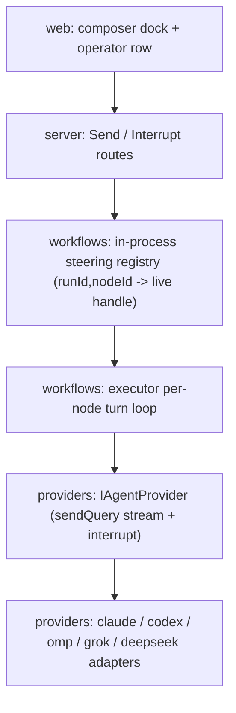
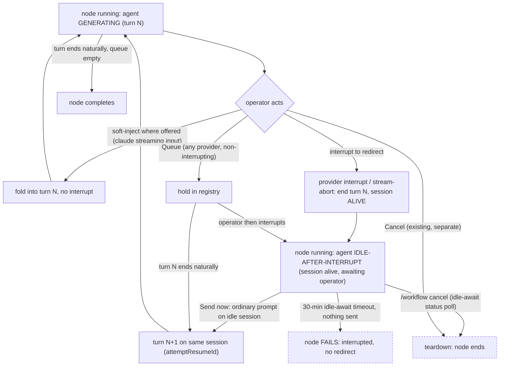

# Architecture Spine — Live Agent Steering

The read half of the node room already ships (Track A). This is the write half — and it is **not** "stop the node." Two operations act on the **live agent** while the node keeps running: **send** it a message, and **interrupt** its current thinking to redirect it. Stopping the whole node already exists (**Cancel**); steering never touches the node lifecycle.

The provider already gives us the primitive. An interrupt ends the current _turn_ but keeps the _session_ alive (claude `query.interrupt()`; a stream-abort on any SDK leaves the provider thread intact) — so the operator's next message continues the same session. The elegant part: **steering-interrupt and Cancel can share the same low-level stream-abort; the only difference is what the executor does after** — Cancel ends the node (existing path), steering keeps the node open and re-runs the same session.

## Design Paradigm

**Ports-and-adapters (hexagonal), inherited from the HITL spine.** `IAgentProvider` is the port. Steering adds **no new port and no durable store**: it drives the provider's native interrupt + streaming-input on the **live session handle** held in an **in-process registry**. The one genuinely new engine behavior is that a **steered node runs multiple turns on one live session** instead of ending after the first.

| Layer                                                                              | Namespace                                                 |
| ---------------------------------------------------------------------------------- | --------------------------------------------------------- |
| Provider adapters (interrupt + streaming input on the live session)                | `packages/providers/src/{claude,codex,grok,community/*}/` |
| Engine (executor per-node turn loop, in-process steering registry, store contract) | `packages/workflows/src/`                                 |
| Core (store impl, DB)                                                              | `packages/core/src/`                                      |
| Server (Send / Interrupt routes, dispatch)                                         | `packages/server/src/routes/`                             |
| Shells (composer dock, operator row)                                               | `packages/web/src/{lib,components,console}/`              |

## Inherited Invariants

Read-only, original ids. **The pause/resume HITL invariants do NOT apply to steering** — they govern Cancel (the run-pause lifecycle), which this feature leaves untouched.

| Inherited     | From parent                                              | Binds here                                                                                                                                              |
| ------------- | -------------------------------------------------------- | ------------------------------------------------------------------------------------------------------------------------------------------------------- |
| HITL/AD-3     | architecture-Archon-workflow-run-view-hitl-2026-09-05    | The executor is the **sole appender** to `remote_agent_workflow_node_messages`; store assigns `seq`. The operator row obeys this.                       |
| HITL/AD-7     | architecture-Archon-workflow-run-view-hitl-2026-09-05    | Split typed POST routes; run-mutation authorized + validated server-side at the tool boundary.                                                          |
| HITL/AD-8     | architecture-Archon-workflow-run-view-hitl-2026-09-05    | Additive schema only; both dialects.                                                                                                                    |
| Track A/AD-1  | architecture-Archon-readable-agent-transcript-2026-09-12 | One core, two shells: what a row **means** is decided in `packages/web/src/lib`, reaching shells as data. The operator row's meaning is composed there. |
| Track A/AD-3  | architecture-Archon-readable-agent-transcript-2026-09-12 | The core never throws, always terminates; logs `family` + `tool_use_id`, never payload or tool name.                                                    |
| Track A/AD-10 | architecture-Archon-readable-agent-transcript-2026-09-12 | The core produces every string a row displays or announces. The operator row's glyph + accessible name are core output.                                 |
| Track A/AD-2  | architecture-Archon-readable-agent-transcript-2026-09-12 | The Console boundary is the `no-restricted-imports` lint rule; `packages/web/src/lib` is shared ground.                                                 |

**Explicitly NOT inherited by steering:** HITL/AD-1 & AD-2 (pause-without-approval + resume CAS) and HITL/AD-6 (`resumeInteractions`) — those are the Cancel/Ask lifecycle. Steering does not pause, does not resume, and does not reuse `resumeInteractions`.

## Invariants & Rules

Dependency direction — each layer may depend only downward:

The in-session flow — the node never leaves `running`:

### AD-1 — Steering acts on the live agent, never on the node lifecycle

- **Binds:** CAP-1, CAP-2, CAP-3, CAP-5; the executor; the registry.
- **Prevents:** modelling steering as a run pause / node stop (that is **Cancel**, which already exists); any durable stop-and-resume state.
- **Rule:** _send_ and _interrupt_ both operate on the **live provider session** of the running node. The node stays `running` throughout — **no pause, no `pending`, no resume**; a send or an interrupt **never fails the node**. (The one way a steered node ends in failure is the operator _abandoning_ an interrupted node past its idle bound — AD-4 — which is the operator's absence, not a steering act.) Stopping the whole node is the existing Cancel/abort path: out of scope here, untouched. A node may contain an agent or not; steering only exists where there is a live agent session to act on.

### AD-2 — Interrupt is the provider's own primitive (or a stream-abort); it ends the turn, not the session

- **Binds:** CAP-2, `IAgentProvider`, the adapters, the executor's abort seam.
- **Prevents:** an engine-side kill; a bespoke steer channel; conflating interrupt with Cancel's teardown; a steering abort falling through to `node_failed`.
- **Rule:** "stop the agent's thinking" ends the **current turn** and leaves the **session alive**. Claude uses the SDK-native `interrupt()` (= `query.interrupt()`); a provider without a native keep-alive interrupt uses a **stream-abort**, which ends the turn while the provider's thread/session persists for a follow-up run (codex resumes it — `codex.resumeThread(sessionId)`, `providers/src/codex/provider.ts:1006`). The session, not a durable marker, carries continuity.
- **The abort seam — a per-turn signal beside the node-level one.** The executor's `nodeAbortController` (`dag-executor.ts:2209`, created **once per node, one-shot**) is **Cancel's**, and steering leaves it byte-for-byte untouched: it feeds `sendQuery` via `abortSignal` (`:2223`), the idle-timeout and cancel-poll abort it (`:2298`/`:2325`), the re-ask loop stops on it (`:3032`, `!nodeAbortController.signal.aborted`), and the inline `:3124` check fails the node on it. Steering must **not** abort that controller — one-shot means a steering abort would kill turn N+1's `sendQuery` (which receives the same signal) and block multi-turn. Instead steering interrupts through a **fresh per-turn signal**: `sendQuery` receives the **combination** `AbortSignal.any([nodeAbortController.signal, perTurnSignal])`, so **Cancel (node-level) or a steering interrupt (per-turn) both end the current turn**, but each new turn gets a fresh per-turn signal while the node-level controller persists across turns — which is what lets a node run more than one turn (the re-ask loop today cannot, because it reuses the one-shot node signal). The registry's interrupt reads the active turn's handle and aborts its per-turn signal **synchronously** (no `await` between read and abort), so on the single-threaded loop it can never fire a torn-down controller.
- **`operatorInterrupt` is a per-turn flag, and placement — not an ordering rule — makes Cancel dominate.** Because steering aborts only the per-turn signal, the node-level `:3124` Cancel check is **never tripped by steering** (Cancel-only, byte-for-byte). The flag is set when steering fires the per-turn abort and read at three post-stream points, all resolved by **position in the existing flow** (`stream → validation → canReask :3032 → :3124 Cancel check → completion`): **(1)** `canReask` (`:3032`) must **also stop on `operatorInterrupt`** — it guards only on the node-level signal today, so without this the re-ask loop would auto-re-ask the interrupted partial (adv-H1); **(2)** the executor **skips validation** on an interrupted turn — no validation-miss events for a turn the operator cut; **(3)** the `operatorInterrupt` branch sits **immediately after the `:3124` Cancel check**, so a co-firing Cancel wins by position, with no ordering rule to invent (adv-H5). The flag is **per-turn** — reset when the loop starts turn N+1 — so a stale flag can never abort or mis-route a later turn (adv-H2).
- **The end cause is a five-case rule the executor resolves, not result-presence alone.** The executor consumes a **provider-normalized** `msg.type === 'result'` (`dag-executor.ts:2533`), but a stream-abort is **not** uniformly result-free across providers: DeepSeek emits a terminal `result` marked `stopReason:'aborted'` / `errorSubtype:'deepseek_aborted'` (`providers/src/community/deepseek/acp-client.ts:105`), while OMP **throws** `Query aborted` (`providers/src/community/omp/provider.ts:317,450`), which reaches the executor catch (`dag-executor.ts:3332`) as `dag_node_failed`. So when the per-turn `operatorInterrupt` fired the executor resolves five cases: **(1)** a `result` with **no** abort marker → **natural** end, interrupt spent, completes/auto-drains (AD-4); **(2)** a `result` **carrying an abort marker** → **interrupted** end → idle-await; **(3)** a **thrown abort** caught at `:3332` → **interrupted** end → idle-await, **not** `node_failed`; **(4)** a throw with `operatorInterrupt` **not** set → genuine `node_failed` (unchanged); **(5)** node-level Cancel (`:3124`) dominates by position (unchanged). The executor **classifies** the abort-marked `result` and the abort throw — the provider adapter **must not suppress** them (they stay visible to other consumers; Fail-Fast). Case (1) still closes the race where the flag is set as a good turn naturally closes; cases (2)–(3) cover the two providers whose abort is not result-free. This rule applies on **both** `executeNodeInternal` and `executeLoopNode`.

### AD-3 — Send is an ordinary prompt on the live session; delivery timing is the operator's choice, not a provider limit

- **Binds:** CAP-1, CAP-3, CAP-5, `IAgentProvider.sendQuery`.
- **Prevents:** a new named `steer()` primitive; disqualifying any provider; a branch that holds a message "because the provider can't do better" (conflating a transport limit with the operator's intent); interrupt-first modelling.
- **Rule:** sending to a running agent is an **ordinary prompt** directed at the live session. **When** it reaches the agent is the operator's choice; **only soft-inject** is gated by provider transport. Three paths, and interrupt (AD-2) is orthogonal to all of them:
  - **`Queue` (default, any provider):** the registry holds the message; it is delivered as **turn N+1 when the current turn ends naturally**. Non-interrupting — the operator chose to let the agent finish this thought. This is the "deliver at the next boundary" baseline.
  - **`Send now` (any provider):** offered only once the agent is **idle-after-interrupt** (AD-9) — so it is simply an ordinary prompt on an idle session → **turn N+1 immediately**. The interrupt that made the agent idle is CAP-2, a separate act; Send now does not itself interrupt.
  - **Soft-inject (CAP-5, provider-gated _and_ spike-gated):** where the provider folds a message into the running turn (claude streaming input at the pin; codex `turn/steer` deferred), it arrives **mid-turn with no interrupt**. claude's soft-inject rests on an **unverified seam** — whether `AsyncIterable` streaming input composes with the resume protocol (the SDK types exist at 0.3.209, but the composition was exercised only on a string prompt). The **v1 floor is interrupt + Queue**, which needs no spike; soft-inject ships when the spike clears. Do not present it as v1-ready.
- The only `IAgentProvider` change: `sendQuery`'s input may be an async iterable (stream) for soft-inject, plus an interrupt affordance — both reuse provider-native operations; **no new named primitive**. Interrupt-then-deliver is reachable on **every** provider (stream-abort is universal; codex re-runs the resumed thread), so no provider is held to "wait for the wrong work to finish."

### AD-4 — A steered node runs multiple provider turns on one live session; turn-end has two causes

- **Binds:** CAP-2, CAP-3, the executor's per-node turn loop.
- **Prevents:** the node ending after its first turn while a steer is pending; an **interrupt with an empty queue completing the node** (operator pressed Stop to redirect and the node just… finished); validating a **partial** interrupted turn as if it were real output; re-establishing a fresh session (losing the agent's context — the failure mode of any resume-from-scratch).
- **Rule:** a node being steered **continues on the SAME provider session across turns**, reusing the existing session-resume seam — the structured-output re-ask already re-invokes `sendQuery` with `attemptResumeId` on the same session (`dag-executor.ts:2290`). Each delivered operator message becomes the **next turn's input**. This is the one genuinely new engine behavior; everything else reuses what exists.
- **The loop distinguishes _how_ the turn ended** — the `operatorInterrupt` flag (AD-2) is the discriminator, and the two causes drain the queue by **different rules**:
  - **Natural end** (agent finished the turn on its own): the queue **auto-drains** — a queued message → run turn N+1; queue empty → **node completes**. Auto-delivery at the natural boundary _is_ `Queue`'s contract (CAP-1).
  - **Interrupted end** (`operatorInterrupt` set): the turn produced a **partial** result — no schema-valid `output_format`, maybe a half tool call — which the executor must **not** validate, must **not** write `node_completed` for, must **not** advance the DAG on. It **always** enters **idle-await**, _whatever the queue holds_ — it never auto-fires. The **only** exits are the operator's **`Send now`** (flush every queued message plus the one just typed, in written order → turn N+1) and the bound. This is what preserves the ratified `Send now` moment: after Stop, the operator gets to add the final correction before anything is sent.
- **The re-ask precedent is imperfect and the delta is here:** re-ask (`:2290`) re-enters the loop on a **validation miss** and treats the state as recoverable; steering re-enters on an **interrupt** from a state the executor today treats as **terminal** (`:3124`). Same seam, different trigger — the `operatorInterrupt` branch is the new code.
- **The idle-await bound — fail after 30 minutes (owner-ratified), and how Cancel reaches it.** On entering idle-await the executor arms a **fresh 30-minute timer** (the operator's decision) — reusing neither the streaming `withIdleTimeout` wrapper (`:2298`; no stream to wrap) nor its `nodeIdleTimedOut` outcome, which _completes_ the node (`:3118`) and would ship the partial turn. On expiry the node takes an **explicit fail** branch: `interrupted by operator, no redirect received`. Because idle-await has no stream, the chunk-driven cancel-poll (`:2312`) is dormant — so `/workflow cancel` (a DB status the poll normally reads) cannot reach idle-await through the signal. Idle-await therefore runs its **own timer-driven poll** of `getWorkflowRunStatus` at `CANCEL_CHECK_INTERVAL_MS` (`:682`), reusing `shouldContinueStreamingForStatus` (`:700-702`, so a sibling Ask-pause still leaves it alone) and taking the existing Cancel ending when the run is no longer streamable. **Idle-await resolves exactly once:** the first of `Send now`, the cancel-poll, or the 30-minute timer wins, and the other two are torn down. (Cancel's _code_ stays untouched — idle-await adds a poll that _reaches_ it. Consequence of reusing `shouldContinueStreamingForStatus`: the 30-minute timer **keeps running through a sibling Ask-pause** — the operator's ratified fail-after-30-min choice covers this.) **The 30-minute timer is an _inactivity_ timer, not a fixed countdown from the interrupt (SC 2.2.1, owner-chosen):** a debounced, authorized operator _composing keepalive_ over the Send/Interrupt route family (AD-11 — not a new grant) **re-arms** the timer without resolving idle-await, so the node fails only after 30 minutes of genuine operator inactivity. This adds a re-arm input, not a fourth resolution — idle-await still resolves exactly once, on `Send now` / cancel-poll / timer expiry.
- **The 30-minute fail is a `node_failed`; resuming re-runs the node with a fresh session.** `/workflow resume` re-runs a failed node from scratch — the interrupted agent's in-progress context is **gone** (there is no durable session for a steer, AD-5). A builder must not try to preserve the session; the operator resumes into a clean re-run. (Rejected bounds: _wait-forever_ — ties up the node indefinitely, fragile in-process per AD-5; _complete-with-partial_ — ships garbage downstream.) This fail is the **in-process owner failing its own node** on a bounded timer it is actively holding — the same class as the existing idle timeout, **not** the cross-process staleness guess AGENTS.md's _No Autonomous Lifecycle Mutation_ rule forbids (that rule governs a process judging non-terminal work started by an unknowable _other_ party; here the failing process is the one running the node).

### AD-5 — In-process only: the registry holds the live handle; detached is deferred

- **Binds:** CAP-1, CAP-2, CAP-5; the web-dispatch executor (`api.ts:3200-3228`); the CLI detach path (`cli/src/commands/workflow.ts:696-722`).
- **Prevents:** pretending steering can reach a run whose live session is in another process; re-introducing durable state to bridge that gap.
- **Rule:** the **in-process registry** — keyed `(runId, nodeId)`, holding the node's **live session handle** + an in-memory inbound queue, valid only while the node is `running` **in this process** — is the **sole** mechanism. A run whose executor is **not in this process** (detached CLI `--detach`) has no reachable live handle → steering is **unavailable** for it in v1: the UI states this, and **Cancel still works**; a detached node otherwise runs to completion on its own (there is nothing to "resume" while it is `running` — `/workflow resume` applies only if it later fails). **No durable steering state:** a server restart drops the live session; any in-flight steer is lost and the run resumes normally — the accepted v1 boundary, matching aion.

### AD-6 — The executor is the single writer of the operator transcript row

- **Binds:** CAP-4, CAP-6; HITL/AD-3.
- **Prevents:** a second appender to the node-message table; `seq` contention; an operator row whose position is unguaranteed; an operator row that cannot be attributed to its sender or reconciled against what the browser marked `sent`.
- **Rule:** an operator message is an ordinary `text` row carrying **three additive `metadata` fields** — `origin = 'operator'`, `operator_user_id` (the acting identity from `resolveAuthContext`, so CAP-4 attributes the message across a multi-user install), and `message_id` (the caller-stamped id from CAP-6, so the client can reconcile which `sent` messages became rows — AD-11). All three are additive on the `.strict()` metadata schema (`workflows/src/schemas/node-execution.ts:29-43`) + a regenerated `api.generated`; **no migration** (the column is already JSON). Written by the executor through the store at the point the message is delivered, placed by `seq` between the turn it redirected and the turn it caused. Delivered to the agent as a **plain prompt**, never `resumeInteractions` (that carriage is the Ask path's `tool_use_id`, which an operator message lacks). The **row is a receipt for the record** — the delivery vehicle is the live session, not this row. The server never writes it.

### AD-7 — Delivery emits no turn-start event from the steering layer

- **Binds:** CAP-3, CAP-4, CAP-5; the executor; every adapter; the transcript record.
- **Prevents:** a fabricated turn boundary corrupting the record the read half projects from.
- **Rule:** delivering an operator message — soft-inject mid-turn, or as the next turn after an interrupt — must emit **no `turn-start` event from the steering layer**; the turn boundary is where the agent's own loop puts it. An adapter that cannot inject without signalling a new turn holds the message for the next boundary rather than fabricating one.

### AD-8 — Delivery confirmation is best-effort, claude-only, gated on the SDK bump

- **Binds:** CAP-6, the UI status chip.
- **Prevents:** making confirmation a mandatory interface function (would disqualify every provider but claude).
- **Rule:** confirmation reports arrival; it is not a delivery mechanism. Only claude echoes a caller-set `uuid`, and that echo needs `@anthropic-ai/claude-agent-sdk` **≥ 0.3.246** — so `delivered` is **unreachable at the inherited pin 0.3.209** and becomes claude-only after that bump (Deferred). Until then the UI shows `sent` for every provider and never advances past it. Correlation is by id, never text or timestamp.

### AD-9 — The agent's generating/interruptible state is projected in the core; both shells read it

- **Binds:** CAP-1, CAP-2, CAP-3; the run-state projector; both dock shells; Track A/AD-1.
- **Prevents:** each shell inferring from raw state whether the agent is mid-generation — forking the one status channel across two surfaces; a persisted status enum re-introducing durable stop state.
- **Rule:** the agent's state **inside** `node = running` is a projected sub-state with **exactly two values** — **`generating`** (a turn is streaming: interruptible, and soft-injectable where the provider offers it) and **`idle-after-interrupt`** (a turn was interrupted, the session is alive and awaiting the operator: this is where `Send now` is offered, AD-3). It is derived in the core from the live turn lifecycle and emitted as data on the node state the shells already consume. **No new persisted status enum** — the node stays `running`; this is the ghost of the rejected `stopping/stopped` states, correctly relocated _inside_ `running` as a projected, typed-contract field (+ `api.generated` regen), never re-derived per surface. The `interrupting` state in `control-states.md` is a **UI-local optimistic transient** (the brief window while an interrupt request is in flight), **never a projected value** — the core emits only the two. Both shells (Legacy + Console) render the composer dock from this one projected sub-state — the cross-shell parity invariant.

### AD-10 — CAP-4 reaches into the transcript spec; that change is made there

- **Binds:** CAP-4, `spec-readable-agent-transcript`.
- **Prevents:** this spine silently adding an item kind to another spec's contract.
- **Rule:** `AgentHistoryItem` there has kinds `assistant | tool | lifecycle`; an operator row is none, and Track A/AD-1 puts every row's meaning in the shared core. The new item kind and its two-shell treatment belong to that spec's own update, opened there before CAP-4 ships. **Sequencing:** an operator `text` row must not reach a live transcript until that reader recognizes `origin='operator'` (else it renders as agent text) — the reader change lands first.

### AD-11 — Send and Interrupt are new authorized routes; races fold forward, only a finished node refuses

- **Binds:** CAP-1, CAP-2, CAP-5; the Send/Interrupt routes.
- **Prevents:** an unauthenticated or cross-user steer mutating a run; a durable-marker/phase gate that this model does not have; a 409 where the queue already absorbs the race.
- **Rule:** Send and Interrupt are **new** routes — `POST /api/workflows/runs/:runId/nodes/:nodeId/send` and `…/interrupt` — resolving the acting identity via `resolveAuthContext`. **Steering defines its own actor grant (owner-ratified 2026-09-15), broadening HITL/AD-7 for these live-session routes only:** any **authenticated** identity may send / interrupt / keepalive a running node, each request attributed by `operator_user_id` (AD-6); unauthenticated → 401; a run with **no** `user_id` (solo / identity-less install) → allowed. This is a **deliberate steering-specific grant** — steering acts on a live session and concurrent multi-operator steering (receipt order below) requires it — and it does **not** touch the retry / cancel / approve mutation rules, which keep HITL/AD-7's starter-or-admin form. There is **no phase/marker gate** (no durable state exists): the route acts on the live registry handle.
- **The send route is the _dispatch_ call, made at `Queue`-press: a queued message is server-side from the moment it is queued.** While the agent is `generating`, pressing `Queue` dispatches the message to the send route (`intent: 'queue'`) and it enters the **in-process registry queue** on the live handle at once; the executor drains it when the current turn ends naturally, or `Send now` flushes it after an interrupt. `x`-delete of a queued message calls an **idempotent withdraw route** (`DELETE …/queue/:messageId`). The **client draft** is only the text still being composed (per-tab); the two-queue split is typing (client draft) vs queued (server registry), and the crossover is `Queue`-press, not the drain moment. This is what makes CAP-1's "delivered at the next natural boundary" deterministic: the message is already on the registry when the executor checks the queue at turn-end, so there is no client-dispatch racing node completion.
- **The registry queue absorbs the races — no 409 for them, and nothing is lost.** A Send that arrives while an interrupt is still in flight simply **lands in the registry queue** and **waits** there — when the interrupt lands (AD-2) the node goes `idle-after-interrupt`, and the queue drains only on the operator's `Send now` (AD-4), never automatically. A `Queue` message whose _generating_ turn ends naturally is delivered at that natural boundary (CAP-1's contract) — the two drain rules differ by how the turn ended, not by a route branch. The **only** refusal is a Send/Interrupt to a node **no longer running**: `node finished` → 409, the draft stays in the browser (matching `control-states.md`'s finished row); and **no live handle in this process** (detached — AD-5) → a clear "not steerable here", never a durable queue.
- **Teardown is the last queue check.** A `Queue` message that lands after the loop's final natural-end check but before the registry entry is torn down is caught at teardown and returns **409 finished** — the browser keeps it as a draft.
- **Every terminal cause surfaces the undelivered queue — the row is how, and the terminal event is when.** On **any** node termination (natural finish, Cancel, or the 30-minute idle-await fail) the in-memory queue dies with the registry, so a late edge is not the only way to strand a `sent` message. The client reconciles its `sent` ids (CAP-6) against the `message_id` on the operator rows that were actually written (AD-6); any `sent` id with **no matching row** is **restored to the draft box as "Never sent"** (`control-states.md`'s finished row already draws this). The reconciliation runs **only on the node's terminal event** (`node_completed`/`node_failed` — HITL/AD-7's refetch trigger, which already sequences _after_ the executor's last row write), **never on a live refetch** — otherwise a Cancel landing mid-flight could read the rows before the final insert commits and mis-mark a _delivered_ message "Never sent", offering to resend it and duplicating the correction. After the terminal event the row set is final and the reconciliation is exact — honouring "never discarded silently" through data that already exists, not a new event.
- **Global order is the registry's receipt order; operators are attributed, not serialized.** On a multi-user install two docks may steer one node — AD-3's "written order" is per-operator, and the single global order is the order the registry **received** the sends (server-side FIFO). Each operator row carries `operator_user_id` (AD-6) so CAP-4 attributes each message to its sender. There is **no per-node steering lock**: concurrent operators interleave in receipt order, attributed, not serialized.
- Correlation of a soft-inject to its target turn is the registry's **in-memory** turn id (aion's `active_turn_id`/`expectedTurnId`), never a durable attempt-key.

### AD-12 — The operator display name is resolved at read time, server-side, and travels as row data

- **Binds:** CAP-4 (SPEC-agent-node-room CAP-11); the node-message read path; Track A/AD-1; AD-6.
- **Prevents:** (a) persisting a mutable display name as a 4th metadata field — breaks AD-6's "exactly three additive fields, no migration" and denormalizes a value that changes; (b) a shell fetching a users endpoint — breaks Track A/AD-1's fetch-free core and the Console import ban (HITL/AD-4); (c) rendering a raw id as the label — EXPERIENCE.md's Accessibility Floor forbids it.
- **Rule:** `operator_user_id` stays the **only** identity on the stored row (AD-6, unchanged). The display name is resolved at **read time** by the server that already serves node-message rows — a join on the canonical `users` row keyed by `operator_user_id` — and attached as a **derived, non-persisted** field on the read-response schema (`operator_display_name: string | null`), **not** inside the `.strict()` `metadata` object, so AD-6's three-field invariant and the no-migration property both hold. The rooms still read exactly **one** endpoint (HITL/AD-3 — the server enriches the row it already serves; it adds no source the room fetches). The functional core consumes the field as data (Track A/AD-1 — no fetch). A join miss (user row gone) yields `null`, and the core renders the short-id fallback. Regenerate `api.generated` for the new response field. Impl owner: the operator-row story (1.11).

## Consistency Conventions

| Concern              | Convention                                                                                                                                                                                                                                                               |
| -------------------- | ------------------------------------------------------------------------------------------------------------------------------------------------------------------------------------------------------------------------------------------------------------------------ |
| Steering target      | always the **live provider session** in the in-process registry; never node/run lifecycle state.                                                                                                                                                                         |
| Interrupt            | provider-native `interrupt()` where offered, else a stream-abort on a **fresh per-turn signal** (`AbortSignal.any` with the node-level one); never the one-shot `nodeAbortController`, which is Cancel's (AD-2). Ends the turn, session persists.                        |
| Node lifecycle       | untouched by steering — stays `running` (sub-state `generating` \| `idle-after-interrupt`, AD-9); completes only when a turn ends **naturally** with nothing queued. An interrupted turn never completes the node (AD-4). Cancel is the separate existing teardown.      |
| Continuity           | the live session (claude resume / codex thread via `attemptResumeId`), never a durable marker.                                                                                                                                                                           |
| Operator row         | `text` row, `metadata` = `{origin='operator', operator_user_id, message_id}`; never a widened `kind`, never a new table; a receipt, not the delivery vehicle (AD-6).                                                                                                     |
| Soft-inject ordering | the executor delivers in **receipt order**; a soft-inject adapter owns its own transport quirks (omp `set_steering_mode:'all'`, not one-at-a-time; RPC mode, never ACP — which cancels). The interrupt path concatenates the flush into one prompt, so it is unaffected. |
| Message identity     | correlation by caller-stamped id; `sent` until the provider echoes it, then `delivered` (claude only, post-bump).                                                                                                                                                        |
| Turn id              | in-memory in the registry; a soft-inject targets the live turn, a stale target folds into the next turn.                                                                                                                                                                 |
| Events               | reuse HITL/AD-7 refetch triggers on live node-state change; no card payloads on the wire; no `turn-start` from steering.                                                                                                                                                 |
| Authorization        | Send/Interrupt resolve identity via `resolveAuthContext`, under HITL/AD-7 (AD-11).                                                                                                                                                                                       |
| Console imports      | governed solely by `eslint.config.mjs:126-163`; `packages/web/src/lib` is shared ground.                                                                                                                                                                                 |

## Stack

Seed — verified at authoring; the code owns it once it exists.

| Name                             | Version / note                                                                                                                                                                                                                                                                                                        |
| -------------------------------- | --------------------------------------------------------------------------------------------------------------------------------------------------------------------------------------------------------------------------------------------------------------------------------------------------------------------- |
| `@anthropic-ai/claude-agent-sdk` | 0.3.209 (pinned) already has streaming-input + `interrupt()` (interrupt ≥ 0.3.205, `AsyncIterable` input ≤ 0.3.142) — steering's transport + interrupt need **no** upgrade. Only CAP-6's `user_message_uuid` echo needs ≥ 0.3.246 (Deferred).                                                                         |
| `@openai/codex-sdk`              | `^0.144.5` (lockfile pins 0.144.5; npm latest 0.154.0). The TS SDK exposes only `run()`/`runStreamed()` — no `turn/steer`/`turn/interrupt` (those are app-server protocol) at 0.144.5, 0.153.4, or 0.154.0. So codex steering is **stream-abort + re-run on the resumed `thread`** (`resumeThread`), not soft-inject. |
| omp / grok / deepseek            | per-adapter interrupt + mid-turn support varies — see `provider-steering-matrix.md`. The floor is interrupt-then-continue on the live session; soft-inject is the acceleration where the transport allows.                                                                                                            |
| SQLite / PostgreSQL              | additive-only (the operator-row `metadata` fields `origin`/`operator_user_id`/`message_id`); no steering state persisted.                                                                                                                                                                                             |

## Capability → Architecture Map

| Capability                                                | Lives in                                                                                                     | Governed by                                    |
| --------------------------------------------------------- | ------------------------------------------------------------------------------------------------------------ | ---------------------------------------------- |
| CAP-1 Compose to a running agent                          | composer dock (`web`), registry inbound queue (`workflows`)                                                  | AD-3, AD-5, AD-9                               |
| CAP-2 Interrupt the agent's thinking (node keeps running) | provider interrupt / per-turn stream-abort + executor keeps the node in idle-await (`workflows`/`providers`) | AD-1, AD-2, AD-4, AD-9, AD-11                  |
| CAP-3 Redirect and continue on the same session           | executor per-node turn loop on the live session (`workflows`)                                                | AD-1, AD-4, AD-6                               |
| CAP-4 The exchange is part of the record                  | operator row (`workflows` write, `web/lib` meaning)                                                          | AD-6, AD-7, AD-10, Track A/AD-1, Track A/AD-10 |
| CAP-5 Mid-turn delivery where the provider allows         | soft-inject on the live session (`workflows`/`providers`)                                                    | AD-3, AD-5, AD-7                               |
| CAP-6 Claim only what it knows                            | id echo + status chip; `message_id` on the row for terminal reconciliation (`providers`/`web`/`workflows`)   | AD-6, AD-8, AD-11                              |

## Deferred

| Item                                                    | Why it can wait                                                                                                                                                                 |
| ------------------------------------------------------- | ------------------------------------------------------------------------------------------------------------------------------------------------------------------------------- |
| Steering a detached (`--detach`) run                    | AD-5: no live handle reachable across the process boundary. Revisit only if a provider offers a channel into a session it did not spawn (grok's leader socket is the one lead). |
| Surviving a server restart mid-steer                    | No durable steering state by design; the run resumes normally. A durable design was built and rejected as over-engineering (memlog).                                            |
| CAP-6 `delivered` on claude                             | Needs SDK ≥ 0.3.246; unreachable at the pin 0.3.209. `sent` ships for all until the pin moves (AD-8).                                                                           |
| The read-only transcript item kind for the operator row | Owned by `spec-readable-agent-transcript`'s own update (AD-10).                                                                                                                 |
| Per-provider soft-inject beyond claude + omp            | The interrupt-then-continue floor ships for all; soft-inject (codex needs app-server, grok a spike) lands per transport.                                                        |
| Cancel node                                             | **Already exists** — the teardown/abort path is untouched by this feature; not in scope.                                                                                        |
| Deploy / env / infra                                    | Rides the existing single-tenant install, SSE, additive schema; no new topology.                                                                                                |
