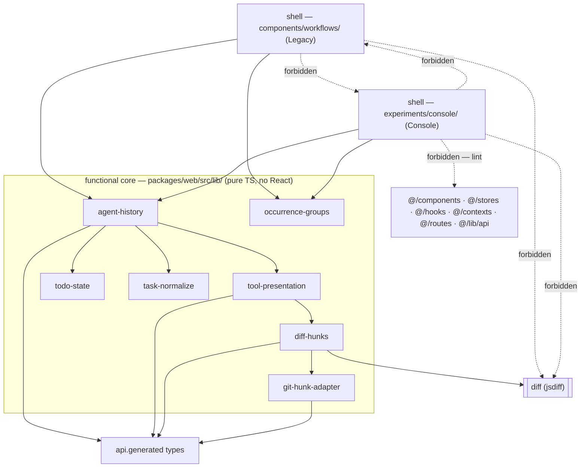

# Architecture Spine — Readable Agent Transcript (Track A)

## Design Paradigm

**Functional core, imperative shell.**

The core is pure TypeScript in `packages/web/src/lib/`: no React, no DOM, no fetch, no provider names. It reads stored rows and returns render-neutral data. (`lib/` is React-free apart from one pre-existing file that is a hook by name, `use-container-split-mode.ts`; nothing this feature adds joins it.) The shells are the two React surfaces — Legacy `components/workflows/` and Console `experiments/console/`. They own JSX, scroll, focus, and the interaction state a DOM needs; they own no interpretation.

Every capability in this feature is a function of data already in the database, so the core is total and deterministic and the shells are replaceable. That is what makes the feature retroactive, and it is why Legacy can be deleted later without touching a line of the core.

## Inherited Invariants

From `architecture-Archon-workflow-run-view-hitl-2026-09-05` (HITL spine, feature altitude). Read-only; original IDs kept. Its numbering overlaps this spine's, so a parent decision is always written **`HITL AD-n`**; a bare `AD-n` is always local.

| Inherited                             | From parent | Binds here                                                                                                                                                                                                                                                                                                               |
| ------------------------------------- | ----------- | ------------------------------------------------------------------------------------------------------------------------------------------------------------------------------------------------------------------------------------------------------------------------------------------------------------------------ |
| HITL AD-3 — per-node transcript table | HITL spine  | `remote_agent_workflow_node_messages` ordered by `seq` is the only source the rooms read. Track A adds no source and no column, which is exactly what makes it apply to runs already stored.                                                                                                                             |
| HITL AD-4 — Console isolation         | HITL spine  | Console must not import `@/components`, `@/contexts`, `@/hooks`, `@/routes`, `@/stores`, `@tanstack/react-query`, or `@/lib/api` **functions**. Type-only `api.generated.d.ts` **is** allowed — a different module path, outside the ban — which is the carve-out AD-6 relies on. Each surface owns its own React shell. |

**Correction to HITL AD-4, carried by AD-2 below.** The parent also calls `lib/run-graph` "the one sanctioned console isolation exception". That clause is stale: the enforced rule is the prohibition list, and `@/lib/` outside `@/lib/api` was never restricted. The parent's prohibition list stands unchanged; only its exception-counting sentence is wrong, and it should be amended upstream.

Note when citing capabilities: the parent binds `CAP-1..CAP-7` of the **HITL** spec. This spine's `CAP-n` are the **readable-transcript** spec's. Always name the spec.

## Invariants & Rules

Dependency direction — an arrow means _may import_. Every edge not drawn is forbidden.



### AD-1 — One core, two markup shells

- **Binds:** CAP-1 … CAP-7, both surfaces.
- **Prevents:** the render fork becoming a logic fork — a renderer learning a provider name, re-deriving a chip label, re-parsing a payload, or the two surfaces drifting into different readings of the same row.
- **Rule:** every decision about _what a row means_ is made in `lib/` and reaches the shells as data. A shell may choose markup, class names, and layout; it may not inspect `input`, `output`, or a tool name. `family`, `label`, `headline`, `headlineKind`, `badges`, `body`, and the text channels AD-10 adds are consumed as given. Neither shell imports from the other.

  **`label` is the tool name as the provider sent it** — `read_file`, `Edit`, `Grep` — not the normalised form. Normalisation (case-folding, stripping `_` and `-`) is a _matching_ device for the resolver and never a display transform; a chip reading `readfile` would contradict every example in the UX run. Four statements across three documents disagreed when this AD was written — `tool-presentation-contract.md:31`/`:160` and `EXPERIENCE.md:90` said "normalised" against `DESIGN.md:377` and `EXPERIENCE.md:79`/`:208`. **All three documents were corrected to "as sent" on 2026-09-12** (`tool-presentation-contract.md:34`/`:165` via `bmad-spec`, `EXPERIENCE.md:90` via `bmad-ux`). The rule below is now what every source says; it is recorded here because it was a decision, not because the sources still fight.

### AD-2 — The Console boundary is the lint rule, and `lib/` is shared ground

- **Binds:** where every shared module in this feature lands.
- **Prevents:** a builder duplicating the presenter into Console to honour a sentence nothing enforces, or growing a hand-maintained exception list that drifts the same way the parent's did.
- **Rule:** the boundary is the `no-restricted-imports` patterns at `eslint.config.mjs:126-163`, and nothing beyond them. `packages/web/src/lib/` is shared ground both shells may import; a new shared module needs no exception and no amendment. Anything a shell must not reach is expressed by adding a pattern to that rule, never by prose in a document. Console imports nothing from `@/lib/api` today and must import nothing from it after this work.

### AD-3 — The core is a total function: it never throws, and it always terminates `[ADOPTED]`

- **Binds:** `tool-presentation`, both normalizers, the todo fold, the diff path.
- **Prevents:** one unvalidated historical row taking the whole web UI to the full-screen error page at `App.tsx:23-64` — the app's only error boundary — and making that run permanently unopenable, because a reload re-renders the same row and fails again. The termination half prevents the inverse failure: satisfying "never throws" by blocking the UI thread forever, which is worse than the error page it replaced.
- **Rule:** no function in the core throws. Anything unparseable resolves to the `generic` arm, which the contract already defines as the escape hatch, and CAP-7's Raw toggle keeps the original bytes reachable. A caught error logs the resolved **family** and the tool-use id, plus the error message — never the payload, and **never the tool name**: on Codex the name _is_ the whole shell command (`SPEC.md:66`, 4,911 of 22,867 rows, heredocs included), so logging it would leak exactly the command text and paths `AGENTS.md` forbids. Every unbounded algorithm in the core carries an explicit bound and a defined answer for exceeding it; the diff is the only one today and AD-4 names its bounds. Correctness is proven by tests over real payloads, not by throwing at runtime. This is a deliberate, scoped departure from the repository's fail-fast default: it applies to this read-only projection layer and to nothing else.

### AD-4 — One module owns the diff; no shell imports `diff` `[ADOPTED]`

- **Binds:** CAP-5 on both surfaces.
- **Prevents:** two shells each calling `structuredPatch` with different options — `context` defaults to 4 and is silently divergent — and rendering different diffs for the same edit; the same edit being diffed twice; and a later adopter such as the chat card growing a third differ.
- **Rule:** `diff` is declared as a dependency of `@archon/web`, and `packages/web/src/lib/diff-hunks.ts` is the **only** caller of `structuredPatch` in the tree, with its options fixed inside it. It exports one function returning `GitDiffHunk[] | null` and carries a bounded memo keyed on the two input strings — legitimate caching, because it is a pure function of them.

  **Bounds are mandatory and deterministic.** jsdiff ships _no_ default timeout and _no_ default edit-length limit, and an unbounded synchronous Myers diff hangs the thread rather than failing, so a caller that names no bound has no degrade path at all. `diff-hunks.ts` refuses inputs above a byte ceiling before calling `structuredPatch`, and passes an explicit `maxEditLength`; both answers are `null`, and the row degrades to path-plus-preview, the same fallback Codex already takes. The bound is `maxEditLength`, never a wall-clock `timeout`: an edit-length bound is a function of the inputs, so the same pair yields the same result on every machine and in every test run, while a time budget would render a diff on a fast machine and a preview on a slow one. The two numbers are starting values, not measured ones — revisit them against the production corpus once real edit sizes are known.

  **Mapping.** `StructuredPatchHunk` is `{oldStart, oldLines, newStart, newLines, lines: string[]}` with prefix-encoded lines. The function walks `lines` with running old/new counters and synthesises the `@@ -a,b +c,d @@` header; the existing `git-hunk-adapter` then converts to `react-diff-view`'s shape unchanged. A line beginning with `\` — the `\ No newline at end of file` marker — is skipped **wherever it appears and however often**, advancing no counter: real jsdiff 9 output puts it mid-array and can emit it twice in one hunk, and it is excluded from `oldLines`/`newLines`. Treating it as a single trailing line desynchronises every counter after it and produces exactly the wrong line numbers this AD exists to prevent.

### AD-5 — The diff is computed while the row is built, not when it is opened

- **Binds:** CAP-1's collapsed row and CAP-5.
- **Prevents:** a builder deferring the diff to expand-time and then finding the collapsed row cannot show its `+n −m` badge, or computing the diff twice to get both.
- **Rule:** the core diffs a file row as it builds it, because `tool-presentation-contract.md:174` puts `+n −m` among the **collapsed**-row badges and that count cannot exist without a diff. One call to `lib/diff-hunks.ts` produces both the badge and the hunks, and the hunks travel to the shells on the presentation. A shell never diffs; it renders what it is handed. Carrying hunks on the presentation was an additive amendment to the contract's `diff` body arm; `bmad-spec` **made it on 2026-09-12**, so the arm now declares `hunks: GitDiffHunk[]` alongside `before`/`after`.

### AD-6 — The moved adapter takes its types from `api.generated`

- **Binds:** the `git-hunk-adapter.ts` move.
- **Prevents:** a move that lands in `lib/` and is then unusable from Console. `eslint.config.mjs` bans the `@/lib/api` path outright and does **not** set `allowTypeImports`, so the base `no-restricted-imports` rule flags `import type` from it too — verified by running the repo's own ESLint 9.39.4. (The option exists in the base rule since ESLint 9.37.0; this config declines it. Do not discard this AD on the belief that a type-only import is automatically exempt.)
- **Rule:** `packages/web/src/components/workflows/source-control/git-hunk-adapter.ts` moves to `packages/web/src/lib/` and re-aliases `GitDiffHunk` / `GitDiffChange` from `api.generated` rather than from `@/lib/api`; they are plain aliases over `components['schemas']` at `api.ts:472-473`, so the move stays mechanical. Its two existing consumers — `virtualized-diff.tsx` and its test — update their import path. Its internal `requiredLine()` throws on a line number that is not a positive integer; `lib/diff-hunks.ts` always emits positive integers from its running counters, so on Track A's path that throw is unreachable by construction rather than merely caught.

### AD-7 — `buildAgentHistory` returns items **and** node-level todo state; grouping is a separate function

- **Binds:** CAP-3, CAP-6, and the three existing call sites.
- **Prevents:** the unsatisfiable shape this AD first asserted — `tool-presentation-contract.md:61` and `SPEC.md` both require the node's folded todo state to come out of `buildAgentHistory()`, and a flat per-item array cannot carry node-level state. Also prevents each shell writing the occurrence-versus-attempt reasoning for itself, or one surface rendering the same rows ungrouped.
- **Rule:** `buildAgentHistory()` returns an object carrying `items: AgentHistoryItem[]` and the node's `TodoPhase[]`. `ConsoleNodeRoom.tsx:607`, `ConsoleExecutionHistory.tsx:204`, and `NodeTranscriptPane.tsx:236` each take a one-line edit; that cost is accepted because the alternative was a contract violation, not because a wider return is desirable. Each tool item gains `presentation` and carries `metadata.execution` through; the `context` field and `toolContext()` go away, and their only two readers are `NodeRoom.tsx:246` and `ConsoleAgentHistoryList.tsx:178`, both JSX this work rewrites. A separate pure function in `lib/` takes `items` and returns groups, and it decides four things so neither shell does:
  1. **When headers appear.** Only when two or more _distinct_ `occurrence_id` values are present. One distinct value — or none — is one group and no header, which is what CAP-6 requires. A row whose `metadata.execution` is absent attaches to the nearest preceding group by `seq`, never to a group of its own; otherwise a node with one occurrence plus one metadata-less row would grow a header CAP-6 forbids.
  2. **What the label says.** `Run N` from `retry_epoch`, `Iteration N` from `loop_ancestry`, composed by the core per the UX spine. A shell renders the string; it never derives it.
  3. **That every item groups, not only tool items.** Assistant and lifecycle items carry `metadata.execution` through too, or an occurrence header would sit above a group its prose rows fell out of.
  4. **Grouping keys on `occurrence_id`.** `attempt_id` is never a key and never a label.

  All three call sites feed this the output of `selectNodeRoomMessages`, and on the _occurrence-entry_ path the server has already filtered to one occurrence (`select-node-room-messages.ts:12`), so exactly one group arrives and no header renders. That is intended, not a gap: CAP-6 exists for the node-entry path, which is the default selection (`resolve-graph-room-row.ts:19-27` prefers the ordinary `node` row). Every surface applies the grouping; a surface may not opt out.

- **Amendment (2026-09-19 — issue #180 decision B1, recorded):** the compatibility-only reading above is the adopted contract, not a stopgap awaiting a better one. A first-class aggregate multi-occurrence view for occurrence-scoped executions — the modern loop rows — was evaluated and is **not authorized**: no entry point, selection identity, retry/nested-loop/route-activation boundary, Ask-ownership, authorization/visibility boundary, paging, default-selection, or performance contract was authored for it, and the earlier `loopParent` / `All iterations` sketch stays rejected. Two consequences, stated plainly so no implementer re-derives them: a modern loop opened through its occurrence rows renders **no** occurrence headings and **no** navigator — exactly one group arrives, as this AD intends — and Story 2.10's finished-iteration reachability is settled by **AD-16** (issue #190 decision B1): the `Execution` selection controls are the occurrence-switching entry point while Story 1.7 `Jump to` stays scroll-only. Multi-occurrence headings and the navigator exist only on the node-scoped path described above.

### AD-8 — The resolver is eager and unmemoized; the diff is the stated exception

- **Binds:** all three call sites, and the performance envelope.
- **Prevents:** one builder adding `useMemo` and another not, leaving two surfaces with different re-render behaviour; and the "cheap" claim being read as covering the diff, which is the one part of the core whose cost scales with content size rather than row count.
- **Rule:** the presenter is attached inside `buildAgentHistory()`, which is unmemoized at all three call sites today and re-runs on every render. At CAP-1's stated scale — forty rows — the resolver costs microseconds, so no memoization is added for it. The diff is exempt and is bounded by the memo inside `lib/diff-hunks.ts` (AD-4) rather than at a call site, so a node of large edits does not re-diff on every render. Revisit the resolver when a node's row count reaches the low hundreds while live-streaming; the fix then is `useMemo` at the call sites, not caching inside the core.

### AD-9 — No runtime switch; revert is the rollback

- **Binds:** the operational envelope of this feature.
- **Prevents:** a kill switch that would require keeping the JSON rendering alive in both shells — preserving the exact defect being deleted, in the surface scheduled for deletion.
- **Rule:** Track A ships no feature flag, no environment variable, and no config key. It adds no migration, no server route, and no deployment step; it reaches users in the web bundle. The rollback is reverting the change, so it lands as one focused, revertible unit rather than mixed into unrelated work. The only operational delta is bundle size: one dependency, `diff`, tree-shaken to `structuredPatch` — measured at ~10.0 KB minified, ~3.8 KB gzipped. One copy in the browser bundle; the root's `diff` 8.0.3 is build-time only and does not collide.

### AD-10 — Everything a row displays is produced by the core, including its text channels

- **Binds:** CAP-1, CAP-2, CAP-6, CAP-7, both shells; the Accessibility Floor in `EXPERIENCE.md`.
- **Prevents:** the fork AD-1 exists to stop, reappearing through the fields the contract's `ToolPresentation` happens not to name. The status glyph, the row's accessible name, the family word, and the body bar are all _required_ by the UX spines and are in _no_ shared type — so each shell would compose its own five glyph characters, its own five accessible names, and its own `family · label` string, and the divergence would be invisible to sighted testing.
- **Rule:** the core produces every string the row displays or announces — the glyph character for each of the five outcomes, the visually-hidden accessible name, the family word the body bar opens with, and the body bar's composed facts. A shell picks markup and placement; it never maps an outcome to a character, never composes an accessible name, and never derives the family word. Anything the UX spines promote to a contract — notably that a badge dropped under pressure must reappear in the body bar — is satisfied by data the core emits, not by two shells agreeing to behave alike.

### AD-11 — The core never elides; the shell always does

- **Binds:** CAP-1's headline, the Accessibility Floor.
- **Prevents:** the full path being destroyed before it reaches the DOM, so assistive technology and copy-paste get the truncated form. The builder has in-module precedent for doing exactly this — the resolver already truncates at Tier 4 (80 characters) and Tier 3 (first line) — so the prohibition has to be explicit.
- **Rule:** `headline` leaves the core complete and un-elided; `headlineKind` says _how_ a shell must shorten it visually, and the shell does so with CSS or a presentational transform that leaves the full string in the accessible name and the DOM text. Tier 3's first-line rule and Tier 4's 80-character cap are _content selection_, not elision — they choose which text is the headline, and what they choose then travels whole.

### AD-12 — The shells own seven behaviours, written twice, and they are enumerated

- **Binds:** both shells; the State Patterns, Interaction Primitives, and Accessibility Floor sections of `EXPERIENCE.md`.
- **Prevents:** the honest gap in "one core, two shells" — a handful of behaviours genuinely cannot live in the core because they are DOM and interaction state, so they _are_ written twice, and nothing otherwise obliges the two copies to agree. Console already ships stick-to-bottom (`ConsoleNodeRoom.tsx:550-572`) and Legacy does not, so the two surfaces are divergent on this list **today**.
- **Rule:** exactly these seven are shell-owned, and both shells implement all seven identically. Anything not on this list belongs to the core.
  1. A row renders collapsed when the outcome is `succeeded`, open when `failed`, and **collapsed for `running`, `interrupted` and `unknown`** — the three the UX spine leaves unstated; only `failed` earns an automatic open. The `<details>` element is **uncontrolled**, seeded once per row from the outcome at first render. A controlled `open={outcome === 'failed'}` is forbidden: under the 1000 ms poll it re-asserts itself and snaps shut a row the reader opened.
  2. A reader's manual open or close outranks every automatic rule and survives live re-renders, including on a row the transcript auto-opened (`:158`). A row that _becomes_ `failed` while the reader has not touched it opens then; one the reader has touched never moves again.
  3. One polite `role="status"` region announces node transitions and failures only — never one per row (`:181`).
  4. The transcript pins to the bottom only while the reader is already at the bottom, otherwise holds position; an append never moves focus (`:175`).
  5. Every todo call collapses to a one-line row; the current checklist renders **only in the pinned todo strip** (#6), not inline in the transcript (CAP-3).
  6. A **pinned todo strip** at the top of the transcript panel mirrors the current `TodoPhase[]`, stays visible while the transcript scrolls, and is absent when the node has no todos (CAP-3). It renders from the core-supplied `TodoPhase[]` — no new core mechanism.
  7. A **loop-iteration selector** navigates directly between occurrence groups (the per-group headers are its anchors) and is absent on a single-occurrence node (CAP-6). It renders from the core-supplied occurrence groups — no new core mechanism.

  Console's existing `showToolCalls` toggle (`ConsoleInspectPane.tsx:68`), which Legacy has no equivalent of, hides **tool rows only**. The todo checklist is node state, not a tool call, so it survives the toggle being off — otherwise turning it off would delete CAP-3 on one surface and not the other.

  An eighth behaviour added later is an amendment to this AD, not a local choice. Each of the seven gets the same assertion in both `NodeRoom.test.tsx` and `ConsoleNodeRoom.test.tsx`, which is what makes "identically" checkable rather than aspirational.

### AD-13 — The glyph is a pure function of `outcome`; output state is a badge

- **Binds:** CAP-1's colour-free status guarantee, both shells.
- **Prevents:** the two shells resolving a self-contradiction in `EXPERIENCE.md:91` differently and forking the one channel that carries status without colour. That cell derived the glyph from `AgentHistoryItem.outcome` _and_ said `–` means "unknown or output missing" — but a result row with `outcome: success` and no output is reachable, and `deriveOutcome()` calls it `succeeded` (`✓`) while `deriveOutputState()` calls it `missing` (`–`). `bmad-ux` corrected that cell on 2026-09-12; this AD is what it was corrected to.
- **Rule:** the glyph is a total function of `outcome` alone — `✓` succeeded, `✕` failed, `◐` running, `⚠` interrupted, `–` unknown. `–` means **unknown, and nothing else**. Output state never touches the glyph; `output missing` and `output unknown` are badges, which is what `EXPERIENCE.md:131` already does. The core emits the character, per AD-10.

### AD-14 — The core emits the complete badge list, in order

- **Binds:** CAP-1's collapsed row, both shells.
- **Prevents:** each shell assembling its own badges in its own order from fields scattered across the item — and, concretely, CAP-1 being unimplementable. The exit code is parsed at `agent-history.ts:115`, consumed at `:126` only to decide `failed`, and then **discarded**; it never reaches `AgentHistoryItem`. CAP-1's success signal requires the failing `bash` call to show its exit code with no click, and `EXPERIENCE.md:127` puts it on the row in error colour, so today neither is achievable.
- **Rule:** `badges` arrives from the core complete and already ordered, and a shell renders the array as given — it never appends, reorders, or derives one. That obliges the core to carry `exit_code` through from `metadata` rather than consume it inside `deriveOutcome`, and to own the drop order under width pressure. A badge dropped under pressure reappears in the body bar (AD-10), which is the core's data, not a shell convention.

### AD-15 — The Codex command prefix is stripped in the core

- **Binds:** CAP-1's headline on Tier 3 — 4,911 of 22,867 rows, 21.5% of the corpus.
- **Prevents:** the one bridge between `tool-presentation-contract.md`'s Tier 3 (which said only that the headline is the first non-empty line of the name) and `EXPERIENCE.md:93` (which additionally strips Codex's fixed wrapper) being built inside a shell, which AD-1 forbids — leaving the rule implemented on one surface and not the other across a fifth of all rows. `bmad-spec` folded the strip into Tier 3 on 2026-09-12 (`tool-presentation-contract.md:139`), so the machine contract now carries it.
- **Rule:** the resolver strips the fixed `/bin/zsh -lc '` or `/bin/bash -lc '` prefix and the matching closing quote before choosing the headline, then applies the first-non-empty-line rule. The full untouched name remains available for the terminal body and the Raw toggle. This is content selection, not elision, so AD-11 is unaffected.

### AD-16 — Finished-iteration dock is reached through `Execution` selection; read-only queue poll is allowed `[ADOPTED]`

- **Binds:** Story 2.10 / issue #190 decision B1; CAP-6 finished-iteration clause; AD-7 scroll-only navigator; both shells' steering docks.
- **Prevents:** treating Story 1.7 `Jump to` as the occurrence-switching entry point for a finished iteration (that control is scroll-only and absent on modern occurrence rooms); reading "no steering request" as a ban on the authenticated node-scoped `GET …/queue` poll; and implying the finished-view band holds only this viewer's rows.
- **Rule:** On a live loop node, the operator reaches a finished iteration through the **`Execution` selection controls** — the header select, a Logs row, or a graph occurrence. Story 1.7 `Jump to` remains scroll-only navigation within already-loaded groups and is not the Story 2.10 entry point. The finished-iteration dock is strictly read-only for **mutations**: no send, withdraw, or interrupt control is rendered or invoked. The existing authenticated node-scoped `GET /api/workflows/runs/:runId/nodes/:nodeId/queue` read **is** allowed and is the only new request the mode performs (1 s serial poll already owned by `startQueuePolling`). The read-only band mirrors the **node's shared pending queue** across operators and tabs (Story 2.9 semantics), not a per-viewer local list. Fail closed (dock stays hidden) whenever same-lineage liveness cannot be proven.
- **Recorded:** 2026-09-20 — headless adoption of plan `issue-190-queued-guidance-finished-iteration` recommended resolution B1.

## Consistency Conventions

| Concern                 | Convention                                                                                                                                                                                                                         |
| ----------------------- | ---------------------------------------------------------------------------------------------------------------------------------------------------------------------------------------------------------------------------------- |
| Naming                  | Core modules are kebab-case files in `lib/`, named for the shape they produce: `tool-presentation.ts`, `todo-state.ts`, `task-normalize.ts`, `occurrence-groups.ts`, `diff-hunks.ts`. Tests sit beside them as `<module>.test.ts`. |
| Data & formats          | Wire types come from `api.generated.d.ts` only. Tool identity is duck-typed over alias sets on the normalized name — case-folded, `_` and `-` stripped, matched as whole tokens, never substrings.                                 |
| Provider differences    | Normalized at the edge in `lib/`, never branched on in a shell. A shared key name is not evidence of a shared shape.                                                                                                               |
| Errors                  | The core returns degraded values instead of throwing (AD-3). Shells render whatever they are given.                                                                                                                                |
| Logging                 | Resolved family + tool-use id + error message only. Never the tool name (a Codex name is the whole shell command — AD-3), never a payload, input, or output.                                                                       |
| Comments and test names | No plan, phase, section, or finding references. A comment states the invariant.                                                                                                                                                    |
| Gate                    | `bun run validate`. Never root `bun test`.                                                                                                                                                                                         |

## Stack

Seed — verified 2026-09-12; the code owns this once it exists.

| Name               | Version                                                                  |
| ------------------ | ------------------------------------------------------------------------ |
| `diff` (jsdiff)    | 9.0.0 — new to `@archon/web`; bundles its own types, so no `@types/diff` |
| `react-diff-view`  | 3.3.3 — already declared                                                 |
| `highlight.js`     | ^11.11.1 — already declared                                              |
| `rehype-highlight` | ^7.0.0 — already declared                                                |

## Structural Seed

```text
packages/web/src/
  lib/                              # functional core — pure TS, no React
    agent-history.ts                # gains `presentation`; TOOL_CONTEXT_KEYS + toolContext() removed
    tool-presentation.ts            # the four-tier resolver
    todo-state.ts                   # projectTodoState(); provider todo shapes -> TodoPhase[]
    task-normalize.ts               # provider task shapes -> TaskSubtask[]
    occurrence-groups.ts            # AgentHistoryItem[] -> groups
    diff-hunks.ts                   # the ONLY caller of structuredPatch; memoized
    git-hunk-adapter.ts             # MOVED here; types re-aliased from api.generated
  components/workflows/             # Legacy shell
    source-control/                 # git-hunk-adapter.ts leaves; virtualized-diff.tsx import updates
  experiments/console/              # Console shell
```

````mermaid
Data flow — the same modules, in the order a row moves through them.

```mermaid
flowchart LR
  R["node_messages row<br/>kind + payload + metadata.execution"] --> B["buildAgentHistory()"]
  B --> P["toolPresentation()"]
  P --> D["diffHunks()<br/>file rows with both sides"]
  B --> T["todo fold"]
  B --> K["task normalize"]
  B --> I["AgentHistoryItem[]<br/>flat, ordered by seq"]
  I --> G["occurrence groups"]
  G --> L["Legacy JSX"]
  G --> C["Console JSX"]
````

## Capability → Architecture Map

| Capability                | Lives in                                                              | Governed by                                         |
| ------------------------- | --------------------------------------------------------------------- | --------------------------------------------------- |
| CAP-1 scannable rows      | `tool-presentation.ts` + both shells                                  | AD-1, AD-3, AD-8, AD-10, AD-11, AD-13, AD-14, AD-15 |
| CAP-2 per-family body     | `tool-presentation.ts`                                                | AD-1, AD-3                                          |
| CAP-3 todo as state       | `todo-state.ts` (`projectTodoState`), folded in `buildAgentHistory()` | AD-1, AD-7, AD-12                                   |
| CAP-4 task dispatch       | `task-normalize.ts`                                                   | AD-1, AD-3                                          |
| CAP-5 inline diff         | `lib/diff-hunks.ts` → `lib/git-hunk-adapter.ts`                       | AD-4, AD-5, AD-6, AD-3                              |
| CAP-6 occurrence grouping | `occurrence-groups.ts`                                                | AD-7, AD-10                                         |
| CAP-7 raw payload         | both shells; payload carried on the item                              | AD-1, AD-3, AD-12                                   |
| Shared-module placement   | `packages/web/src/lib/`                                               | AD-2, HITL AD-4                                     |
| Ship and roll back        | the web bundle                                                        | AD-9                                                |

## Deferred

- **Memoizing the resolver at the call sites.** Not now; AD-8 carries the revisit condition.
- **A transcript-scoped error boundary.** AD-3 makes the core unable to trigger one. If a shell later needs its own boundary for a different reason, that is a shell decision, written twice.
- **Adopting the presenter in chat's `ToolCallCard.tsx`.** `ToolPresentationInput` is structural so it can, but that is a separate slice and a spec non-goal today.
- **Deleting the Legacy shell.** Scheduled elsewhere (`App.tsx:93-95`). AD-1 is what makes it a deletion rather than a migration.
- **Amending the parent spine's HITL AD-4 wording.** Belongs to the HITL spine's own Update, not to a local override here.
- **Virtualising very long transcripts.** No evidence a node needs it; it would be a shell decision under AD-1, and the core would not change.
