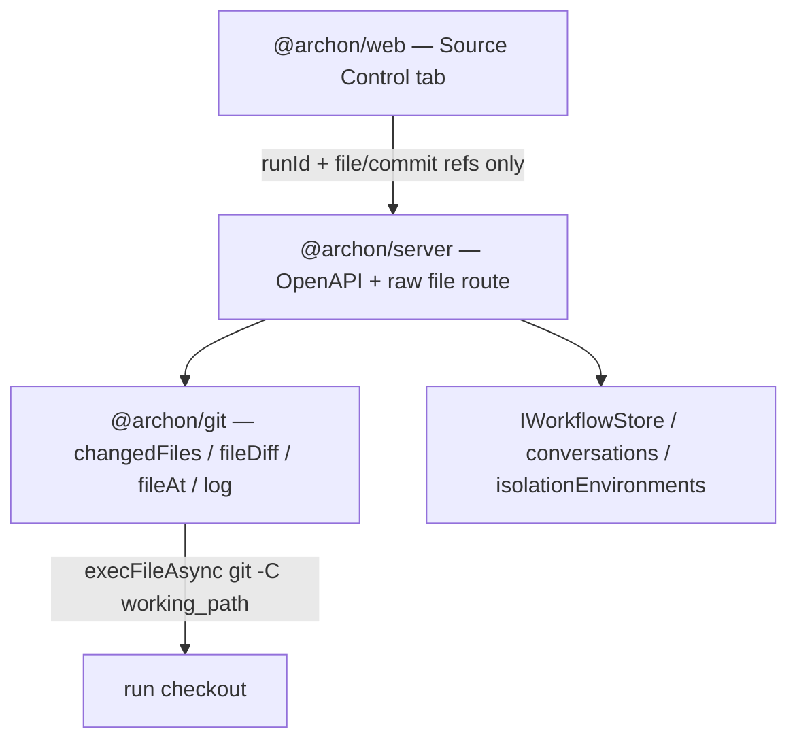

# Architecture Spine — Archon Source Control (legacy UI)

## Design Paradigm

**Ports-and-adapters.** Git-read is a port implemented in `@archon/git`. Server adapters own resolution, empty-state gating, auth, and transport. `@archon/web` is a thin renderer over OpenAPI types. `@archon/workflows` never imports isolation or does git I/O; CAP-8 is the one current caller that may extend `WorkflowDeps`.



## Invariants & Rules

### AD-1 — Pin and contain every read [ADOPTED]

- **Binds:** CAP-5, all git routes, `@archon/git` helpers, web client
- **Prevents:** UI-supplied `working_path`; `..` / symlink / encoded-traversal escape; `oid:path` revision syntax
- **Rule:** Client sends `runId` + file/commit refs only. Server loads the existing `workflow_runs.working_path` (already persisted on the run row — do not add a column, do not re-derive from `isolation_environments.metadata`). `realpath` it; reject if missing/non-git (CAP-6). Live filesystem reads: realpath the candidate and require it stay under the realpathed checkout. Commit-scoped reads: `git --literal-pathspecs ls-tree -z <oid> -- <path>` then `git cat-file blob <blobOid>` — never `git show <oid>:<path>`. Reject NUL, absolute paths, encoded `..`. Filenames with `:`, leading `-`, or glob metacharacters MUST succeed.

### AD-2 — Git-read lives in `@archon/git` [ADOPTED]

- **Binds:** CAP-2, CAP-3, CAP-4, `@archon/git`, `@archon/server`
- **Prevents:** Inline git in route handlers; a new `@archon/source-control` package; shell-string `exec`
- **Rule:** Add focused read-only helpers (`changedFiles`, `fileDiff`, `fileAt`, `log`) on `execFileAsync`. Routes resolve, gate, and serialize — they do not assemble git argv beyond calling the helpers.

### AD-3 — JSON metadata + raw content [ADOPTED]

- **Binds:** CAP-2–5, CAP-7, route schemas
- **Prevents:** Base64-bloated JSON for large/binary; all-raw APIs that skip OpenAPI types
- **Rule:** Changes list, commit log, per-commit files, and `M` hunks are JSON via `registerOpenApiRoute`. File content / large text / binary use a raw wildcard `app.get` (artifacts precedent: server-resolved, `..` rejected) with byte/line ranges. `[ASSUMPTION]` path seed: `/api/workflows/runs/:runId/git/{changes,log,diff}` and `/api/workflows/runs/:runId/git/file/*`.

### AD-4 — Canonical hunk JSON, adapter on the web [ADOPTED]

- **Binds:** CAP-3, CAP-7, `M` viewer
- **Prevents:** Unified-diff as the wire format; implementer-chosen hunk shapes; client-side whole-file diff
- **Rule:** Diff endpoint returns `{ path, status: "M", scope: "now"|"commit", ref, hunks: [{ oldStart, oldLines, newStart, newLines, header, changes: [{ type: "normal"|"insert"|"delete", oldLine?, newLine?, content }] }], cursor, truncated }`. `ref` is the commit OID for `scope: "commit"` and the sentinel string `"live"` (never null/absent) for `scope: "now"`. `cursor` is an opaque string the web echoes as `?cursor=` on the next page; the web MUST NOT parse it as a scroll offset — virtualizer position comes from accumulated hunk line counts. Web maps hunks to react-diff-view `HunkData`/`ChangeData` in a tested pure function. `A`/`D` never use this endpoint — they use AD-3 raw content. Now = `HEAD → worktree`; commit = `parent → commit`.

### AD-5 — Viewer stack [ADOPTED]

- **Binds:** CAP-3, CAP-7, `@archon/web`
- **Prevents:** Shiki; Monaco; client-diff libraries that need both file sides; welding the viewer into the tab
- **Rule:** One new dep: `react-diff-view@3.3.3` (npm, 2026-03-30). Syntax via installed `highlight.js@^11.11.1`. Large lists/diffs via installed `@tanstack/react-virtual@^3` plus AD-4 `cursor`. Open-strategy cutoffs are those in `viewer-rules.md` (first paint ~256 KB / ~2,000 lines; stream Cancel > ~1 MB; download-only > ~50 MB; NUL-in-first-8KB = binary; images inline; else hex peek ~4 KB) — do not invent parallel thresholds. Viewer is a reusable component (HITL reuse is COULD; do not import `/console`). Split default 30/70, resizable 20–70%. Each diff pane scrolls independently; below 900px stack lists-above-viewer. Diffs carry `+`/`-` gutters; badges carry the letter `M`/`A`/`D` — never color-only.

### AD-6 — Empty-state gate before git [ADOPTED]

- **Binds:** CAP-6, all git routes
- **Prevents:** Inferring container from `codebases.kind` or a filesystem heuristic; using run status as “checkout gone”; treating a missing `isolation_env_id` as container or as automatic `no_checkout`
- **Rule:** If `run.conversation_id → conversation.isolation_env_id → isolationEnvironments.getById.provider === 'container'` (any env status) → CAP-6, no git. This check is mandatory on **every** git route (changes, log, diff, file) with no exemption for "history is immutable". If `isolation_env_id` is NULL or the env row is missing, skip the container branch — a missing FK is not CAP-6. For every non-container path, host availability is directory-exists AND is-a-git-checkout at read time. CAP-6 is always `HTTP 200` with `{ emptyReason: "container" | "no_checkout" }` on every git route (JSON and raw); never 404 for this case. Web: `emptyReason: "container"` has no Reload CTA; `emptyReason: "no_checkout"` has Reload. Git/API failures on a valid checkout are the UX "API error" state, not CAP-6. Empty Changes ("No uncommitted changes") and Empty History ("No commits yet") are **region** empties on a 200 populated envelope — never CAP-6.

### AD-7 — Live git is SoT; events are hints [ADOPTED]

- **Binds:** CAP-2, CAP-4, all change lists
- **Prevents:** Reconstructing the change list from `workflow_events`
- **Rule:** Every list/diff/content read is `git -C working_path` against the run branch. Event paths may annotate later (COULD); they never author the list.

### AD-8 — CAP-8 seam only in v1 [ADOPTED]

- **Binds:** CAP-8, `WorkflowDeps`, executor finalize
- **Prevents:** Inventing a snapshot writer without a hook; failing the run because snapshot write failed
- **Rule:** When CAP-8 is built: write via a `WorkflowDeps` finalize hook; idempotent; no-op if checkout already gone; temp+rename under `output_root`; write failure logs, does not fail the run. v1 does not implement the write. Live API falls back to CAP-6 when neither checkout nor snapshot exists.

### AD-9 — Legacy tab, no poll [ADOPTED]

- **Binds:** CAP-1, `@archon/web` WorkflowExecution
- **Prevents:** Console-first v1; auto-refresh; a write/commit/stage control; alarm copy / toast-or-modal for absence and fetch failure
- **Rule:** Fourth tab on `/legacy/workflows/runs/:id` beside Graph / Logs / Chat. Manual Reload only — never poll. If the host changed since load, show "Changed on disk — Reload"; **never mutate the open view** under the reader. Read-only chrome — no stage/commit/edit/discard. Microcopy is terse, factual, non-alarming (EXPERIENCE.md Voice and Tone is the copy source). Binding floor: (1) CAP-6 and region empties explain the absence in one plain sentence — no error chrome, no warning icon; (2) API failure on a live checkout keeps the list and shows Reload in-region — never a modal or toast stack; (3) never invent alarm copy ("Error:", "unsupported", "⚠️").

## Consistency Conventions

| Concern       | Convention                                                                                                                                                         |
| ------------- | ------------------------------------------------------------------------------------------------------------------------------------------------------------------ |
| Status set    | Exactly `M`/`A`/`D`. Projections: untracked→`A`; rename→`D`+`A`; copy→`A`; type-change/unmerged→`M`.                                                               |
| File identity | Server-issued file/commit refs (path is display + git-relative after resolve). Never a client absolute path.                                                       |
| Errors        | CAP-6 = HTTP 200 + `{ emptyReason: "container" \| "no_checkout" }` on every git route. Git/API failure on a live checkout = error envelope + Reload, list remains. |
| Auth          | Same as existing run-detail and `/api/artifacts/:runId/*`: global `/api/*` gate only; no `requireWebUser`; no per-run owner ACL in v1.                             |
| Logging       | Named Pino events in domain.action_state form; never log paths, remotes, file contents, or secrets.                                                                |
| Types         | Route Zod in `packages/server/src/routes/schemas/`; web consumes `api.generated.d.ts` only.                                                                        |
| Tests         | Containment: symlink-escape refuse; encoded `..` refuse; colon / leading-dash / glob filename SUCCESS. Container top-level → CAP-6.                                |

## Stack

| Name                                | Version                                                                                                                                             |
| ----------------------------------- | --------------------------------------------------------------------------------------------------------------------------------------------------- |
| Bun + TypeScript                    | workspace (`^1.3` / `^5.3`)                                                                                                                         |
| Hono + `@hono/zod-openapi`          | workspace (`^4.12` / `^1.4`)                                                                                                                        |
| React / Vite / Tailwind v4 / shadcn | `@archon/web` (`^19` / `^6`)                                                                                                                        |
| `react-diff-view`                   | **3.3.3** (new; verified npm 2026-03-30). Peer `react >=16.14` (satisfied by React 19). Runtime dep `lodash@^4.17` — count in the large-diff spike. |
| `highlight.js`                      | `^11.11.1` (installed)                                                                                                                              |
| `@tanstack/react-virtual`           | `^3.0.0` (installed)                                                                                                                                |
| `react-resizable-panels`            | `^4` (installed)                                                                                                                                    |
| `@tanstack/react-query`             | `^5` (installed)                                                                                                                                    |

## Structural Seed

```text
packages/git/src/          # AD-2 helpers + containment tests
packages/server/src/routes/
  schemas/                 # changes / log / hunk Zod
  api.ts                   # OpenAPI git routes + raw file get
packages/web/src/components/workflows/
  source-control/          # tab + reusable viewer [ASSUMPTION: folder name]
```

No new tables in v1. CAP-8 artifact lives under the run `output_root` (filesystem), not a new row.

## Capability → Architecture Map

| Capability                  | Lives in                                  | Governed by         |
| --------------------------- | ----------------------------------------- | ------------------- |
| CAP-1 Tab + Changes/History | `@archon/web` WorkflowExecution           | AD-9, UX EXPERIENCE |
| CAP-2 M/A/D lists           | `@archon/git` `changedFiles` + JSON route | AD-2, AD-3          |
| CAP-3 Shared viewer         | reusable viewer + hunk adapter + raw file | AD-4, AD-5          |
| CAP-4 History               | `@archon/git` `log` + per-commit files    | AD-2, AD-7          |
| CAP-5 Read-only + confine   | server resolve + AD-1 tests               | AD-1, AD-9          |
| CAP-6 Empty states          | server gate + UX copy                     | AD-6                |
| CAP-7 Large/binary          | raw route ranges + cursor hunks + virtual | AD-3, AD-4, AD-5    |
| CAP-8 Durable snapshot      | `WorkflowDeps` finalize (not v1)          | AD-8                |

## Deferred

| Item                                               | Why it can wait                                                                                      |
| -------------------------------------------------- | ---------------------------------------------------------------------------------------------------- |
| CAP-8 snapshot manifest + run-end write            | SHOULD; seam is AD-8; live worktree is v1 SoT                                                        |
| Container overlay / docker-exec reads              | SPEC non-goal; CAP-6 in v1                                                                           |
| HITL reuse of the viewer                           | roadmap COULD; AD-5 already forbids welding                                                          |
| Event-path provenance overlay                      | events stay hints (AD-7)                                                                             |
| Secret redaction in diffs                          | recorded risk in the prior architecture note; not a v1 AD                                            |
| Large-diff spike (~2 MB first-paint)               | keep react-diff-view unless spike fails (~1s rule in `plans/architectures/archon-source-control.md`) |
| Per-run owner ACL / `requireWebUser` on git routes | not v1; Auth convention matches artifacts + run-detail                                               |
| New process, env var, or deployable                | git I/O is in-request on the existing server; no extra runtime                                       |
| Server-side cache of git reads                     | live checkout is SoT; clients use react-query keyed by AD-4 `ref`                                    |
