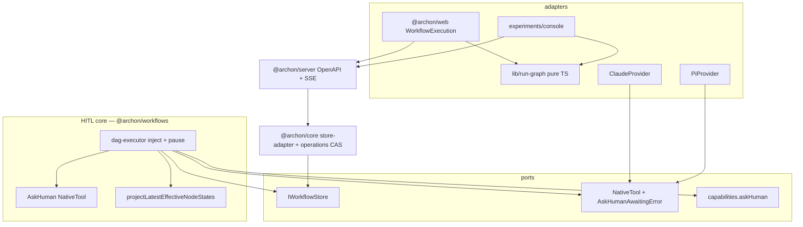
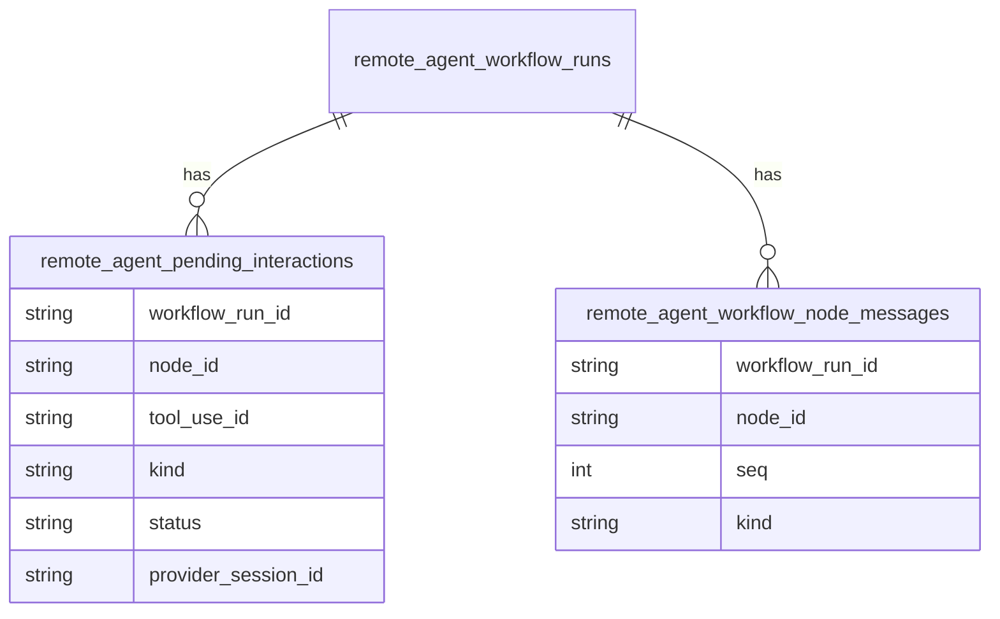

# Architecture Spine — Workflow Run View HITL

## Design Paradigm

**Ports-and-adapters.** HITL core (pending envelope, durable pause/resume, per-node transcript) lives in `@archon/workflows` behind `IWorkflowStore` / `WorkflowDeps` / `@archon/providers/types`. Providers register tools and propagate `AskHumanAwaitingError`; `@archon/core` implements store + answer CAS; `@archon/server` transports; both web surfaces are thin renderers of one contract.



## Invariants & Rules

### AD-1 — `awaiting` node + one `pendingInteractionSchema` [ADOPTED]

- **Binds:** CAP-4, CAP-5, store, executor, server OpenAPI, both UIs
- **Prevents:** Riding AskHuman on `metadata.approval`; inferring cards from `workflow_events` or transcript `status` rows; forked row vs route vs console shapes
- **Rule:** Canonical `pendingInteractionSchema` lives in `packages/workflows/src/schemas/`. Server route schemas import or `.extend` it — they do not fork it. Console may import **types only** from `api.generated.d.ts`. Columns: `workflow_run_id`, `node_id`, `tool_use_id` (this **is** Ask `request_id` and Permission `call_id`; unique per run), `kind` (`ask` | `permission`), `status` (`pending` | `answered` | `purged`), `envelope` JSON (form only, no answer), `answer` JSON nullable, `provider_session_id`, `created_at`, `resolved_at`, `resolved_by`. CAS first-wins on `(workflow_run_id, tool_use_id)`. A node stays `awaiting` until **all** pending rows for `(run_id, node_id)` are resolved. Engine reads/writes **only** through `IWorkflowStore`. Declared gates keep `ApprovalContext`; AskHuman never shares that slot. Add `awaiting` to `nodeStateSchema`, `workflowStepStatusSchema`, **and** server `workflowNodeStateSchema.status`. Run status stays `paused`.

### AD-2 — Ask pause without approval slot; operations own resume [ADOPTED]

- **Binds:** CAP-5, `IWorkflowStore.pauseWorkflowRun`, dag-executor, `workflow-operations`
- **Prevents:** Stamping `metadata.approval` on Ask; second concurrent Ask failing because the run is already `paused`; executor and operations both calling `resumeWorkflowRun`
- **Rule:** Extend `pauseWorkflowRun` so `approvalContext` is optional. Ask pause sets `status='paused'` and **must not** write `metadata.approval`. Ask pause is **idempotent**: already-`paused` + another pending insert is success. Concurrent sibling Ask: persist + tear down **that** node's `sendQuery`; do not fail the node if the run is already paused. In-flight siblings may finish streaming (`shouldContinueStreamingForStatus`); the next DAG layer does not start. Do not write `node_completed` for an asking node. **One Ask-resume owner:** the `workflow-operations` CAS that moves the last `pending` row to `answered`|`purged` is the only caller of `resumeWorkflowRun` for this feature, in the same transaction as the row update. The executor never resumes an Ask pause; it only re-enters on hydrate-when-running. On that hydrate, re-enter **every** node with no `node_completed` and ≥1 `answered` pending row (all concurrent awaiting nodes). Wait indefinitely. Purge pending on cancel/fail; half-committed rows recover on restart; a resume that cannot re-enter **fails the node** and keeps the answer. Child-run Ask: pending rows live on the **child** `run_id`; parent follows existing `workflow:` child-paused behavior; answer the child, not the parent.

### AD-3 — Per-node transcript table [ADOPTED]

- **Binds:** CAP-1, CAP-2, CAP-3, node room
- **Prevents:** Assembling a room from `messages` + `workflow_events`; stuffing cards into transcript `status` rows
- **Rule:** Executor appends to `remote_agent_workflow_node_messages`. Store assigns monotonic `seq` per `(run_id, node_id)`. `kind` + `payload`: `text` → `{ text }`; `tool` → `{ name, id, input?, output? }`; `status` → `{ state, detail? }` (lifecycle notes only — **not** Ask cards). Room and `GET .../nodes/:nodeId/messages` read **this table only**, ordered by `seq`. Cascade-delete with the run. Existing `remote_agent_messages` stay the merged/chat path and are not node-tagged.

### AD-4 — Shared pure-TS run-graph module [ADOPTED]

- **Binds:** CAP-1, both surfaces
- **Prevents:** Two barycenter / port-rule / taken-path implementations; shells forking the module's input type
- **Rule:** Layout, edge routing (distance-aware top vs side ports), taken-path classification live in `packages/web/src/lib/run-graph/` — no React, DOM, or API imports — with its own tests. Public API: `layout({ nodes: { id, nodeState: NodeState }[], edges }) → { positions, routes }`. Taken-path treats `awaiting` as active/on-path, never skipped. This is the **one** sanctioned console isolation exception. Console still must not import `@/components`, `@/stores`, `@/contexts`, `@/routes`, `@/hooks`, `@tanstack/react-query`, or `@/lib/api` **functions**; type-only `api.generated.d.ts` is allowed. Each surface owns its React/SVG shell (pan/zoom, click, cards). Both surfaces **keep** a Logs/log-history view; the graph is an additional entry into the same node room (CAP-1 Logs convention).

### AD-5 — AskHuman owned by workflows; branded error is a `sendQuery` reject [ADOPTED]

- **Binds:** CAP-4, CAP-7, `@archon/workflows`, `@archon/providers/types`, converters
- **Prevents:** Chat-orchestrator injection; workflows importing core; a new YAML field; wrappers turning the awaiting throw into a tool-result string; Ask `inputSchema` crashing flat converters
- **Rule:** `@archon/workflows` owns the `AskHuman` `NativeTool`. `dag-executor` injects it onto `command` / `prompt` / `loop` when `capabilities.askHuman` is true. `AskHumanAwaitingError` is part of `@archon/providers/types`. Handler persists pending then throws that class — it **must not** return a normal tool-result string. Provider wrappers **must not** stringify it; they abort the in-flight query and **reject** `sendQuery` with the same error. Other throws remain tool errors. `NativeTool.handler` stays `Promise<string>` so `manage_run` is unchanged. Converters **must** accept AskHuman `questions` as an array of objects whose fields are strings/enums/booleans (extend the flat converters in this change). New capability `askHuman` (v1: Claude + Pi) plus a `generate:capability-matrix` axis. Inject by default on capable providers. **CAP-7 (ratified narrowing):** run-start fails loud **only** if `allowed_tools` names AskHuman on `askHuman: false`. Other Codex/Grok/OpenCode/Copilot agent runs proceed without the tool. No YAML authoring change. Do not wrap `AskUserQuestion` (AD-9).

### AD-6 — Provider-owned resume injection [ADOPTED]

- **Binds:** CAP-4, Claude/Pi `sendQuery`, `SendQueryOptions`
- **Prevents:** Executor stuffing answers into the prompt while the provider also injects; one resume protocol for both SDKs; three session-id homes
- **Rule:** Injection is **provider-owned**. Executor re-enters with a normal `sendQuery` plus `SendQueryOptions.resumeInteractions: Array<{ tool_use_id, payload, declined }>` (all **answered** rows for that node, store order) and does **not** put answers in the prompt. Claude host-aborts after the custom `mcp__archon__AskHuman` callback persists the Ask, resumes the same provider session with `options.resume`, injects one provider-owned user message, and does not reissue AskHuman. Pi opens the persisted `SessionManager`, appends each matching `ToolResultMessage` through `SessionManager.appendMessage` before `createAgentSession`, constructs the new `AgentSession` from that manager, and calls `session.agent.continue()` (`pi-agent-core` `Agent.continue()` at `0.80.6`; not `AgentSession.continue()`). `provider_session_id` on the pending row is the resume session id; `workflow_node_sessions` is not a second SoT for this path. Same-process seamless resume may skip teardown but must persist pending and use the same `resumeInteractions` contract.

### AD-7 — Dedicated events, GET embed, split POST [ADOPTED]

- **Binds:** CAP-3, CAP-4, CAP-6, SSE, both UIs
- **Prevents:** Reusing `approval_pending`; each surface inventing a GET; `call_id` ≠ `tool_use_id`; reconstructing cards from the SSE buffer
- **Rule:** New `WORKFLOW_EVENT_TYPES`: `node_awaiting`, `interaction_resolved`. Those events are **refetch triggers**, not card payloads. `node_awaiting` write is the same transaction as the pending insert (not best-effort-swallowed). Extend **existing** `GET /api/workflows/runs/:runId` with `pending_interactions: PendingInteraction[]` and `nodeStates[].status` including `awaiting`. Room transcript: `GET /api/workflows/runs/:runId/nodes/:nodeId/messages`. POST ask: `POST /api/workflows/runs/:runId/ask/:requestId/answer` body `{ answers: { questionId, value }[] } | { decline: true }` (`requestId` = `tool_use_id`). POST permission: `POST /api/workflows/runs/:runId/permissions/:callId/confirm` body `{ intent: string }` (`callId` = `tool_use_id`). Ask envelope in the pending row: ordered `questions[]` with `id`, `prompt`, `selection: 'single'|'multi'`, `options: string[]`, `allowOther: boolean`. Other requires non-empty `value` when selected; client Submit disabled until every question is valid; one POST answers the whole card. Surfaces **must not** re-project node status from raw events (legacy `buildDagNodeStatesFromEvents` is not a second lifecycle projector). One projector in `@archon/workflows` (`projectLatestEffectiveNodeStates`): `node_started`→`running`, `node_awaiting` **or** pending rows for that node→`awaiting`, `interaction_resolved` does not complete the node, `node_completed` only when the node actually completes. GET `nodeStates` **must** use that projector. Cards come from `pending_interactions`, never from transcript. CAS first-wins; already-resolved → 409. Only `workflow_runs.user_id` may mutate; missing starter identity fails **when an Ask would be persisted**, not at start of every identity-less CLI run. Use `resolveAuthContext`. Decline delivers `"declined"` into `resumeInteractions`; the **agent** decides the node outcome.

### AD-8 — Additive schema; run-level awaiting is a projection [ADOPTED]

- **Binds:** both dialects, parity test, UIs
- **Prevents:** Adding `awaiting` to `workflowRunStatusSchema`; indexes beside `CREATE TABLE`; SQLite-only or Postgres-only tables
- **Rule:** Both new tables are additive-only, mirrored in `migrations/000_combined.sql` and `sqlite.ts` `createSchema()` / `migrateColumns()`, with indexes and column comments in the trailing section. `bun run check:schema-upgrades` is required. Run chrome "awaiting input" = `status === 'paused'` AND count(pending)>0. Node chrome = projector `awaiting` (AD-7). Awaiting chrome is warning tokens ("waiting on you"), never error/destructive; CAP-7 start failure is the error state.

### AD-9 — AskHuman invocation is the only ask channel [ADOPTED]

- **Binds:** CAP-4, CAP-7, executor, both UIs, Claude/Pi adapters
- **Prevents:** Classifying assistant prose as an ask; wiring Claude `AskUserQuestion` + `defer` as a second contract; treating console Reply as a HITL channel
- **Rule:** Awaiting triggers only on the `AskHuman` tool invocation (system-prompt + tool description teach the model to call it). Never prose-sniff, never `until:`-style sentinels, never chat-orchestrator injection of AskHuman. A model that asks in prose is an accepted residual — not engine-visible. Do not implement or wrap `AskUserQuestion`. Console composer/Reply is not an ask path.

## Consistency Conventions

| Concern            | Convention                                                                                                                                                                                                          |
| ------------------ | ------------------------------------------------------------------------------------------------------------------------------------------------------------------------------------------------------------------- |
| Table names        | `remote_agent_pending_interactions`, `remote_agent_workflow_node_messages`                                                                                                                                          |
| AskHuman tool name | `AskHuman` (Claude MCP: `mcp__archon__AskHuman`)                                                                                                                                                                    |
| Envelope           | One `pendingInteractionSchema` for Ask + Permission; response types stay split (AD-7)                                                                                                                               |
| Card identity      | `tool_use_id` unique per run = `request_id` = `call_id`                                                                                                                                                             |
| Unified render     | Same envelope, states, validity, and copy — **not** a shared React NodePanel                                                                                                                                        |
| CAP-1 Logs         | Unmerged node-**run** rows (iteration = its own row); graph is an extra door; one panel instance per surface                                                                                                        |
| Awaiting tone      | Warning / "waiting on you"; never `--error`. Teammate copy is factual, names the starter, no Submit/Decline                                                                                                         |
| Node taxonomy      | Agent room + ad-hoc HITL: `command`/`prompt`/`loop` only. `route_loop` = controller. `loop_group` = container. `bash`/`script` = stdout. `approval`/`plannotator_gate` = declared gate. `workflow` = child-run link |
| Store ports        | `insertPendingInteraction`, `resolvePendingInteraction` (CAS), `listPendingInteractions`, `appendNodeMessage`, `listNodeMessages`; `pauseWorkflowRun(id, approvalContext?)`                                         |
| Capability matrix  | New `askHuman` axis in `scripts/generate-capability-matrix.ts` (CI already fails without it)                                                                                                                        |
| Auth               | Starter = `workflow_runs.user_id`; teammate views read-only                                                                                                                                                         |
| Types              | Engine Zod in `packages/workflows/src/schemas/`; routes import it; web + console consume `api.generated.d.ts` types only                                                                                            |
| Logging            | `workflow.ask_pending` / `workflow.ask_resolved` / `workflow.ask_resume_failed`; never log answer bodies                                                                                                            |
| Claude SDK         | Intercept `AskHuman` tool invocation. Exact manifest and lockfile version is **0.3.209**. The Story 6.1 isolated `0.3.261` comparison does not authorize a floating range.                                          |

## Stack

| Name                                      | Version                                                                                        |
| ----------------------------------------- | ---------------------------------------------------------------------------------------------- |
| Bun + TypeScript                          | workspace (`^1.3` / `^5.3`)                                                                    |
| Hono + `@hono/zod-openapi`                | workspace (`^4.12.16` / `^1.4.0`)                                                              |
| React / Vite / Tailwind v4 / Zustand      | `@archon/web` (`^19` / `^6` / v4 / `^5.0.12`)                                                  |
| `@anthropic-ai/claude-agent-sdk`          | **0.3.209** (exact; Story 6.1 isolated 0.3.261 comparison does not authorize a floating range) |
| `@earendil-works/pi-coding-agent`         | `^0.80.6` (lock 0.80.6; `continue()` via `session.agent`)                                      |
| SQLite (`bun:sqlite`) / PostgreSQL (`pg`) | workspace default / `^8.11.0`                                                                  |

No new frontend dependency for the graph module.

## Structural Seed

```text
packages/workflows/src/
  ask-human.ts              # NativeTool + AskHumanAwaitingError throw
  store.ts                  # pending + transcript + optional-approval pause
  schemas/                  # pendingInteractionSchema + nodeMessageSchema
  node-state.ts             # sole projector (awaiting from pending / node_awaiting)
  dag-executor.ts           # inject, intercept, pause; hydrate re-enters all awaiting
packages/providers/src/
  types.ts                  # AskHumanAwaitingError; SendQueryOptions.resumeInteractions
  claude/ + community/pi/   # reject branded error; register; Pi continue
  **/capabilities.ts        # askHuman: true only claude, pi
packages/core/src/
  db/adapters/              # both dialects + parity
  workflows/store-adapter.ts
  workflows/workflow-operations.ts  # ONLY Ask resume caller
packages/server/src/routes/
  schemas/                  # import pendingInteractionSchema
  api.ts                    # GET run embed + messages GET + two POSTs + SSE
packages/web/src/lib/run-graph/     # AD-4 layout()
packages/web/src/components/workflows/   # legacy shells
packages/web/src/experiments/console/    # log-first shells; run-graph + generated types only
```



## Capability → Architecture Map

| Capability                               | Lives in                                             | Governed by                        |
| ---------------------------------------- | ---------------------------------------------------- | ---------------------------------- |
| CAP-1 Graph + Logs retained              | `run-graph` + Logs list + panel shells               | AD-4, CAP-1 Logs convention        |
| CAP-2 Per-type node panel / agent room   | transcript GET + panel shells                        | AD-3                               |
| CAP-3 Chat timeline + Ask inline in room | pending embed + transcript + cards                   | AD-3, AD-7, AD-9                   |
| CAP-4 Ask contract                       | AskHuman + envelope + answer POST                    | AD-5, AD-6, AD-7, AD-9             |
| CAP-5 Concurrency / last-clears          | pending table + idempotent pause + all-node re-enter | AD-1, AD-2                         |
| CAP-6 Starter-only answer                | fail at persist-Ask, not at every CLI start          | AD-7                               |
| CAP-7 Unsupported provider               | `allowed_tools` + `askHuman` at run-start            | AD-5 (explicit-name only)          |
| Permission envelope (dormant)            | same schema; `call_id` ≡ `tool_use_id`; `{ intent }` | AD-1, AD-7; variant cards deferred |

## Deferred

| Item                                             | Why it can wait                                                                                                                                                                                                                          |
| ------------------------------------------------ | ---------------------------------------------------------------------------------------------------------------------------------------------------------------------------------------------------------------------------------------- |
| Per-node independent scheduling                  | AD-2 covers v1; revisit when a real run has long parallel branches that must progress past a sibling ask                                                                                                                                 |
| Permission variant cards + live activation       | Envelope/`kind`/`call_id`/`{ intent }` are in-scope (AD-1, AD-7); **cards** wait for an activation source                                                                                                                                |
| Changing `NativeTool.handler` return type        | Branded throw + wrapper reject keeps `manage_run` on `Promise<string>`                                                                                                                                                                   |
| CLI / chat / `manage_run` answer UX              | Same REST/store; surfaces after web                                                                                                                                                                                                      |
| New deploy / env / infra topology                | Feature rides the existing single-tenant install, SSE, and additive schema                                                                                                                                                               |
| Source-control viewer reuse inside the node room | Separate spine; do not import `/console`                                                                                                                                                                                                 |
| Claude `tool_deferred` / PreToolUse `defer`      | Resolved by Story 6.1: exact `0.3.209` uses host abort, same-session `options.resume`, and one provider-owned user message with no AskHuman reissue. Isolated `0.3.261` defer is comparison evidence only and is not an active protocol. |
| Pi reopen-after-dispose continue                 | Resolved by Story 6.1: `SessionManager.open`, `appendMessage(ToolResultMessage)`, `createAgentSession`, then `session.agent.continue()`.                                                                                                 |
