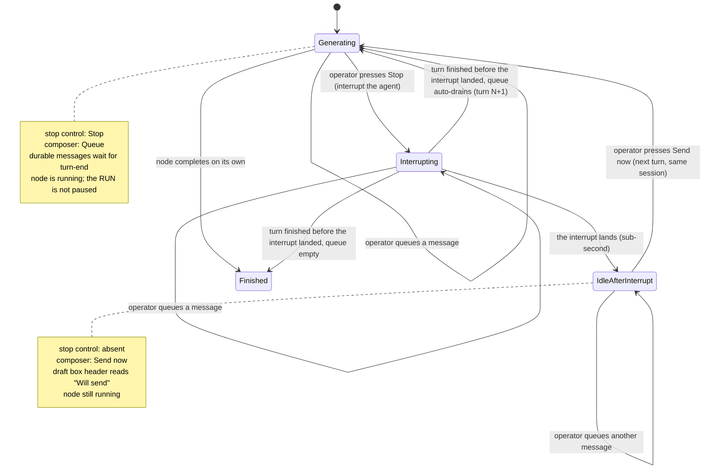

# Control states

The two controls in a node room — the stop control and the send control, both on the composer dock pinned to the bottom of the node panel — and what each reads in every state.

> **This is the ratified UX, re-expressed after the reframe.** The interaction Kevin settled in the UX run survives almost intact: **Stop + `Queue` while the agent is working, `Send now` after.** The controls follow the agent's sub-state inside `node = running`, not a node-lifecycle state. Stop ends the agent's current turn through the provider's `interruptSignal` implementation, while the node and provider session remain available. The visual and behavioural specs remain `ux-Archon-agent-node-room-2026-09-09/{DESIGN,EXPERIENCE}.md`.

The dock is where the controls live because the shipped panel header cannot hold them: it is a `flex-wrap` row already carrying eight items at Legacy's 460px, so a control placed there wraps, and the control that stops an agent must not. Settled during the UX run.

Both follow **the agent's sub-state**, never a mode the operator has to remember setting. There is no toggle anywhere, so there is nothing to leave in the wrong position.

## The table

| Agent sub-state (node stays `running`) | Stop                         | Send       | What sending does                                                                                                                                                                                                                                                                                                                           |
| -------------------------------------- | ---------------------------- | ---------- | ------------------------------------------------------------------------------------------------------------------------------------------------------------------------------------------------------------------------------------------------------------------------------------------------------------------------------------------- |
| **generating**                         | `Stop`                       | `Queue`    | Persists the message in the node queue; it is delivered as the next turn when the current turn ends naturally. The agent is untouched — nothing interrupted, nothing lost.                                                                                                                                                                  |
| **interrupting**                       | `Stopping…`, `aria-disabled` | `Queue`    | The provider interrupt is in flight. If shown, this state is brief and never uses a progress bar. **`aria-disabled`, never the `disabled` attribute** — the native one blurs the element that carries it, so the operator who just pressed the control lands on `<body>`.                                                                   |
| **idle-after-interrupt**               | —                            | `Send now` | `Send now` persists the newly typed message and asks the executor to claim the durable queue — queued then just-typed, in server FIFO order — as the **next turn on the same live session**. The agent continues and the node never left `running`. Typing in the composer keeps the node open by re-arming the 30-minute inactivity timer. |
| **recovery required**                  | —                            | —          | A server restart restored the author's draft and the node queue, but no live provider process is assumed. The band is read-only and states `restored after server restart · Resume the workflow to continue`. The operator uses the existing run-level Resume action.                                                                       |
| **finished**                           | —                            | —          | Nothing can be steered. The field and controls are absent. Durable undelivered content remains readable with its verified delivery state, and a saved draft is not discarded. With no durable content there is no dock.                                                                                                                     |

The transition is **symmetric and automatic**. The moment the agent starts generating again, the send control says `Queue` again and `Stop` returns to the dock — same instant, same signal. Nothing stays stuck in send mode.

## Viewing a finished iteration of a live loop node

The operator reaches a finished iteration through the **`Execution` selection controls** (header select, Logs row, or graph occurrence) while the node is still `running`/`awaiting`. Story 1.7 `Jump to` stays scroll-only and is not this entry point. The dock does **not** steer that finished iteration — send, withdraw, and interrupt **mutations** only ever act on the live one.

- The dock collapses to one line — `reading a finished iteration · the agent is working in iteration N` — plus a `Go to iteration N` control that returns to the live dock via the existing execution-selection callback.
- Below it, a **read-only** band mirrors the node's durable shared queue across operators and tabs. The pending messages are inert here, with no `Send now`, delete, next-out mark, or Stop. They remain queued for the live iteration. The band appears only when it has content and caps at `33vh`.
- The composer is absent and the client issues no send, withdraw, or interrupt mutation for a finished iteration. The authenticated node-scoped queue read is allowed so the band stays current. Mutation routes stay keyed `(runId, nodeId)` and are not iteration-aware. A terminal node returns `409 node_finished`, while a restored node without a live process reports recovery-required state without guessing process origin.
- That finished iteration's **already-delivered** operator messages are read back from the transcript itself (its occurrence group, FR6/FR11 / Story 2.8), not from this band.

This is distinct from viewing a non-live **execution** (a different run), where the dock is fully absent.

## The run keeps going — `Stop` interrupts the agent, not the run `[reframe consequence — confirm against EXPERIENCE.md]`

This inverts the guidance the UX run wrote under the old durable model. Back then `Stop` paused the **whole run**: sibling nodes froze, no later layer started, and the interface was told _not_ to imply the rest of the run was still progressing. Under the reframe, `Stop` interrupts only **this agent's current generation**; the node stays `running` and **the rest of the run is unaffected** — independent siblings and later layers keep going. So the interface must now do the opposite: it must **not** imply the run stopped. Only the agent's current thought was interrupted, and this one node is waiting for the operator. `EXPERIENCE.md` copy built on "the run is paused" needs this correction — that spine is owned by the UX run, flagged here as a dependency.

## Why the stop is explicit

A redirect **interrupts the agent's current thinking** — it ends the turn the agent is in. Making that an explicit `Stop` the operator presses, rather than something a `Send` does silently, keeps the control honest about what it does: the operator sees that redirecting cuts off the current thought. That costs one click and buys an interface that matches its own mechanism.

(The old rationale also argued the stop was forced because "no provider has an inbound channel yet." That mechanism argument is **retired** — every provider can be interrupted, and claude/omp can even take a message mid-turn without interrupting. The honesty argument is why the explicit `Stop` stays; the mechanism no longer requires it.)

When mid-turn delivery is used (CAP-12, where the provider's stream takes a message without interrupting — claude today), a second path appears **while generating**: send without interrupting. It is honest there because the mechanism genuinely does not interrupt anything. The states above do not move; one gains an extra option.

## Behaviour inside a state

**Queueing.** A newly typed message joins the **end** of the queue rather than jumping it, so the agent reads corrections in the order the operator thought of them.

**Per-item send follows verified capability data.** A provider with exercised soft injection exposes `Send now` on each queued item while generating. A queue-only provider omits the action instead of drawing a disabled control.

**The draft and queue bands.** The author's composer draft and the node queue are server-persisted and render only when they hold content. Queue headings read `Queued` while generating and `Will send` while idle-after-interrupt. Terminal and recovery views use verified delivery wording rather than claiming that content remained in one browser tab.

**On send.** The executor atomically claims durable queue items before delivery. A confirmed failure returns the item to the front of the queue. An outcome made ambiguous by process loss becomes `delivery unknown` and is never resent automatically.

**Send now uses the durable queue as its server gate.** A send that arrives while Stop is landing waits durably until the operator presses `Send now`. An interrupted node drains only on `Send now`, never automatically. A finished node returns `409 node_finished`. A restored node without a live provider process keeps its durable content and directs the user to the existing Resume action.

**Nothing follows a flickering busy signal.** Controls follow the agent's projected sub-state (`generating` | `idle-after-interrupt`), a typed field the core emits — not a raw "is a chunk arriving right now" signal that flickers and makes the affordance appear and disappear under the operator's cursor.

**Auto-send.** The durable `Auto-send` pill sends one queued item after each natural agent reply in server FIFO order. It does not fire after an interrupted turn. Disabling it preserves every queued item.

**Message status.** Draft, queued, dispatching, sent, delivered, delivery unknown, withdrawn, and failed are distinct states. `delivered` requires provider acknowledgement for the stamped message id. A provider without that evidence never advances by matching text or timestamps.

## What the stop control must not imply

Stop preserves session state up to the last completed provider action. It does **not** roll back files the agent already wrote. The control means "end this turn and wait for me", never "undo", and the wording must carry that when the operator is most likely to assume cleanup occurred.
