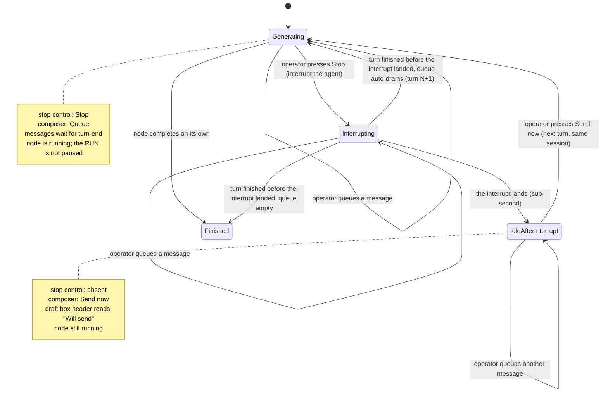

# Control states

The stop control, composer send control, per-item send control, and approved room controls in every node-room state.

> **This is the ratified UX, re-expressed after the reframe.**
> The interaction Kevin settled in the UX run survives almost intact: **Stop + `Queue` while the agent is working, `Send now` after.**
> What the reframe changed is the _mechanism and the lifecycle underneath it_, and three consequences follow (flagged inline): the node **never pauses** — the controls now follow the **agent's** sub-state inside `node = running` (`generating` | `idle-after-interrupt`, spine AD-9), not a node-lifecycle state; `Stop` interrupts the **agent's current generation**, it does not stop the node (stopping the node is the separate **Cancel** button); and the in-flight wait shrinks from a 10-second database poll to a **sub-second** in-process interrupt ack.
> The visual and behavioural specs remain `ux-Archon-agent-node-room-2026-09-09/{DESIGN,EXPERIENCE}.md`.

The dock is where the controls live because the shipped panel header cannot hold them: it is a `flex-wrap` row already carrying eight items at Legacy's 460px, so a control placed there wraps, and the control that stops an agent must not.
This placement was settled during the UX run.

The stop and composer send controls follow **the agent's sub-state**, never a remembered mode.
The approved provider selector exposes the real transport mode for the selected provider and decides whether per-item `Send now` executes or shows a refusal.

## The table

| Agent sub-state (node stays `running`) | Stop                         | Send       | What sending does                                                                                                                                                                                                                                                                                                                                                                                                                      |
| -------------------------------------- | ---------------------------- | ---------- | -------------------------------------------------------------------------------------------------------------------------------------------------------------------------------------------------------------------------------------------------------------------------------------------------------------------------------------------------------------------------------------------------------------------------------------- |
| **generating**                         | `Stop`                       | `Queue`    | Holds the new draft for the next natural boundary; every queued item also shows `Send now`, which soft-injects on Claude and OMP or shows a clear refusal without dequeueing on other providers.                                                                                                                                                                                                                                       |
| **interrupting**                       | `Stopping…`, `aria-disabled` | `Queue`    | The interrupt is in flight. Now **sub-second** (a provider primitive / stream-abort in-process, not a 10s poll) — whether to show this state at all is Kevin's call; if shown, it must be brief. **`aria-disabled`, never the `disabled` attribute** — the native one blurs the element that carries it, so the operator who just pressed the control lands on `<body>`.                                                               |
| **idle-after-interrupt**               | —                            | `Send now` | The queued messages are already on the registry; `Send now` dispatches the newly typed one, and the executor flushes the registry — queued then just-typed, in receipt/written order — as the **next turn on the same live session**; the agent continues. The node never left `running`. Typing in the composer keeps the node open — the 30-minute idle-await timer is an inactivity timer re-armed by composer activity (SC 2.2.1). |
| **finished**                           | —                            | —          | Nothing. The field and both controls are absent. The dock reduces to an undelivered draft box, rendered read-only and stating that the node finished and the messages never left — a half-typed line in the field folds in as its last item rather than vanishing. With nothing undelivered there is no dock at all.                                                                                                                   |

The transition is **symmetric and automatic**.
The moment the agent starts generating again, the send control says `Queue` again and `Stop` returns to the dock — same instant, same signal.
Nothing stays stuck in send mode.

## Viewing a finished iteration of a live loop node

The operator reaches a finished iteration through the **`Execution` selection controls** (header select, Logs row, or graph occurrence) while the node is still `running`/`awaiting`.
Story 1.7 `Jump to` stays scroll-only and is not this entry point.
The dock does **not** steer that finished iteration — send, withdraw, and interrupt **mutations** only ever act on the live one.

- The dock collapses to one line — `reading a finished iteration · the agent is working in iteration N` — plus a `Go to iteration N` control that returns to the live dock via the existing execution-selection callback.
- Below it, a **read-only** band mirrors the **node's shared** registry queue across operators/tabs (Story 2.9) — still-pending messages, inert here (no `Send now`, no delete, no next-out mark, and no interrupt).
  They are not lost: they deliver when the operator returns to the live iteration.
  The band appears only when `sent.length > 0` (no empty shell) and caps at `33vh`.
- The composer is absent and the client normally issues no send, withdraw, interrupt, or keepalive mutation from a finished-iteration view.
  Every mutation carries the selected `retry_epoch`.
  If a delayed event or replay does issue one, the server compares it with the live handle and returns `stale_retry_epoch` before any state change.
  The authenticated node-scoped `GET …/queue` poll remains allowed so the shared band stays current.
- That finished iteration's **already-delivered** operator messages are read back from the transcript itself (its occurrence group, FR6/FR11 / Story 2.8), not from this band.

This is distinct from viewing a non-live **execution** (a different run), where the dock is fully absent.

## The run keeps going — `Stop` interrupts the agent, not the run `[reframe consequence — confirm against EXPERIENCE.md]`

This inverts the guidance the UX run wrote under the old durable model.
Back then, `Stop` paused the **whole run**: sibling nodes froze, no later layer started, and the interface was told _not_ to imply the rest of the run was still progressing.
Under the reframe, `Stop` interrupts only **this agent's current generation**; the node stays `running` and **the rest of the run is unaffected** — independent siblings and later layers keep going.
The interface must now do the opposite: it must **not** imply the run stopped.
Only the agent's current thought was interrupted, and this one node is waiting for the operator.
`EXPERIENCE.md` copy built on "the run is paused" needs this correction — that spine is owned by the UX run and is flagged here as a dependency.

## Why the stop is explicit

A redirect **interrupts the agent's current thinking** — it ends the turn the agent is in.
Making that an explicit `Stop` the operator presses, rather than something a `Send` does silently, keeps the control honest about what it does: the operator sees that redirecting cuts off the current thought.
That costs one click and buys an interface that matches its own mechanism.

(The old rationale also argued the stop was forced because "no provider has an inbound channel yet.")
That mechanism argument is **retired** — every provider can be interrupted, and Claude/OMP can even take a message mid-turn without interrupting.
The honesty argument is why the explicit `Stop` stays; the mechanism no longer requires it.

Mid-turn delivery is current behavior for Claude and OMP.
While generating, each queued item shows `Send now`.
The selected item enters the active turn without interruption when the provider supports soft-inject.
The same control stays visible on other providers and explains that the provider cannot send mid-turn; the item remains queued.
The agent sub-state does not change in either case.

## Behaviour inside a state

**Queueing.**
A newly typed message joins the **end** of the queue rather than jumping it, so the agent reads corrections in the order the operator thought of them.

**Per-item send while generating.**
Every queued row has `Send now` and delete.
`Send now` soft-injects only on a provider with an exercised transport.
On a provider without soft-inject, activating it produces the inline `Cannot send during this provider's active turn` refusal and keeps the row and its order unchanged.

**Draft and queued scope.**
The words `this tab only` qualify only text that is still unsent in the composer, even when the draft and queued rows share a combined surface.
Queued rows are node-scoped and shared across tabs and operators.
The surface renders only when it holds something.
Its queued header reads `Queued` while generating, `Will send` while `idle-after-interrupt`, and `Never sent` once the node has finished and the box is read-only.

**Queue layout.**
A full Legacy or Console room uses the full-bleed queue band.
The compact dock and state-review layout uses the inset queue well.
Both display the same shared ordered queue.
The live queue surface can collapse without changing queue contents.
Each live queued row shows its ordinal, and the first row has the next-out treatment.
The read-only finished-iteration queue keeps order but omits next-out and item actions.

**On send.**
Every queued item leaves the box before delivery starts, so nothing can be picked up twice.
If delivery fails, items return to the **front** of the queue rather than being dropped.

**Send now needs no durable phase gate.**
There is no durable stop marker or phase because the node never left `running`.
The registry queue absorbs an interrupt race: a Send that arrives while the interrupt lands waits until the operator presses `Send now`, and an interrupted node never drains automatically.
The server still validates the mutation `retry_epoch`, terminal state, in-process handle, and provider soft-inject capability.
The old `409` on `phase:'stop'` is gone with the durable marker it guarded.

**Nothing follows a flickering busy signal.**
Controls follow the agent's projected sub-state (`generating` | `idle-after-interrupt`), a typed field the core emits — not a raw "is a chunk arriving right now" signal that flickers and makes the affordance appear and disappear under the operator's cursor.

**Message status.**
Three states exist: draft, `sent`, and `delivered`.
A message becomes `delivered` only after the provider confirms the exact caller-stamped message id.
G1 makes the Claude SDK upgrade to at least 0.3.246 current release work.
Providers without exact-id confirmation remain at `sent`.

## Approved room controls

The approved top controls are product behavior, not documentation scaffolding.
The numbered state controls select the complete state presentation and keep the run, node, transcript, todo, queue, and dock data consistent.
The node-kind control selects the prompt or `loop ×3` execution presentation.
The provider control selects the Claude soft-inject or queue-only presentation and updates per-item capability feedback.
`Cancel` remains the separate lifecycle action while the run is active.
`Re-run` appears for completed and failed runs and starts a new execution through the existing rerun behavior.
`Log` or `Logs`, `Graph`, and the counted `Artifacts` control navigate to their existing surfaces without changing run state.
Selecting a Logs execution row synchronizes the row, room header, transcript, and `Execution` control.
The node-room `✕` closes the room and returns focus through the existing panel-close behavior.

## What the stop control must not imply

Interrupting saves session state up to the last completed tool call.
It does **not** roll back files the agent already wrote.
The control means "stop thinking and wait for me", never "undo" — and the wording has to carry that, because an operator stops exactly when they believe something is going wrong, which is when they are most likely to assume it cleans up after itself.
This is also why `Stop` must read clearly as _interrupt the agent_, distinct from the **Cancel** button that tears the whole node down.
