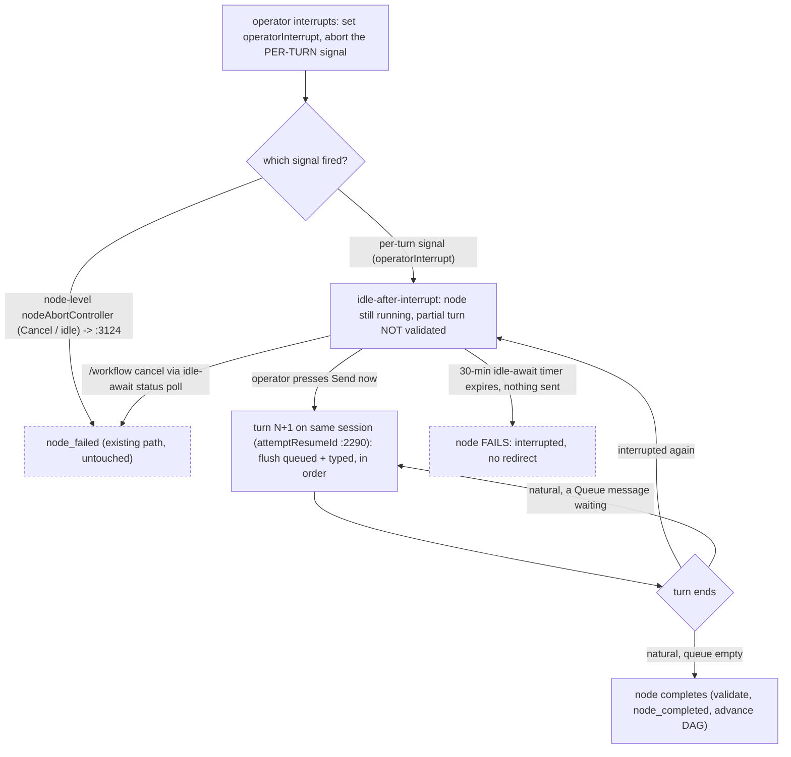

# Engine integration

Everything between the browser and the provider seam.
The provider matrix answers _can the agent hear us_; this document answers _can anything in Archon reach the agent to speak, and what does the engine do after_.
Four findings are verified against source, and each one decides work that the capabilities need.

The frame is the one the spine fixes: steering acts on the **live agent**, never on the node lifecycle.
The node stays `running` throughout — there is no durable marker, no run pause, and no stop-and-resume.
This document explains how the executor reaches the live session, interrupts it without failing the node, and runs more than one turn on it.

The visible multi-occurrence vocabulary uses primary `Run N` in occurrence order.
Loop iteration, provider pass, retry, and interruption context follows as a suffix where relevant.

## 1. Interrupt is a provider primitive on the live handle — and the abort plumbing already exists

Interrupting the agent's current generation is not a database signal; it is a direct call on the node's **live session handle**, held in the in-process registry (§3).
Claude exposes it natively (`query.interrupt()`); a provider without a keep-alive interrupt gets a **stream-abort on a per-turn signal** (§2), which ends the turn while the provider's thread/session survives for a follow-up run (Codex re-runs it — `codex.resumeThread(sessionId)`, `providers/src/codex/provider.ts:1006`).

The abort machinery already exists in the executor.
Today it serves **Cancel**, through the one-shot `nodeAbortController` (`:2209`).
Steering does **not** reuse that controller (§2 explains why it cannot) — it adds a per-turn signal beside it, so Cancel's path stays byte-for-byte unchanged and the only real difference is what the executor does after an interrupt (§2).

The old design routed the stop through the database cancel-check (`dag-executor.ts:2304-2334`, every `CANCEL_CHECK_INTERVAL_MS` = 10s, `:682`).
That design is gone.
A database poll was the mechanism for reaching a run in another process; the clean model is in-process only (§3), so the interrupt is a direct in-memory call with no 10-second floor and no silent-long-tool-call blind spot.
The poll remains what it always was — Cancel's path — untouched.

## 2. The node keeps running — a per-turn signal, and the turn loop, are the delta

**The node-level abort controller is one-shot, and it is Cancel's — steering cannot use it.**
The executor creates `nodeAbortController` once per node (`:2209`) and passes its signal to `sendQuery` (`:2223`).
Three sites read that signal, and all three are Cancel's:

> `dag-executor.ts:3124` — `if (nodeAbortController.signal.aborted && !nodeIdleTimedOut)` → `node_failed` + `recordFailedStatus('Cancelled by user')`.
> This path does **not** throw, so it never reaches the catch-block classifier at `:3387`.
> `:3032` — the re-ask loop continues only `while (… && !nodeAbortController.signal.aborted)`.
> `:2298` / `:2325` — the idle-timeout callback and the chunk-driven cancel-poll are what abort it.

An `AbortController` fires **once**.
If steering aborted `nodeAbortController` to end turn N, turn N+1's `sendQuery` — which receives that same signal (`:2223`/`:2290`) — would abort on arrival, and the re-ask loop (`:3032`) would refuse to continue.
Therefore, steering **cannot** reuse it.

**Steering interrupts through a fresh per-turn signal.**
`sendQuery` receives the combination `AbortSignal.any([nodeAbortController.signal, perTurnSignal])`: **Cancel** (node-level) or a **steering interrupt** (per-turn) both end the current turn, but each new turn gets a **fresh** per-turn signal while `nodeAbortController` persists across turns — which is exactly what makes multi-turn possible.
The registry's interrupt reads the active turn's handle and aborts its per-turn signal **synchronously** (no `await` between read and abort), so on the single-threaded loop it can never fire a torn-down controller.

**`operatorInterrupt` is a per-turn flag, resolved by placement in the existing flow.**
The execution order is `stream (:2290) → validation → canReask (:3032) → :3124 Cancel check → completion`.
Because a steering abort touches only the per-turn signal, **`:3124` is never tripped by steering** (Cancel-only, byte-for-byte).
The flag is set when steering fires the per-turn abort, and three edits at three existing points close the gaps a bare flag would leave:

- **(1) `canReask` (`:3032`) must also stop on `operatorInterrupt`.**
  Today it guards only on `!nodeAbortController.signal.aborted`, which a per-turn abort does not set — so without this guard the structured-output re-ask would fire on the interrupted partial and re-run the wrong work (the adversarial "re-ask vs steering own the same slot" hole).
  The `:3030` comment already names the intent — _"Don't reask after an idle-timeout/abort — those are genuine failures, not validation misses"_ — so `&& !operatorInterrupt` extends a guard the design already reasons about; it is one token at a point built for exactly this distinction.
- **(2) Validation is skipped on an interrupted turn** — no validation-miss events for a turn the operator deliberately cut.
- **(3) The `operatorInterrupt` branch sits immediately after the `:3124` Cancel check**, so a co-firing `/workflow cancel` wins by position — no ordering rule to invent.
- **The flag is per-turn**: reset when the loop starts turn N+1, so a stale flag can never abort or mis-route a later turn.
- **The end cause is a five-case rule the executor resolves, not "did the turn emit a `result`" alone.**
  The executor consumes a **provider-normalized** `msg.type === 'result'` (`:2533`), but a stream-abort is **not** uniformly result-free: DeepSeek emits a terminal `result` marked `stopReason:'aborted'` / `errorSubtype:'deepseek_aborted'` (`providers/src/community/deepseek/acp-client.ts:105`), and OMP **throws** `Query aborted` (`providers/src/community/omp/provider.ts:317,450`), caught at `:3332` as `dag_node_failed`.
  When `operatorInterrupt` fired, the executor resolves five cases: **(1)** `result`, no abort marker → **natural** end, spent, complete/auto-drain; **(2)** `result` with an abort marker → **interrupted** end → idle-await; **(3)** a thrown abort caught at `:3332` → **interrupted** end → idle-await, not `node_failed`; **(4)** a throw with the flag unset → genuine `node_failed`; **(5)** node Cancel (`:3124`) dominates by position.
  The executor **classifies** the abort-marked `result` and the abort throw; the adapter **never suppresses** them (Fail-Fast — they stay visible to other consumers).
  This rule applies on both `executeNodeInternal` and `executeLoopNode`.

**Turn-end has two causes, and the loop distinguishes them:**

- **Natural end** — the agent finished the turn on its own.
  The queue **auto-drains**: a queued message → run turn N+1; queue empty → **node completes** (validate `output_format`, write `node_completed`, advance the DAG — the existing terminal path).
  Auto-delivery at the natural boundary is `Queue`'s contract.
  A `Queue`d message is already on the **in-process registry queue** — it was dispatched to the send route at `Queue`-press, not at this boundary — so the executor simply finds it here and runs turn N+1; there is no client dispatch racing this completion check.
  The client draft box holds only text still being composed; deletion of a queued message goes through the idempotent withdraw route.
  The two-queue split is typing, client draft, versus queued, server registry.
- **Interrupted end** — `operatorInterrupt` is set.
  The turn produced a **partial** result: no schema-valid `output_format`, and maybe a half-written tool call.
  The executor must **not** validate it, write `node_completed`, or advance the DAG.
  It **always** enters **idle-await**, _whatever the queue holds_ — it never auto-fires.
  The **only** exits are the operator's **`Send now`** and the idle-await timeout (below).
  The queued messages are already on the registry from the `Queue` press; `Send now` dispatches the newly typed one, and the executor flushes the queued messages and then this one in receipt/written order before turn N+1.
  This rule preserves the ratified `Send now` moment (`control-states.md`): after Stop, the operator adds the final correction before anything is sent.

**Per-item `Send now` is current during generation only on a proven Archon live-turn transport.**
It sends exactly the selected queued message into the active turn without Stop, a natural-end wait, or a new turn.
Claude streaming input, Grok live input, and OMP RPC are current G2/G3/G4 release proof gates; none is established by an advertised provider feature alone.
Grok must pass its actual Archon same-turn and causal receipt gate in this release.
Codex, DeepSeek, and Grok `--single` are queue-only modes and omit the action.
A direct unsupported request returns `soft_inject_unavailable` without queue mutation.
The selected-item path is separate from the dock `Send now` next-turn flush after Stop.

**A steered node runs multiple turns on one live session.**
Continuing across turns reuses a seam that already exists:

> `dag-executor.ts:2290` — the structured-output re-ask already re-invokes `sendQuery` with `attemptResumeId` on the **same** session when a turn's output fails validation.

The precedent is close but **imperfect, and the difference is the new code**: re-ask re-enters on a _validation miss_ from a state the executor treats as recoverable; steering re-enters on an _interrupt_ (or a queued Send at natural turn-end) from a state the executor today treats as **terminal** (`:3124`).
The `operatorInterrupt` branch and the queue check are the delta; the session-resume carriage is reused as-is.

**The idle-await bound — fail after 30 minutes (owner-ratified), and how Cancel reaches it.**
Idle-await arms a **fresh 30-minute timer** on entry — reusing neither the streaming `withIdleTimeout` wrapper (`:2298`; no stream to wrap) nor its `nodeIdleTimedOut` outcome, which _completes_ the node (`:3118`: `completed via idle timeout`, and the `!nodeIdleTimedOut` guard at `:3124` keeps it out of the fail branch).
Reusing that path would _complete-with-partial-output_ — the garbage AD-4 forbids.
On expiry, the timer takes an **explicit fail** branch: `interrupted by operator, no redirect received`; rerunning it with `workflow retry-node <run-id> <node-id>` re-runs the node with a **fresh session** (the interrupted context is gone — there is no durable session for a steer).
Cancel is the subtle part: `/workflow cancel` is a DB status normally read by the chunk-driven cancel-poll (`:2312`) — which is **dormant** in idle-await because there is no stream.
Idle-await therefore runs its **own timer-driven poll** of `getWorkflowRunStatus` at `CANCEL_CHECK_INTERVAL_MS` (`:682`), reusing `shouldContinueStreamingForStatus` (`:700-702`) and taking the existing Cancel ending when the run is no longer streamable.
**Idle-await resolves exactly once** — the first of `Send now`, the cancel-poll, or the 30-minute timer wins; the other two are torn down.
Cancel's _code_ is untouched — idle-await adds a poll that _reaches_ it.
The rejected bounds are **wait-forever**, which is fragile in-process (§3), and **complete-with-partial**, which is the do-nothing bug.

Note the deliberately-dropped invariant: `shouldContinueStreamingForStatus` (`:700-702`) returns true for both `running` and `paused` so a concurrent Ask gate does not kill a sibling mid-stream.
Steering never relies on this invariant because steering never changes the run status — the node simply stays `running` and its turn loop runs again.

## 3. Where the executor runs decides whether a run is steerable at all

| How the run started | Where the executor runs                                                                                                           |
| ------------------- | --------------------------------------------------------------------------------------------------------------------------------- |
| Web dispatch        | **In the API server process** — `packages/server/src/routes/api.ts:3200-3228` dynamically imports `executeWorkflow` and awaits it |
| CLI `--detach`      | **A detached child in its own process group** — `packages/cli/src/commands/workflow.ts:696-722`                                   |

Under the old durable design, the stop travelled through the database, so it reached a detached run.
The clean model has **no durable steering state** — the interrupt, the inbound queue, and the live session handle all live in an **in-process registry** keyed `(runId, nodeId)`, valid only while the node runs _in this process_.
The process boundary now binds **all** of steering, not only mid-turn delivery:

- A run whose executor is **in this process** (web dispatch) is fully steerable.
- A run whose executor is a **detached child** has no reachable live handle → Send and Interrupt return a clear "not steerable here" (the UI states it).
  Cancel and normal `/workflow resume` still work on it.

This is the accepted process boundary.
A server restart drops the registry, live session, timer, and in-flight steer but leaves a durable non-terminal run.
Archon does not autonomously fail or resume that ambiguous run from staleness; recovery uses explicit abandon or cancel and then CLI `archon workflow retry-node` when wanted.

Each live handle also carries the current `retry_epoch` as a mutation fence.
Every send, interrupt, keepalive, and withdraw mutation supplies the epoch selected by the client.
The registry compares it before any state change and rejects a stale value.
This fail-closed check prevents a delayed or replayed request from a finished iteration from steering the live iteration, while queue reads remain node-scoped and shared.

If steering a session the caller did not spawn is ever wanted, one lead exists: Grok's leader socket (`~/.grok/leader.sock`, `grok agent leader`, `--leader` — "multiple clients share one backend").
It is the only channel found that reaches a session another process owns.
It is unexplored, Grok-only, and deferred.

## 4. An operator row needs a speaker

`workflow_node_messages` rows carry `kind: text | tool | status` and no speaker field (`packages/workflows/src/schemas/node-message.ts:39-43`).
The place to put one is `metadata` — but `nodeTranscriptMetadataSchema` is `.strict()` (`packages/workflows/src/schemas/node-execution.ts:29-43`), so it is **not** free JSON.

**Decision: an operator message is an ordinary `text` row carrying three additive `metadata` fields — `origin = 'operator'`, `operator_user_id` (the sender, from `resolveAuthContext`, for CAP-11 attribution on a multi-user install), and `message_id` (the caller-stamped id, so the client can reconcile which `sent` messages became rows).**
There is no new table and no widened `kind` enum — the same lesson Aion recorded (reuse existing enum values rather than widen a CHECK constraint).
The cost is honest and small: three optional fields on a strict schema, plus a regenerated `api.generated` for the web.
**No database migration is necessary** — the column is already JSON.
The **executor is the sole writer** (HITL/AD-3, which assigns `seq`), placing the row by `seq` between the turn it interrupted and the turn it caused.
The row is a **receipt for the record** — the delivery vehicle is the live session, not this row — and its `message_id` supports terminal reconciliation of queued but unaccepted work.
That reconciliation runs **only on the node's terminal event** (`node_completed`/`node_failed`, HITL/AD-7's refetch trigger, which sequences after the executor's last write), never on a live refetch.
An accepted id without a row is an explicit recording failure, not a `Never sent` draft eligible for resend.

The queue receipt is `queued`; live provider transport acceptance removes only the selected item and writes one `sent` operator row immediately.
Only this accepted per-item row hides its visible sender name; stored `operator_user_id` and read-model attribution remain.
The UI changes that row to `delivered` only after a matching native lifecycle event or a stream causally tied to that message proves agent consumption.
An RPC acknowledgement proves acceptance only; unrelated ongoing output, elapsed time, text match, and a turn boundary cannot synthesize consumption.
The stamped `message_id` is the row and idempotency key, but an echoed id is not the only valid proof.
G1 is a current release proof gate, not an assumption that a Claude SDK version establishes delivery.

**This reaches outside the spec.**
`AgentHistoryItem` in `spec-readable-agent-transcript` has kinds `assistant | tool | lifecycle`; an operator row is none of them, and that spec's AD-1 puts every row's meaning in the shared core.
CAP-11 therefore depends on a new item kind and a row treatment in **both** shells over there — including that its `deriveOutcome` (`agent-history.ts:120`) reads the tool card, so the `interrupted` glyph must be folded into the card's outcome there, and that an operator `text` row must not reach a live transcript until that reader recognizes `origin='operator'` (else it renders as agent text).
This dependency is recorded here; that spec is not edited from this one.

## What this adds to the build

Ordered by what blocks what:

1. **The per-turn signal and the `operatorInterrupt` flag.**
   Give each turn a fresh per-turn abort signal, hand `sendQuery` the `AbortSignal.any` of it and the one-shot node-level `nodeAbortController` (`:2209`/`:2223`), and set `operatorInterrupt` when steering fires the per-turn abort.
   `:3124` (and the `:3387` classifier) stay untouched — Cancel-only; place the `operatorInterrupt` branch after the `:3124` check (Cancel dominates by position), add `operatorInterrupt` to the `canReask` guard (`:3032`), skip validation on an interrupted turn, and reset the flag at turn N+1.
   The node-level controller and its three read sites are unchanged.
2. **The multi-turn loop.**
   On an interrupted turn-end, do not validate or complete the partial turn; enter idle-await; drain on the operator's `Send now` → run turn N+1 on the same session (`attemptResumeId`, `:2290`), or fail on the fresh **30-minute** idle-await timer (never the existing idle timeout, which completes).
   A natural turn-end auto-drains the queue.
   This is the one genuinely new engine behaviour.
   The idle-await timer is an **inactivity** timer (SC 2.2.1, owner-chosen): a debounced authorized composing-keepalive (Send/Interrupt route family, AD-11) **re-arms** it without resolving idle-await, so a node fails only after 30 minutes of true operator inactivity.
3. **The in-process registry.**
   This is `(runId, nodeId) → live session handle + inbound queue + retry epoch`, populated while the node runs in-process and torn down when it ends.
   Send, Interrupt, keepalive, and Withdraw routes resolve the handle here and fail closed on a stale epoch; no handle means `not steerable here`.
4. **The operator row.**
   Add `origin`, `operator_user_id`, `message_id` to the transcript metadata schema, regenerate `api.generated`, and write the `text` row on transport acceptance for per-item active-turn sending.
   The client reconciles queued receipts against written ids at terminal, marks only proven unaccepted items `Never sent`, and surfaces an accepted-but-unrecorded id as a recording failure.
   Open the matching `AgentHistoryItem` change against `spec-readable-agent-transcript`.
5. **The selected-item live-input seam.**
   The send route resolves a server-owned queued `message_id` and selected `retry_epoch`, rather than accepting replacement text or sender identity from the per-item caller.
   The registry claims that one item against an active turn token and calls a provider-owned live-input port; a second `sendQuery()` on a resumed session is a new turn and cannot satisfy this action.
   The port returns a typed acceptance result for `sent` and independent, causally linked consumption evidence for `delivered` when available.
   A rejection releases the claim in place; turn-end, Stop, Cancel, epoch change, or uncertain timeout cannot silently convert the action into next-turn delivery or trigger blind reinjection.
   If transcript recording fails after acceptance, keep the accepted id out of sendable queue state and surface the failure.
   G2, G3, and G4 require provider-specific proof through the actual Archon Claude, Grok, and OMP modes before the action appears; Codex, DeepSeek, and Grok `--single` remain queue-only.
   G3 is a release requirement, and its Grok path must also prove causal agent receipt for G1 status.
