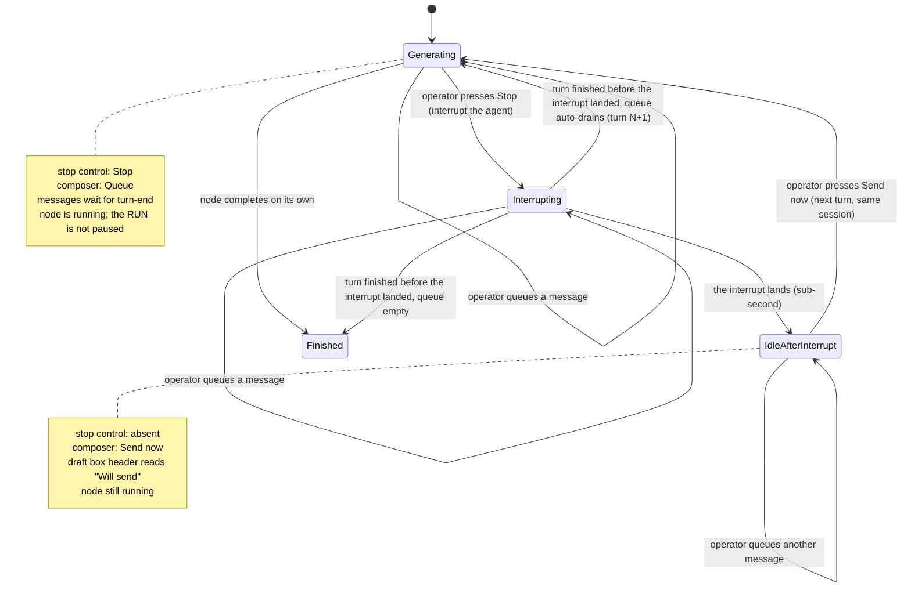

# Control states

> **Historical source only.**
> This document records the pre-merge live-steering design and is not an implementation contract.
> The canonical current contract is `../../control-states.md`.

The two controls in a node room — the stop control and the send control, both on the composer dock pinned to the bottom of the node panel — and what each reads in every state.

> **This is the ratified UX, re-expressed after the reframe.** The interaction Kevin settled in the UX run survives almost intact: **Stop + `Queue` while the agent is working, `Send now` after.** What the reframe changed is the _mechanism and the lifecycle underneath it_, and three consequences follow (flagged inline): the node **never pauses** — the controls now follow the **agent's** sub-state inside `node = running` (`generating` | `idle-after-interrupt`, spine AD-9), not a node-lifecycle state; `Stop` interrupts the **agent's current generation**, it does not stop the node (stopping the node is the separate **Cancel** button); and the in-flight wait shrinks from a 10-second database poll to a **sub-second** in-process interrupt ack. The visual and behavioural specs remain `ux-Archon-agent-node-room-2026-09-09/{DESIGN,EXPERIENCE}.md`.

The dock is where the controls live because the shipped panel header cannot hold them: it is a `flex-wrap` row already carrying eight items at Legacy's 460px, so a control placed there wraps, and the control that stops an agent must not. Settled during the UX run.

Both follow **the agent's sub-state**, never a mode the operator has to remember setting. There is no toggle anywhere, so there is nothing to leave in the wrong position.

## The table

| Agent sub-state (node stays `running`) | Stop                         | Send       | What sending does                                                                                                                                                                                                                                                                                                                                                        |
| -------------------------------------- | ---------------------------- | ---------- | ------------------------------------------------------------------------------------------------------------------------------------------------------------------------------------------------------------------------------------------------------------------------------------------------------------------------------------------------------------------------ |
| **generating**                         | `Stop`                       | `Queue`    | Holds the message; it is delivered as the next turn when the current turn ends naturally. The agent is untouched — nothing interrupted, nothing lost.                                                                                                                                                                                                                    |
| **interrupting**                       | `Stopping…`, `aria-disabled` | `Queue`    | The interrupt is in flight. Now **sub-second** (a provider primitive / stream-abort in-process, not a 10s poll) — whether to show this state at all is Kevin's call; if shown, it must be brief. **`aria-disabled`, never the `disabled` attribute** — the native one blurs the element that carries it, so the operator who just pressed the control lands on `<body>`. |
| **idle-after-interrupt**               | —                            | `Send now` | Delivers every queued message plus the one just typed, in written order, as the **next turn on the same live session**; the agent continues. The node never left `running`. Typing in the composer keeps the node open — the 30-minute idle-await timer is an inactivity timer re-armed by composer activity (SC 2.2.1).                                                 |
| **finished**                           | —                            | —          | Nothing. The field and both controls are absent. The dock reduces to an undelivered draft box, rendered read-only and stating that the node finished and the messages never left — a half-typed line in the field folds in as its last item rather than vanishing. With nothing undelivered there is no dock at all.                                                     |

The transition is **symmetric and automatic**. The moment the agent starts generating again, the send control says `Queue` again and `Stop` returns to the dock — same instant, same signal. Nothing stays stuck in send mode.

## The run keeps going — `Stop` interrupts the agent, not the run `[reframe consequence — confirm against EXPERIENCE.md]`

This inverts the guidance the UX run wrote under the old durable model. Back then `Stop` paused the **whole run**: sibling nodes froze, no later layer started, and the interface was told _not_ to imply the rest of the run was still progressing. Under the reframe, `Stop` interrupts only **this agent's current generation**; the node stays `running` and **the rest of the run is unaffected** — independent siblings and later layers keep going. So the interface must now do the opposite: it must **not** imply the run stopped. Only the agent's current thought was interrupted, and this one node is waiting for the operator. `EXPERIENCE.md` copy built on "the run is paused" needs this correction — that spine is owned by the UX run, flagged here as a dependency.

## Why the stop is explicit

A redirect **interrupts the agent's current thinking** — it ends the turn the agent is in. Making that an explicit `Stop` the operator presses, rather than something a `Send` does silently, keeps the control honest about what it does: the operator sees that redirecting cuts off the current thought. That costs one click and buys an interface that matches its own mechanism.

(The old rationale also argued the stop was forced because "no provider has an inbound channel yet." That mechanism argument is **retired** — every provider can be interrupted, and claude/omp can even take a message mid-turn without interrupting. The honesty argument is why the explicit `Stop` stays; the mechanism no longer requires it.)

When mid-turn delivery is used (CAP-5, where the provider's stream takes a message without interrupting — claude today), a second path appears **while generating**: send without interrupting. It is honest there because the mechanism genuinely does not interrupt anything. The states above do not move; one gains an extra option.

## Behaviour inside a state

**Queueing.** A newly typed message joins the **end** of the queue rather than jumping it, so the agent reads corrections in the order the operator thought of them.

**No per-item send while generating.** While the agent generates there is nothing an individual message can do except wait, so the only per-item actions are keep and delete. Offering a per-item send there would be the same lie as a generating-state send control.

**The draft box.** Rendered only when it holds something — never an empty shell. Its header reads `Queued` while generating, `Will send` while `idle-after-interrupt`, and `Never sent` once the node has finished and the box is read-only; that one word is what signals whether the control below it is live, or gone.

**On send.** Every queued item leaves the box before delivery starts, so nothing can be picked up twice. If delivery fails, items return to the **front** of the queue rather than being dropped.

**Send now needs no server gate.** There is no durable stop marker to race against and no `phase` to guard — the node never left `running`, and the registry queue absorbs any race (a Send that arrives while the interrupt is still landing simply **waits in the queue until the operator presses `Send now`** — an interrupted node drains only on `Send now`, never automatically). The **only** server refusal is a Send to a node that is **no longer running** (`node finished` → 409, the draft stays in the browser; or a detached run with no live handle → "not steerable here"). The old `409`-on-`phase:'stop'` race guard is gone with the durable marker it guarded.

**Nothing follows a flickering busy signal.** Controls follow the agent's projected sub-state (`generating` | `idle-after-interrupt`), a typed field the core emits — not a raw "is a chunk arriving right now" signal that flickers and makes the affordance appear and disappear under the operator's cursor.

**Message status.** Three states, and the third is only reachable on a provider that echoes back the id we stamped: in the draft box → `sent` → `delivered`. Where no echo exists, a message never advances past `sent`, and the interface does not pretend otherwise. At the current pinned SDK **no provider echoes yet** (claude's echo needs ≥ 0.3.246), so `delivered` is not shown to anyone until that bump — `sent` is today's ceiling for all. _(Unchanged by the reframe.)_

## What the stop control must not imply

Interrupting saves session state up to the last completed tool call. It does **not** roll back files the agent already wrote. The control means "stop thinking and wait for me", never "undo" — and the wording has to carry that, because an operator stops exactly when they believe something is going wrong, which is when they are most likely to assume it cleans up after itself. (This is also why `Stop` must read clearly as _interrupt the agent_, distinct from the **Cancel** button that tears the whole node down.)
