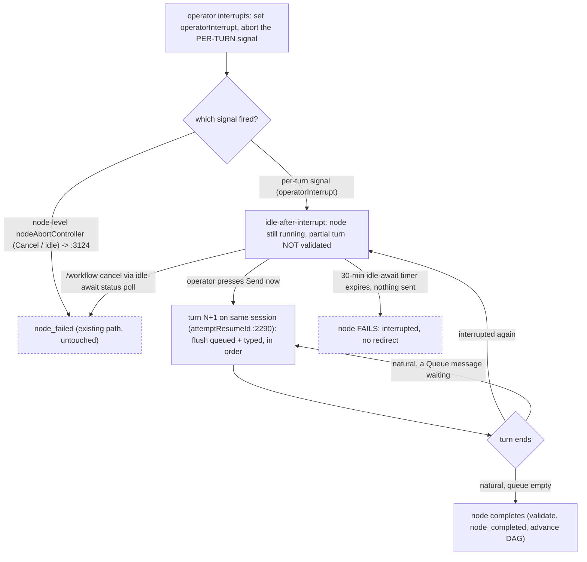

# Engine integration

Everything between the browser and the provider seam. The provider matrix answers _can the agent hear us_; this answers _can anything in Archon reach the agent to speak, and what does the engine do after_. Four findings, each verified against source, each deciding work the capabilities cannot be built without.

The frame is the one the spine fixes: steering acts on the **live agent**, never on the node lifecycle. The node stays `running` throughout — there is no durable marker, no run pause, no stop-and-resume. What follows is how the executor reaches the live session, interrupts it without failing the node, and runs more than one turn on it.

## 1. Interrupt is a provider primitive on the live handle — and the abort plumbing already exists

Interrupting the agent's current generation is not a database signal; it is a direct call on the node's **live session handle**, held in the in-process registry (§3). claude exposes it natively (`query.interrupt()`); a provider without a keep-alive interrupt gets a **stream-abort on a per-turn signal** (§2), which ends the turn while the provider's thread/session survives for a follow-up run (codex re-runs it — `codex.resumeThread(sessionId)`, `providers/src/codex/provider.ts:1006`).

The abort machinery already exists in the executor. Today it serves **Cancel**, through the one-shot `nodeAbortController` (`:2209`). Steering does **not** reuse that controller (§2 explains why it can't) — it adds a per-turn signal beside it, so Cancel's path stays byte-for-byte unchanged and the only real difference is what the executor does after an interrupt (§2).

The old design routed the stop through the database cancel-check (`dag-executor.ts:2304-2334`, every `CANCEL_CHECK_INTERVAL_MS` = 10s, `:682`). That is gone. A database poll was the mechanism for reaching a run in another process; the clean model is in-process only (§3), so the interrupt is a direct in-memory call with no 10-second floor and no silent-long-tool-call blind spot. The poll remains what it always was — Cancel's path — untouched.

## 2. The node keeps running — a per-turn signal, and the turn loop, are the delta

**The node-level abort controller is one-shot, and it is Cancel's — steering cannot use it.** The executor creates `nodeAbortController` once per node (`:2209`) and passes its signal to `sendQuery` (`:2223`). Three sites read that signal, and all three are Cancel's:

> `dag-executor.ts:3124` — `if (nodeAbortController.signal.aborted && !nodeIdleTimedOut)` → `node_failed` + `recordFailedStatus('Cancelled by user')`. Does **not** throw, so it never reaches the catch-block classifier at `:3387`.
> `:3032` — the re-ask loop continues only `while (… && !nodeAbortController.signal.aborted)`.
> `:2298` / `:2325` — the idle-timeout callback and the chunk-driven cancel-poll are what abort it.

An `AbortController` fires **once**. If steering aborted `nodeAbortController` to end turn N, turn N+1's `sendQuery` — which receives that same signal (`:2223`/`:2290`) — would abort on arrival, and the re-ask loop (`:3032`) would refuse to continue. So steering **cannot** reuse it.

**Steering interrupts through a fresh per-turn signal.** `sendQuery` receives the combination `AbortSignal.any([nodeAbortController.signal, perTurnSignal])`: **Cancel** (node-level) or a **steering interrupt** (per-turn) both end the current turn, but each new turn gets a **fresh** per-turn signal while `nodeAbortController` persists across turns — which is exactly what makes multi-turn possible. The registry's interrupt reads the active turn's handle and aborts its per-turn signal **synchronously** (no `await` between read and abort), so on the single-threaded loop it can never fire a torn-down controller.

**`operatorInterrupt` is a per-turn flag, resolved by placement in the existing flow.** The execution order is `stream (:2290) → validation → canReask (:3032) → :3124 Cancel check → completion`. Because a steering abort touches only the per-turn signal, **`:3124` is never tripped by steering** (Cancel-only, byte-for-byte). The flag is set when steering fires the per-turn abort, and three edits at three existing points close the gaps a bare flag would leave:

- **(1) `canReask` (`:3032`) must also stop on `operatorInterrupt`.** Today it guards only on `!nodeAbortController.signal.aborted`, which a per-turn abort does not set — so without this guard the structured-output re-ask would fire on the interrupted partial and re-run the wrong work (the adversarial "re-ask vs steering own the same slot" hole). The `:3030` comment already names the intent — _"Don't reask after an idle-timeout/abort — those are genuine failures, not validation misses"_ — so `&& !operatorInterrupt` extends a guard the design already reasons about; it is one token at a point built for exactly this distinction.
- **(2) Validation is skipped on an interrupted turn** — no validation-miss events for a turn the operator deliberately cut.
- **(3) The `operatorInterrupt` branch sits immediately after the `:3124` Cancel check**, so a co-firing `/workflow cancel` wins by position — no ordering rule to invent.
- **The flag is per-turn**: reset when the loop starts turn N+1, so a stale flag can never abort or mis-route a later turn.
- **The discriminator is "did the turn emit a `result`", not the flag alone.** The executor already consumes a **provider-normalized** `msg.type === 'result'` (`:2533`); a stream-abort yields none. If the interrupt lands as the turn ends on its own, the turn produced its `result` and completes/auto-drains regardless of the flag; the interrupt is spent. Only a turn with **no** `result` and `operatorInterrupt` set is an interrupted end.

**Turn-end has two causes, and the loop distinguishes them:**

- **Natural end** — the agent finished the turn on its own. The queue **auto-drains**: a queued message → run turn N+1; queue empty → **node completes** (validate `output_format`, write `node_completed`, advance the DAG — the existing terminal path). Auto-delivery at the natural boundary is `Queue`'s contract.
- **Interrupted end** — `operatorInterrupt` set. The turn produced a **partial** result: no schema-valid `output_format`, maybe a half-written tool call. The executor must **not** validate it, **not** write `node_completed`, **not** advance the DAG. It **always** enters **idle-await**, _whatever the queue holds_ — it never auto-fires. The **only** exits are the operator's **`Send now`** (flush every queued message plus the one just typed, in written order → turn N+1) and the idle-await timeout (below). This is what preserves the ratified `Send now` moment (`control-states.md`): after Stop, the operator adds the final correction before anything is sent.

**A steered node runs multiple turns on one live session.** Continuing across turns reuses a seam that already exists:

> `dag-executor.ts:2290` — the structured-output re-ask already re-invokes `sendQuery` with `attemptResumeId` on the **same** session when a turn's output fails validation.

The precedent is close but **imperfect, and the difference is the new code**: re-ask re-enters on a _validation miss_ from a state the executor treats as recoverable; steering re-enters on an _interrupt_ (or a queued Send at natural turn-end) from a state the executor today treats as **terminal** (`:3124`). The `operatorInterrupt` branch and the queue check are the delta; the session-resume carriage is reused as-is.

**The idle-await bound — fail after 30 minutes (owner-ratified), and how Cancel reaches it.** Idle-await arms a **fresh 30-minute timer** on entry — reusing neither the streaming `withIdleTimeout` wrapper (`:2298`; no stream to wrap) nor its `nodeIdleTimedOut` outcome, which _completes_ the node (`:3118`: `completed via idle timeout`, and the `!nodeIdleTimedOut` guard at `:3124` keeps it out of the fail branch). Reusing that path would _complete-with-partial-output_ — the garbage AD-4 forbids. So on expiry the timer takes an **explicit fail** branch: `interrupted by operator, no redirect received`; resuming re-runs the node with a **fresh session** (the interrupted context is gone — there is no durable session for a steer). Cancel is the subtle part: `/workflow cancel` is a DB status normally read by the chunk-driven cancel-poll (`:2312`) — which is **dormant** in idle-await (no stream). So idle-await runs its **own timer-driven poll** of `getWorkflowRunStatus` at `CANCEL_CHECK_INTERVAL_MS` (`:682`), reusing `shouldContinueStreamingForStatus` (`:700-702`) and taking the existing Cancel ending when the run is no longer streamable. **Idle-await resolves exactly once** — the first of `Send now`, the cancel-poll, or the 30-minute timer wins; the other two are torn down. (Cancel's _code_ is untouched — idle-await adds a poll that _reaches_ it. Rejected bounds: **wait-forever** — fragile in-process, §3; **complete-with-partial** — the do-nothing bug.)

Note the deliberately-dropped invariant: `shouldContinueStreamingForStatus` (`:700-702`) returns true for both `running` and `paused` so a concurrent Ask gate does not kill a sibling mid-stream. Steering never relies on this, because steering never changes the run status — the node simply stays `running` and its turn loop runs again.

## 3. Where the executor runs decides whether a run is steerable at all

| How the run started | Where the executor runs                                                                                                           |
| ------------------- | --------------------------------------------------------------------------------------------------------------------------------- |
| Web dispatch        | **In the API server process** — `packages/server/src/routes/api.ts:3200-3228` dynamically imports `executeWorkflow` and awaits it |
| CLI `--detach`      | **A detached child in its own process group** — `packages/cli/src/commands/workflow.ts:696-722`                                   |

Under the old durable design the stop travelled through the database, so it reached a detached run. The clean model has **no durable steering state** — the interrupt, the inbound queue, and the live session handle all live in an **in-process registry** keyed `(runId, nodeId)`, valid only while the node runs _in this process_. So the process boundary now binds **all** of steering, not only mid-turn delivery:

- A run whose executor is **in this process** (web dispatch) is fully steerable.
- A run whose executor is a **detached child** has no reachable live handle → Send and Interrupt return a clear "not steerable here" (the UI states it). Cancel and normal `/workflow resume` still work on it.

This is the accepted v1 boundary. A server restart drops the registry with the live sessions; any in-flight steer is lost and the run resumes normally — matching aion, which keeps `active_turn_id` in memory and treats a crash mid-turn the same way.

If steering a session the caller did not spawn is ever wanted, one lead exists: grok's leader socket (`~/.grok/leader.sock`, `grok agent leader`, `--leader` — "multiple clients share one backend"). It is the only channel found that reaches a session another process owns. Unexplored, grok-only, deferred.

## 4. An operator row needs a speaker

`workflow_node_messages` rows carry `kind: text | tool | status` and no speaker field (`packages/workflows/src/schemas/node-message.ts:39-43`). The place to put one is `metadata` — but `nodeTranscriptMetadataSchema` is `.strict()` (`packages/workflows/src/schemas/node-execution.ts:29-43`), so it is **not** free JSON.

**Decision: an operator message is an ordinary `text` row carrying three additive `metadata` fields — `origin = 'operator'`, `operator_user_id` (the sender, from `resolveAuthContext`, for CAP-4 attribution on a multi-user install), and `message_id` (the caller-stamped id, so the client can reconcile which `sent` messages became rows).** No new table, no widened `kind` enum — the same lesson aion recorded (reuse existing enum values rather than widen a CHECK constraint). The cost is honest and small: three optional fields on a strict schema, plus a regenerated `api.generated` for the web. **No database migration** — the column is already JSON. The **executor is the sole writer** (HITL/AD-3, which assigns `seq`), placing the row by `seq` between the turn it interrupted and the turn it caused. The row is a **receipt for the record** — the delivery vehicle is the live session, not this row — and its `message_id` is what lets the client mark any unmatched `sent` message "Never sent" rather than lose it silently. That reconciliation runs **only on the node's terminal event** (`node_completed`/`node_failed`, HITL/AD-7's refetch trigger, which sequences after the executor's last write), never on a live refetch — otherwise a Cancel mid-flight could read rows before the final insert commits and mis-mark a _delivered_ message "Never sent", duplicating the correction on resend.

**This reaches outside the spec.** `AgentHistoryItem` in `spec-readable-agent-transcript` has kinds `assistant | tool | lifecycle`; an operator row is none of them, and that spec's AD-1 puts every row's meaning in the shared core. CAP-4 therefore depends on a new item kind and a row treatment in **both** shells over there — including that its `deriveOutcome` (`agent-history.ts:120`) reads the tool card, so the `interrupted` glyph must be folded into the card's outcome there, and that an operator `text` row must not reach a live transcript until that reader recognizes `origin='operator'` (else it renders as agent text). Recorded here as a dependency; that spec is not edited from this one.

## What this adds to the build

Ordered by what blocks what:

1. **The per-turn signal and the `operatorInterrupt` flag.** Give each turn a fresh per-turn abort signal, hand `sendQuery` the `AbortSignal.any` of it and the one-shot node-level `nodeAbortController` (`:2209`/`:2223`), and set `operatorInterrupt` when steering fires the per-turn abort. `:3124` (and the `:3387` classifier) stay untouched — Cancel-only; place the `operatorInterrupt` branch after the `:3124` check (Cancel dominates by position), add `operatorInterrupt` to the `canReask` guard (`:3032`), skip validation on an interrupted turn, and reset the flag at turn N+1. The node-level controller and its three read sites are unchanged.
2. **The multi-turn loop.** On an interrupted turn-end, do not validate/complete the partial turn; enter idle-await; drain on the operator's `Send now` → run turn N+1 on the same session (`attemptResumeId`, `:2290`), or fail on the fresh **30-minute** idle-await timer (never the existing idle timeout, which completes). A natural turn-end auto-drains the queue. This is the one genuinely new engine behaviour. The idle-await timer is an **inactivity** timer (SC 2.2.1, owner-chosen): a debounced authorized composing-keepalive (Send/Interrupt route family, AD-11) **re-arms** it without resolving idle-await, so a node fails only after 30 minutes of true operator inactivity.
3. **The in-process registry.** `(runId, nodeId) → live session handle + inbound queue`, populated while the node runs in-process, torn down when it ends. Send/Interrupt routes resolve the handle here; no handle → "not steerable here".
4. **The operator row.** Add `origin`, `operator_user_id`, `message_id` to the transcript metadata schema, regen `api.generated`, write the `text` row and the `interrupted` status row through the store at delivery; the client reconciles `sent` ids against `message_id` on any terminal (mark unmatched "Never sent"); open the matching `AgentHistoryItem` change against `spec-readable-agent-transcript`.
5. **The provider seam** — what the matrix describes. Sending is an ordinary prompt; `sendQuery`'s input becomes a stream only for providers that soft-inject mid-turn. Never the hard half.
