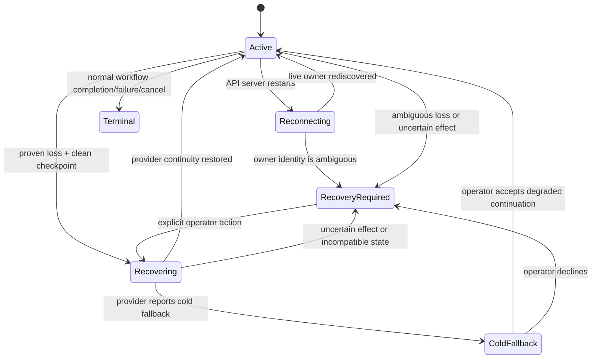

# Recovery state contract

This file defines the observable recovery states and safety boundaries. Architecture may choose the storage and transport, but it may not weaken these distinctions.

## Terms

- **Managed executor:** an Archon-owned worker registered under one run and execution epoch.
- **Execution epoch:** the fencing identity authorized to mutate a run, write its events, or accept control commands.
- **Trusted host boot identity:** an OS/runtime boot-incarnation token that stays stable across Archon process restarts and changes only when processes from the prior incarnation cannot survive; an application-start UUID does not qualify.
- **Registered process identity:** the tuple of trusted host boot identity, runtime-native process or instance identifier, and immutable process-start token recorded for a managed executor.
- **Positive death evidence:** an authoritative supervisor exit record for the registered process identity, a current trusted host boot identity different from the registered one, or a trusted OS/runtime probe that confirms the exact registered process identity is absent.
- **Provider checkpoint:** the provider identity, resumable session/thread identifier, node occurrence, retry epoch, and last durable lifecycle boundary needed to attempt continuation.
- **Uncertain effect:** a tool or external operation that started but has no authoritative completion outcome.

## Conceptual states

| State               | Meaning                                                                                                                                           | Permitted behavior                                                                                        |
| ------------------- | ------------------------------------------------------------------------------------------------------------------------------------------------- | --------------------------------------------------------------------------------------------------------- |
| `active`            | One reachable execution epoch owns the run.                                                                                                       | Observe and steer through that owner.                                                                     |
| `reconnecting`      | The control plane restarted and is rediscovering the still-live owner.                                                                            | Replay durable observation; queue only through the versioned owner contract. Do not mutate run lifecycle. |
| `recovery-required` | No safe automatic continuation is authorized, or ownership, checkpoint, provider continuity, or effect state is ambiguous.                        | Present evidence and explicit choices. Do not auto-replay, take over, or terminalize.                     |
| `recovering`        | Positive death evidence and a clean checkpoint allowed one new epoch to be claimed, or an operator explicitly selected a permitted recovery path. | Reject stale-owner writes, skip completed nodes, and recover the incomplete node under this contract.     |
| `cold-fallback`     | A resume was requested but provider context was not restored.                                                                                     | Surface degraded continuity; do not present it as a warm resume or silently replay uncertain effects.     |
| `terminal`          | Existing workflow terminal semantics apply.                                                                                                       | No recovery action mutates the finished run outside supported retry flows.                                |

The names above are contract vocabulary, not a mandate to add a matching database enum. Architecture should reuse existing status surfaces where that stays truthful.

## Failure classification

| Failure                                                                           | Classification    | Required result                                                                                                                         |
| --------------------------------------------------------------------------------- | ----------------- | --------------------------------------------------------------------------------------------------------------------------------------- |
| API process restarts; managed worker remains live                                 | Reconnect         | The worker and provider stream continue. No run-status transition and no new execution epoch.                                           |
| Supervisor records exit of the exact registered process identity                  | Proven owner loss | Atomically claim a new epoch and recover automatically when the checkpoint and effect ledger are safe.                                  |
| Current trusted host boot identity differs from the registered identity           | Proven owner loss | No exit receipt is required; atomically claim a new epoch and recover automatically when safe.                                          |
| Trusted OS/runtime probe confirms the exact registered process identity is absent | Proven owner loss | Atomically claim a new epoch and recover automatically when safe. PID reuse with a different start token cannot preserve the old claim. |
| Heartbeat or activity timestamp becomes stale                                     | Ambiguous         | No takeover or terminal mutation from the timestamp alone.                                                                              |
| Process probe is unavailable, unauthorized, malformed, or inconclusive            | Ambiguous         | Preserve the owner claim and surface recovery-required; elapsed time cannot upgrade the evidence.                                       |
| Database/network partition while worker may still run                             | Ambiguous         | Preserve the existing owner claim, fail control mutations closed, and require reconciliation.                                           |
| Legacy or external detached executor                                              | Unmanaged         | Do not guess ownership; retain explicit unsupported/ambiguous behavior.                                                                 |

## Resume safety

1. Positive death evidence, a durable checkpoint, and no uncertain effect are all required before automatic recovery. Missing or inconclusive evidence enters `recovery-required`.
2. Claim the replacement execution epoch with one atomic compare-and-set against the prior epoch before starting a worker. Concurrent recovery coordinators must converge on one winner.
3. Reconstruct the DAG from durable run data and skip every completed node exactly as the existing resume projection does.
4. Recover only the incomplete node occurrence and retry epoch named by the provider checkpoint.
5. Automatic provider recovery uses strict resume with fresh-session fallback disabled. It starts a new provider turn on the saved session; it does not reconnect the dead byte stream or promote partial assistant text to final output.
6. A tool start without a matching authoritative result is an uncertain effect. It blocks automatic replay even if tracked git state can be reset.
7. Restart-from-checkpoint may reset supported tracked workspace state, but it cannot claim to undo network calls, package publication, database writes, or other external effects.
8. Every provider/tool dispatch and durable execution write verifies the current execution epoch. Rejecting stale writes is necessary but does not by itself make an already-issued external side effect reversible.
9. Cold, unsupported, rejected, and unverified outcomes return to `recovery-required`. Continuing fresh requires operator intent and the safety policy for the incomplete node; it is never silently accepted as restored continuity.

## Recovery choices

- **Continue provider session:** available when a provider checkpoint exists; preserves the current workspace and asks the provider to continue from its durable context.
- **Restart node from checkpoint:** invalidates the incomplete attempt and uses the supported node-retry/reset boundary; requires confirmation whenever prior effects may escape that boundary.
- **Terminate:** use an existing supported terminal action with explicit operator intent; recovery never invents a silent abandon operation.
