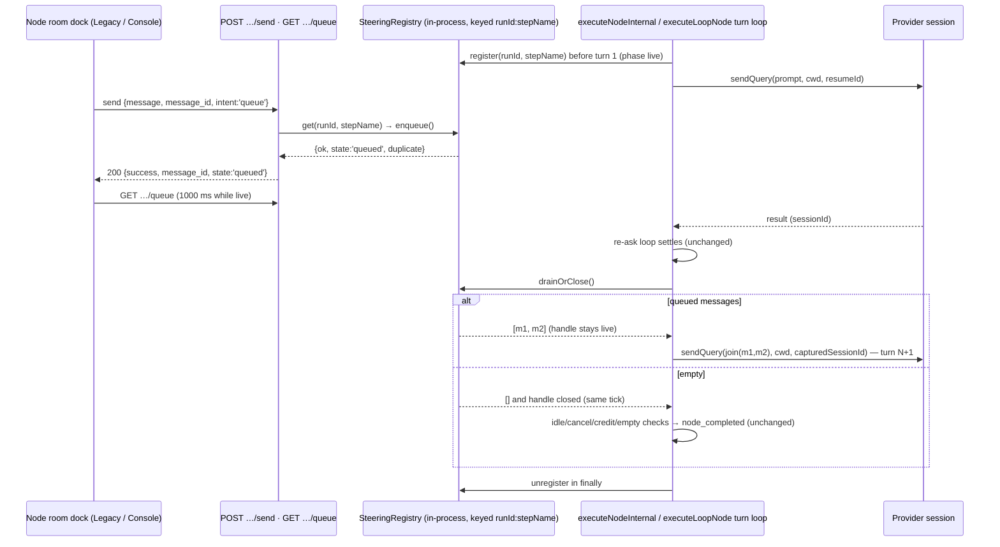

# Issue 181 queue guidance for a running agent

## Goal and user outcome

An operator watching a running agent node can type guidance and press `Queue` (or `Cmd`/`Ctrl`+`Enter`) without disturbing the current turn. The message is accepted at once onto a process-local queue keyed `(runId, nodeId)`, shown under `QUEUED · n`, and delivered by the executor at the next natural turn boundary as turn N+1 on the **same provider session**, in server receipt order. The node stays `running` throughout. Unsent composer text is labelled `this tab only`; a queued message is server-side.

This is Story 2.1 / CAP-8 at the v1 floor (`Queue` only, every message `sent`). It is the first write-half story, so it also lands the shared transport the later stories build on: the in-process registry, the send route, and the executor's multi-turn loop for the natural-end case. Interrupt (2.3), withdraw (2.2), the operator transcript row (2.8), cross-tab convergence (2.9), and terminal reconciliation (2.11) are **not** in scope.

## Verified evidence and authority

Authority order used by every phase:

1. Story 2.1 acceptance criteria in `_bmad-output/planning-artifacts/epics-agent-node-room/epics.md` (lines 404-442) and `_bmad-output/specs/spec-agent-node-room/SPEC.md` (CAP-8, CAP-12 v1 floor, the write-half constraints).
2. `_bmad-output/specs/spec-agent-node-room/steering-api-contract.md` owns the wire contract: request/response/error shapes, status codes, idempotency, and the steering actor grant.
3. `_bmad-output/specs/spec-agent-node-room/engine-integration.md` owns the executor design (natural end auto-drains; in-process registry keyed `(runId, nodeId)`; no durable steering state; turn N+1 reuses the `attemptResumeId` seam).
4. `_bmad-output/specs/spec-agent-node-room/control-states.md` and `EXPERIENCE.md` / `DESIGN.md` under `_bmad-output/planning-artifacts/ux-designs/ux-Archon-agent-node-room-2026-09-09/` own the dock copy, tokens, and accessibility rules.
5. `_bmad-output/specs/spec-agent-node-room/steering-test-plan.md` names the minimum coverage.
6. Current code and tests own existing public behavior that this story must preserve.

Repository inspection (scout reports under `plans/reports/scout-260919-0007-*.md`) established:

- No steering code exists. There is no in-process registry of running runs/nodes, no send route, and no multi-turn-on-one-session loop. This is new infrastructure.
- One turn is `aiClient.sendQuery(prompt, cwd, resumeSessionId, options)` wrapped by `withIdleTimeout` inside `runStreamPass` (`packages/workflows/src/dag-executor.ts:2266-2967`). The provider session id is captured **only** from the `result` chunk (`if (msg.sessionId) newSessionId = msg.sessionId;`, `dag-executor.ts:2565` at planning time). The existing structured-output re-ask loop (`:2992-3121`) deliberately runs later passes on a **fresh** session; turn N+1 must therefore pass the captured id explicitly.
- `nodeAbortController` (`dag-executor.ts:2209`) is one-shot and belongs to Cancel. This story never touches it; the drain is gated on `!nodeIdleTimedOut && !nodeAbortController.signal.aborted`, the same guard `canReask` uses (`:3031-3032`).
- `executeNodeInternal` has eleven terminal returns plus a function-level `catch` (`:3332`). `executeLoopNode` (`:5150`) is a separate duplicated implementation with its own per-iteration `attempts:` re-ask loop, `AskHumanAwaitingError` catch, and completion channels (`until_field` → `until` → `until_bash`); the owner chose to cover it in 2.1 as well (Validation Log Q2).
- Transcript rows are keyed by the namespaced `stepName` (`dag-executor.ts:1978-1981`), which is also what `GET /api/workflows/runs/{runId}/nodes/{nodeId}/messages` accepts. The registry keys on the same identifier so the client addresses one id.
- Node running/terminal state is derived from `workflow_events` via `projectLatestEffectiveNodeStates` (`packages/workflows/src/retry-state.ts:92`); there is no status column.
- Every existing route returns a flat `{ error, detail? }`; the steering contract's `{ success: false, error: { code, message } }` shape needs its own helper and a route-scoped validation hook (`registerOpenApiRoute`'s third argument, precedent `workflowEnvValidationErrorHook` in `packages/server/src/routes/openapi-defaults.ts:37-47`).
- Web-dispatched runs execute in the API server process (`api.ts:3183-3230`, `orchestrator.ts:487`); CLI runs do not. `resolveAuthContext` (`api.ts:2232`) returns `undefined` on a bare solo install.
- Both node rooms poll: a 1000 ms node-message loop and a 3000 ms run-level poll; Console is REST-poll only. Pending interactions are per run and filtered per node with each shell's `selectVisibleNodeAskInteractions`.
- The `e2e-fake` provider has `delayMs` and `sessionResume: true` but no prompt-echo-on-resume; the E2E runtime has a web-dispatch helper (`runHitlWorkflowViaWeb`) — CLI-spawned runs are `422` by design.

## Decisions

| # | Decision | Rationale and rejected alternative |
|---|----------|------------------------------------|
| D1 | **In-process registry module in `@archon/workflows`** (`steering-registry.ts`), a process singleton mirroring `getWorkflowEventEmitter()`. | Server and executor share the process for web dispatch; sub-runs spawned in-process are steerable for free. Rejected: a DB-backed queue polled at the turn boundary (scout-executor §7) — SPEC forbids durable steering state and mandates `422 not_steerable_here` for detached runs. Rejected: threading through `ExecuteWorkflowOptions` — seven `executeWorkflow` call sites for no behavioral gain. |
| D2 | **Registry keyed by `stepName`** (namespaced transcript node id). | The web addresses nodes by the id the `/messages` route takes. |
| D3 | **Atomic `drainOrClose()`**: one synchronous method returns queued items or, when empty, flips the handle to `closed` in the same tick. | Closes the window between the executor's last queue check and teardown; a send in that window gets `409 node_finished` instead of a receipt for a message that is never delivered ("the teardown queue check is the last gate"). |
| D4 | **All queued messages flush as one turn N+1**, joined in receipt order by a blank line, verbatim (no `$ref`/`buildPromptWithContext` substitution over operator prose). | Contract: "drains it in server receipt order as the next turn". Operator prose is a prompt, not a wire format. |
| D5 | **Turn N+1 resumes the session id captured from the previous turn's `result`.** `newSessionId` is reset at the top of every turn, so a turn must positively produce its id; a turn without one stops the chain with a `warn`. Drained turns pass `forkSession: false` and drop `resumeInteractions`. Providers without `sessionResume` are never registered. | Same-session continuation is the whole promise. A fresh or forked session would silently change semantics; a stale id from an earlier turn would hide provider drift. |
| D6 | **Idempotency memory per handle**: accepted `message_id`s are remembered for the handle's lifetime, so a duplicate replays `queued` even after the original drained. | Contract: duplicate send replays the original receipt. |
| D7 | **Park on ask-pause, unregister on terminal.** `register()` is get-or-create; the ask-pause exit calls `park()` (queue kept, phase `parked`); every terminal exit unregisters, logging a `warn` with the count if messages are discarded. A parked handle refuses sends with `422` but its queue stays visible on `GET …/queue`. | CAP-8: "nothing is lost". An ask-parked node has no live session (EXPERIENCE.md:178), yet messages queued before the ask must survive the answer and stay visible. Handlers reconcile a parked entry against the event projection and drop it when the node finished elsewhere. A Cancel or idle timeout with a non-empty queue discards loudly; restoring those as `NEVER SENT` is Story 2.11. |
| D8 | **Route ordering: 401 → 400 → 404 → 409/422**, with the registry consulted first on the success path. | 401 via `app.use` middleware ahead of validation (precedent `api.ts:4981`); 400 via a route-scoped hook so the body is the contract shape; a registry hit needs no DB read. |
| D9 | **Actor grant**: any resolved identity is allowed (any role); no identity is `401` only when `isWebAuthEnabled() || isApiGateEnabled()`; otherwise (solo install) allowed with `operator_user_id: null`. | Contract names "identity-less install → allowed"; this is `answerAskHuman`'s shape, not `confirmPermission`'s. Retry/cancel/approve rules are untouched. |
| D10 | **Add `GET /api/workflows/runs/{runId}/nodes/{nodeId}/queue`** returning `{ steerable, queued: [...] }`, under the same actor grant as `send`, polled at 1000 ms while steerable and 3000 ms once not. | `QUEUED · n` cannot be truthful after the executor drains without a read path, and Console has no SSE. The epic rule places shared transport in the first story that needs it; Story 2.9 shrinks to convergence and withdraw refresh. |
| D15 | **Bounds on the in-memory registry**: 50 pending messages per handle, 500 remembered ids per handle, 16 000-character messages; a credit-exhaustion signal at a turn boundary stops the chain. | The registry is one process-wide singleton; unbounded growth or an unbounded operator-driven turn chain would be a memory or spend DoS on every run in the process. No cap on the number of turns: each turn needs a fresh operator send and the credit check runs at every boundary. |
| D11 | **AI loop nodes are steerable in 2.1** (owner decision, Validation Log Q2). `executeLoopNode` gets the same registry, park, and drain treatment: at an iteration boundary the handle is drained without closing (`drain()`), a drained turn runs inside the current iteration on the same session, and the completion channels are evaluated on the drained turn's output; only the node's final boundary uses `drainOrClose()`. Loop-group body nodes already run through `executeNodeInternal` and are registered under their namespaced `stepName`. | `executeLoopNode` is a separate implementation (about +4h); covering it now means every AI node kind a room can open is steerable, and `422 not_steerable_here` is left to mean exactly what the contract says — no live handle in this process. |
| D12 | **No Stop control and no per-item delete in 2.1.** | A control that cannot act must not be drawn (SPEC). Stop lands with the interrupt route (2.3); delete lands with the withdraw route (2.2). |
| D13 | **State-8 disclosure uses neutral copy**: `not steerable here · this node's live session is not in this server process`. | The server cannot tell a detached run from any other reason a live handle is absent (a node between `node_started` and registration, a provider without `sessionResume`, a parked node with no pending ask visible yet); the ratified EXPERIENCE.md:187 copy names detach as the cause. Owner confirmed the neutral wording (Validation Log Q4). |
| D14 | **No transcript row and no new workflow event at drain.** | The operator row is Story 2.8; a turn-start event is forbidden by SPEC. The queue read path is the drain signal. |

## Architecture



The turn loop wraps the existing re-ask loop; the code below it (idle-timeout notice, Cancel check, credit and empty-output checks, `node_completed`) is unchanged and runs once, after the loop's final `break`. In `executeLoopNode` the same turn loop sits inside each iteration and uses the non-closing `drain()` until the completion channels say the loop is done.

## Phases

| # | Phase | Status |
|---|-------|--------|
| 1 | [Engine: steering registry and natural-boundary drain](./phase-01-start.md) | Pending |
| 2 | [Server: typed send and queue routes](./phase-02-server-send-and-queue-routes.md) | Pending |
| 3 | [Web: Queue composer dock in both shells](./phase-03-web-composer-dock-both-shells.md) | Pending |
| 4 | [E2E evidence, gates, and closeout](./phase-04-e2e-evidence-and-closeout.md) | Pending |

Phase 1 is planned in full detail (deep mode). Phases 2-4 are planned to execution depth but each gets a dedicated scout pass at cook time against the then-current tree, because Phase 1 and Phase 2 change the surfaces they build on.

Effort: Phase 1 11h, Phase 2 5h, Phase 3 6h, Phase 4 4h.

## Dependency map

- Phase 2 depends on Phase 1 (registry API: `get`, `enqueue`, `snapshot`, phases).
- Phase 3 depends on Phase 2 (regenerated `api.generated.d.ts` with `SendWorkflowNodeBody`, `SendWorkflowNodeResponse`, `WorkflowNodeQueueResponse`, `SteeringError`).
- Phase 4 depends on Phases 1-3 and on the `e2e-fake` echo-on-resume scenario added in Phase 4 itself.
- Story 2.2 will reuse the handle's `withdraw(message_id)` seam; 2.3 will add `interrupt` and a live handle; 2.8 will write the operator row at the drain point; 2.9/2.11 will build on `GET …/queue`.

## File inventory

| File | Action | Test impact |
|------|--------|-------------|
| `packages/workflows/src/steering-registry.ts` | Create | New unit suite |
| `packages/workflows/src/steering-registry.test.ts` | Create | Registry contract |
| `packages/workflows/src/dag-executor.ts` | Modify (`executeNodeInternal` and `executeLoopNode`) | Turn-loop suites in `dag-executor.test.ts` |
| `packages/workflows/src/dag-executor.test.ts` | Modify | New drain/park/close cases |
| `packages/workflows/package.json` | Modify (exports subpath `./steering-registry`; append the new test file to the explicit `test` chain) | Boundary; CI coverage |
| `packages/server/src/routes/schemas/workflow.schemas.ts` | Modify | Schema tests via route tests |
| `packages/server/src/routes/openapi-defaults.ts` | Modify (steering validation hook) | Route 400 shape |
| `packages/server/src/routes/api.ts` | Modify (two routes, one middleware, one error helper) | `api.workflow-runs.test.ts` |
| `packages/server/src/routes/api.workflow-runs.test.ts` | Modify | New describe blocks |
| `packages/web/src/lib/api.generated.d.ts` | Regenerate | Type-only |
| `packages/web/src/lib/api.ts` | Modify (`sendNodeGuidance`, `getNodeQueue`) | — |
| `packages/web/src/lib/steering-dock.ts` | Create | New unit suite |
| `packages/web/src/lib/steering-dock.test.ts` | Create | Controller/guards |
| `packages/web/src/components/workflows/ComposerDock.tsx` | Create | `ComposerDock.test.tsx` |
| `packages/web/src/components/workflows/ComposerDock.test.tsx` | Create | Legacy dock |
| `packages/web/src/components/workflows/NodeTranscriptPane.tsx` | Modify (mount) | Existing pane tests |
| `packages/web/src/components/workflows/NodeTranscriptPane.test.tsx` | Modify | Mount/visibility |
| `packages/web/src/experiments/console/skills/runs.ts` | Modify (Console helpers) | — |
| `packages/web/src/experiments/console/components/ConsoleComposerDock.tsx` | Create | `ConsoleComposerDock.test.tsx` |
| `packages/web/src/experiments/console/components/ConsoleComposerDock.test.tsx` | Create | Console dock |
| `packages/web/src/experiments/console/components/ConsoleNodeRoom.tsx` | Modify (mount) | `ConsoleNodeRoom.test.tsx` |
| `packages/web/src/experiments/console/components/ConsoleNodeRoom.test.tsx` | Modify | Mount/visibility |
| `packages/web/src/experiments/console/console-isolation.test.ts` | Modify (add `ConsoleComposerDock.tsx` to `roomFiles`; approve `@/lib/steering-dock`) | Boundary |
| `packages/providers/src/e2e-fake/provider.ts` | Modify (`echoPrompt` scenario key) | `provider.test.ts` |
| `packages/providers/src/e2e-fake/provider.test.ts` | Modify | Echo case |
| `e2e/fixtures/workflows/e2e-queue-guidance.yaml` | Create | Fixture |
| `e2e/lib/playwright/archon-runtime.ts` | Modify (`startQueueGuidanceWorkflowViaWeb`) | Runtime |
| `e2e/ui/agent-queue-guidance.spec.ts` | Create | Both shells, a11y, 460 px / Console width |
| `_bmad-output/specs/spec-agent-node-room/steering-api-contract.md` | Modify (document `GET …/queue`) | Docs |
| `_bmad-output/implementation-artifacts/agent-node-room/sprint-status.yaml` | Workflow-owned `backlog` → `done` after gates | — |
| `plans/260918-1721-issue-181-queue-guidance-for-running-agent/reports/*` | Create evidence | — |

## Validation commands

Package-isolated only; never run root `bun test`.

```bash
(cd packages/workflows && bun test src/steering-registry.test.ts)
(cd packages/workflows && bun test src/dag-executor.test.ts -t 'queued guidance')
(cd packages/server && bun test src/routes/api.workflow-runs.test.ts -t 'steering')
(cd packages/web && bun test src/lib/steering-dock.test.ts)
(cd packages/web && NODE_ENV=development bun test src/components/workflows/ComposerDock.test.tsx src/components/workflows/NodeTranscriptPane.test.tsx)
(cd packages/web && NODE_ENV=development bun test src/experiments/console/components/ConsoleComposerDock.test.tsx src/experiments/console/components/ConsoleNodeRoom.test.tsx src/experiments/console/console-isolation.test.ts)
(cd packages/providers && bun test src/e2e-fake/provider.test.ts)
(cd e2e && npm run typecheck)
bun run --cwd e2e test:ui -- --grep 'queue guidance'
bun run validate
```

## Risks, compatibility, and rollback

- **Executor regression:** the turn loop wraps the most-exercised code path in the engine. Mitigation: the loop is a no-op when the registry has no handle or the queue is empty (`drainOrClose` returns `[]`), and the existing `dag-executor.test.ts` suite must stay green untouched.
- **Message loss windows:** closed by D3 (atomic drain-or-close) and D7 (park on ask). Remaining known gap: a server restart drops the registry — accepted v1 boundary (SPEC).
- **Parked-entry leak:** a node parked in this process and finished in another leaves one small entry; handlers reconcile parked entries against the event projection and drop them; bounded and documented.
- **Contract divergence:** the nested error shape is unprecedented in `api.ts`; it is owner-ratified in the contract, so it is implemented as a route-family helper rather than changing `apiError`.
- **Generated types:** `generate:types` targets `localhost:3090`; run `PORT=3090 bun run dev:server` in this worktree, regenerate, stop the server by its PID.
- **Rollback:** revert the focused PR. No migration, no schema change, no feature flag; the registry is memory only.

## Red Team Review

### Session — 2026-09-19
**Findings:** 21 (15 accepted, 6 rejected)
**Severity breakdown:** 8 Critical, 5 High, 8 Medium
**Reviewers:** Security Adversary (Fact Checker), Assumption Destroyer (Contract Verifier), Failure Mode Analyst (Fact Checker + Flow Tracer)

| # | Finding | Severity | Disposition | Applied To |
|---|---------|----------|-------------|------------|
| 1 | Any-authenticated actor grant lets a member steer another user's run with the starter's credentials | Critical | Reject as a plan change — owner-ratified in `steering-api-contract.md` (AD-11, 2026-09-15); raised to the owner as validation question Q1 with the credential-reuse consequence stated | — |
| 2 | Unbounded turn loop bypasses the credit-exhaustion check | Critical | Accept (credit check at every boundary); turn cap rejected — each turn needs an operator send | Phase 1 |
| 3 | No bounds on message size, queue depth, accepted-id memory | High | Accept | Phase 1, Phase 2, D15 |
| 4 | `GET …/queue` exposes undelivered text without the send grant | Medium | Accept (same grant as send); ownership check folds into Q1 | Phase 2, D10 |
| 5 | Duplicate `message_id` with different text silently drops content | Medium | Accept partially (warn log); response shape unchanged — the contract fixes the receipt replay | Phase 2 |
| 6 | 404/409/422 branches are an existence oracle for any identity | Medium | Reject — consequence of the ratified grant; folds into Q1 | — |
| 7 | `newSessionId` never reset per turn, so a missing id goes undetected after turn 1 | Critical | Accept | Phase 1, D5 |
| 8 | `resumeInteractions`/`forkSession` leak into drained turns | Critical | Accept | Phase 1, D5 |
| 9 | `buildReaskPrompt` closes over `finalPrompt`, dropping guidance on a re-ask | Critical | Accept | Phase 1 |
| 10 | `GET …/queue` returns `[]` for a parked handle, hiding surviving messages | Critical | Accept | Phase 2, Phase 3, D7 |
| 11 | Cancel/idle timeout drops queued messages silently | High | Accept (loud discard log; restoration is Story 2.11) | Phase 1, D7 |
| 12 | Tokens do not fold across turns; the plan's test could not pass | Medium | Accept (turn token sum) | Phase 1 |
| 13 | Timer and send-triggered `refresh()` race | Medium | Accept (monotonic request counter) | Phase 3 |
| 14 | Drained turns re-fork for `persist_session` nodes | Critical | Accept (same as 8) | Phase 1 |
| 15 | Attempt-id rotation had no concrete plumbing | Critical | Accept (`turnIndex` parameter) | Phase 1 |
| 16 | Blanket echo-on-resume breaks the HITL loop E2E | Critical | Accept (`echoPrompt` directive carried in the message) | Phase 4 |
| 17 | Console isolation allowlist edit does not gate the new file | High | Accept (`roomFiles` + `approved`) | Phase 3 |
| 18 | New workflows test file not in the explicit `test` chain | High | Accept | Phase 1, inventory |
| 19 | Try/catch anchor misdescribed | Medium | Accept | Phase 1 |
| 20 | Per-second projection cost while polling a non-steerable node | Medium | Accept (3000 ms back-off) | Phase 2, Phase 3 |
| 21 | `stepName` stability across resume entry points unproven | Medium | Reject — top-level nodes use an empty prefix (`dag-executor.ts:1978-1981`); loop-group bodies derive the same `stepNamePrefix + node.id` on every entry; `retry-node` starts a new execution whose old handle was unregistered on failure | — |

### Whole-Plan Consistency Sweep

Decision delta: D5 (per-turn session id, `forkSession`/`resumeInteractions` per turn), D7 (parked queue visible; loud discard), D10 (grant on the read route; back-off), D15 (bounds and boundary credit check), Phase 4 echo scoped to a directive. Swept `plan.md` and all four phase files for: "echo on generic resume" (removed), `queued: []` for parked (replaced), the try anchor (corrected), the three-argument `runStreamPass` call (now four), and "cost/tokens fold as re-ask" (replaced by the explicit token sum). No contradictions remain.

## Validation Log

### Session 1 — 2026-09-19 (mode: prompt; 5 questions, re-asked once with full context in Vietnamese at the operator's request)

| # | Question | Decision | Propagated to |
|---|----------|----------|---------------|
| Q1 | Actor grant for send/queue: keep the ratified any-authenticated grant, or narrow to owner/admin? | **Keep the ratified grant** (any authenticated identity; solo install allowed); retry/cancel/approve rules unchanged. The credential-reuse consequence (red-team #1) is accepted by the owner. | D9, Phase 2 `authorizeSteering` |
| Q2 | AI loop nodes in 2.1 or deferred to Story 2.3? | **Include loop nodes in 2.1** (+4h). | D11, Phase 1 `executeLoopNode` section and tests, Phase 4 loop E2E case, effort |
| Q3 | Add `GET …/queue` in 2.1 and document it in the contract? | **Yes.** | D10, Phase 2, Phase 4 closeout |
| Q4 | State-8 disclosure copy: neutral wording or the ratified detached wording? | **Neutral wording.** | D13, Phase 3 `DISCLOSURE_NOT_STEERABLE` |
| Q5 | Stop and per-item delete controls in the 2.1 dock? | **Omit both** until Stories 2.3 and 2.2 land. | D12, Phase 3 |

### Verification Results
- Claims checked: 24 (Fact Checker, Security Adversary) + 13 contracts (Contract Verifier) + 7 flows (Flow Tracer)
- Verified: 41 | Failed: 3 (all corrected in Red Team Session 1: session-id line drift, token fold, parked queue read) | Unverified: 0
- Tier: Standard (4 phases)

### Whole-Plan Consistency Sweep
After propagating Q2, swept all files for "loop nodes are not registered", "never registered", "Story 2.3's stated scope", and "`executeNodeInternal` only"; each occurrence was rewritten. D11, the architecture note, the file inventory, red-team #21, and the Phase 1/4 tests now agree that AI loop nodes are steerable in 2.1. No unresolved contradiction remains.

## Definition of done

- [ ] Every Story 2.1 acceptance criterion has automated evidence or an honestly recorded manual blocker.
- [ ] Registry, executor, server, web, provider, and E2E suites named above pass; `bun run validate` passes.
- [ ] Rejected requests (401/400/404/409/422) are proven to leave node, queue, and transcript unchanged.
- [ ] A queued message is proven to arrive as turn N+1 on the same session id (executor unit test and E2E echo).
- [ ] The final diff stays within the inventory, except cause-aligned fixes discovered by tests and recorded in the report.
- [ ] `steering-api-contract.md` documents `GET …/queue`; the owning BMad workflow moves `2-1-queue-guidance-for-a-running-agent` to `done` only after gates.
- [ ] PR uses the repository template, targets `develop`, includes `Closes #181`.

<!-- slug: issue-181-queue-guidance-for-running-agent -->
