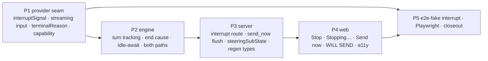

# Issue 183 interrupt and redirect a running Claude agent

## Outcome

While a Claude node runs in the current server process, the operator can press `Stop`. The interrupt route calls Claude's native `interrupt()` through a fresh per-turn seam; the node-level Cancel controller is never touched, the node stays `running`, and the provider session stays alive. The executor classifies the turn end: an interrupted end skips validation and re-ask, writes exactly one `interrupted` status transcript row, never emits `node_failed`, and enters `idle-after-interrupt`. The dock then shows `Send now`, header `WILL SEND · n`, no `Stop`, and the stop disclosure. `Send now` delivers already-queued messages plus the new one, in receipt order, as the next turn on the same Claude session, and the dock returns to generating. The same behavior applies to direct AI nodes, AI loop nodes, and provider-calling nodes inside loop groups. The interrupt route reports the actual end state (`idle-after-interrupt`, `generating` after an auto-drain, or 409 `node_finished`) and never loses an accepted message. Accessibility: serialized transition announcements, `Stopping…` with `aria-disabled`, `role="alert"` on delivery failure, and focus never lands on `<body>`.

## Scope boundary

In scope (Story 2.3 acceptance criteria, `_bmad-output/planning-artifacts/epics-agent-node-room/epics.md:472-516`):

- per-turn interrupt seam on `IAgentProvider` options and the Claude provider's native `interrupt()` (streaming-input mode), with a typed abort marker on the normalized result;
- registry live-turn tracking, projected sub-state (`generating` | `idle-after-interrupt`), idle-await, and `Send now` drain, on both executor AI paths and loop-group bodies;
- `POST …/interrupt` route, `intent: 'send_now'` flush, sub-state on node state, regenerated web types;
- Stop / `Stopping…` / `Send now` / `WILL SEND` / stop-disclosure dock states in both shells with the a11y contract;
- deterministic e2e-fake interrupt path, Playwright evidence, sprint-status closeout.

Deliberately excluded (owned by other accepted stories):

- 30-minute inactivity timer, keepalive route, and the 30-minute disclosure copy (Story 2.12) — this plan does ship the idle-await cancel poll so `/workflow cancel` reaches an idle node (see Decision D3);
- withdraw route (2.2); operator text rows and `NEVER SENT` reconciliation (2.8, 2.11); cross-tab queue reads (2.9); finished-iteration projection (2.10);
- Codex / OMP / Grok / DeepSeek interrupt (2.4–2.7) — non-Claude providers receive a typed refusal, never a silent no-op;
- mid-turn soft-inject (G2–G4) and the `delivered` chip (G1).

No schema migration, no durable steering state, no new workflow event type, no `kind` enum widening.

## Evidence checked

| Evidence                                                                                                                                  | Verified implication                                                                                                                                                                                                                                                                                       |
| ----------------------------------------------------------------------------------------------------------------------------------------- | ---------------------------------------------------------------------------------------------------------------------------------------------------------------------------------------------------------------------------------------------------------------------------------------------------------- |
| SDK declarations `@anthropic-ai/claude-agent-sdk@0.3.209` (`sdk.d.ts:2225-2245`, `:3400-3406`, `:4146-4200`, `:4440-4450`, `:6721`)       | `Query.interrupt(): Promise<SDKControlInterruptResponse \| undefined>` exists; control requests are "only supported when streaming input/output is used". On a clean interrupt the receipt is written before "the interrupted turn result", so a `result` still arrives. `TerminalReason` includes `'aborted_streaming' \| 'aborted_tools'`. |
| Vendor docs, streaming-vs-single-mode page                                                                                                | Single-message (string prompt) mode "does not support real-time interruption". The Claude provider must run streaming input (`AsyncIterable<SDKUserMessage>`) for a steerable turn.                                                                                                                       |
| `packages/providers/src/claude/provider.ts:1689` and `:1596-1607`                                                                          | Today the prompt is a string and the only abort listener aborts the SDK controller and closes the query — a Cancel-grade kill. A separate per-turn signal is required.                                                                                                                                     |
| `packages/providers/src/claude/provider.ts:953-960`, `packages/workflows/src/schemas/node-execution.ts:40`                                 | The SDK marks an interrupted tool result with `is_interrupt`; the provider already normalizes it to `toolOutcome: 'interrupted'`, and transcript metadata already has `outcome: 'interrupted'` (Story 1.1's `⚠` glyph).                                                                                    |
| `packages/workflows/src/dag-executor.ts:2210-2224`, `:3074-3075`, `:3189`, `:3336-3357`, `:3500-3512`, `:2566`                              | `nodeAbortController` is one-shot and Cancel's; `canReask` guards only on it; the Cancel check precedes the natural-boundary drain gate; the catch block classifies aborts by the same controller; the session id is captured only on the `result` chunk.                                                  |
| `packages/workflows/src/steering-registry.ts`                                                                                             | The handle is synchronous, keyed `(runId, stepName)`, with `live/parked/closed` phases. Turn tracking, sub-state, and an idle-await waiter are additive.                                                                                                                                                    |
| `packages/core/src/db/workflows.ts:1450-1465`, `:1495`, `:1526`                                                                            | Same-process Cancel already calls `discardRun` after the terminal write commits — `discard()` can wake an idle-await waiter.                                                                                                                                                                              |
| `packages/server/src/routes/api.ts:1576-1606`, `:2188-2196`, `:5173-5290`, `:5590-5620`                                                    | The send route pattern (auth pre-check, projection, registry handle, last gate) and `nodeStates` assembly are the templates for the interrupt route and the sub-state field.                                                                                                                              |
| `packages/web/src/lib/steering-dock.ts`, `ComposerDock.tsx`, `ConsoleComposerDock.tsx`                                                    | The dock derives its mode from `rowStatus`/`live`/`hasPendingAsk`/refusal; `send_now` and sub-state are additive inputs.                                                                                                                                                                                   |
| `_bmad-output/specs/spec-agent-node-room/{engine-integration,control-states,steering-api-contract,steering-test-plan}.md`                  | Five-case end-cause rule, placement rules, route shapes, response enums, and the test tables this plan's matrices mirror.                                                                                                                                                                                  |
| `_bmad-output/planning-artifacts/ux-designs/ux-Archon-agent-node-room-2026-09-09/EXPERIENCE.md:247`, `:264-266`, `:390-400`; `DESIGN.md:650` | Stop disclosure copy, announcement texts, `aria-disabled` rule, focus rules, `⚠ interrupted` climax.                                                                                                                                                                                                       |

Scout reports for this plan land in `./reports/` (`scout-260919-0830-*.md`); phase files cite the anchors verified above and mark spike-dependent claims `[UNVERIFIED]`.

## Decisions

- **D1 — Per-turn seam is a new typed option, not a reason-discriminated `AbortSignal.any`.** `AgentRequestOptions.interruptSignal?: AbortSignal` is created fresh per `runStreamPass` in the executor. `abortSignal` stays node-level and Cancel-only. The Claude provider reacts to `interruptSignal` by calling `query.interrupt()`; it never aborts its SDK controller or closes the query for a steering interrupt. Alternative considered (provider scout, `reports/scout-260919-0830-claude-provider-interrupt.md` §2): keep one `abortSignal = AbortSignal.any([...])` and branch on `signal.reason === 'operator_interrupt'` (Bun forwards the reason — verified). Rejected for this story because a stringly sentinel on `reason` is hidden dynamic behavior the type contract cannot express, and every non-Claude provider would silently receive a Cancel-grade abort on a steering interrupt until its own story lands; the explicit option lets the capability gate (D4) keep that impossible. Revisit in 2.4–2.7 if threading two signals proves noisy (validation question V1).
- **D2 — Claude runs streaming-input mode only when `interruptSignal` is present.** The string prompt is wrapped in a one-message `AsyncIterable<SDKUserMessage>` that stays open until the turn's `result` arrives (or the query closes). Chat and non-steerable paths keep the string prompt byte-for-byte. Phase 1 spikes this composition with `resume` before Phase 2 relies on it.
- **D3 — Idle-await exits in this story: `Send now`, run discard (same-process Cancel), and a cancel status poll.** The 30-minute timer and keepalive are Story 2.12. The poll reuses `CANCEL_CHECK_INTERVAL_MS` and `shouldContinueStreamingForStatus` so a CLI-process `/workflow cancel` still reaches the idle node; without it the node would wait forever in the server process. Story 2.12's "cancel poll remains reachable" criterion is then verified, not built.
- **D4 — Capability gate.** `ProviderCapabilities.interrupt: 'native' | 'stream-abort' | false` (Claude and e2e-fake `'native'`, all others `false` in this story). The executor hands a provider an `interruptSignal` only when the capability is set; the interrupt route refuses a handle registered without it with 422 `not_interruptible` (additive error code; the run/node/queue are untouched).
- **D5 — Abort marker.** The normalized `result` chunk gains `terminalReason?: string`; the executor treats a result whose `terminalReason` starts with `aborted_` while `operatorInterrupt` is set as an interrupted end (spec case 2). A thrown abort with the flag set is case 3. Result without a marker is a natural end (case 1) even if the flag was set.
- **D6 — Interrupt route resolves to the actual end state.** `handle.interrupt()` returns a promise the executor settles at classification: `idle-after-interrupt`, `generating` (natural end auto-drained a queued message), or `node_finished` (natural end, empty queue, handle closed → 409). Repeated interrupt while idle replays `idle-after-interrupt`.
- **D7 — `send_now` response state.** `state` reports whether the message is still waiting after the call: `awaiting_send_now` for `intent: 'queue'` on an idle node; `queued` when `send_now` flushed it (it is now part of the next turn). Flagged in the validation log because the contract does not spell this case out.
- **D8 — Sub-state on node state.** `WorkflowNodeState.steeringSubState?: 'generating' | 'idle-after-interrupt'` joined from the in-process registry in `GET /api/workflows/runs/:runId`; present only when a live handle exists in this process. Both shells derive the dock from it plus the optimistic UI-local `interrupting` transient. Reach beyond the pressing tab is shell-specific and verified in `reports/scout-260919-0830-server-web-dock.md` §1.9/§3: Legacy re-polls the run every 3 s while live, Console is SSE-driven with only a 30 s heartbeat and no steering SSE event exists — so a reloaded Console tab converges slowly; the `interrupted` status row (written and polled in both shells) is the fallback signal. Cross-tab convergence stays Story 2.9 (V7).

## Phases

| #   | Phase                                                                                         | Status  | Depends on |
| --- | --------------------------------------------------------------------------------------------- | ------- | ---------- |
| 1   | [Claude native interrupt seam (spike + provider)](./phase-01-claude-native-interrupt-seam.md) | Pending | —          |
| 2   | [Engine: registry turns, end cause, idle-await](./phase-02-engine-registry-turns-and-idle-await.md) | Pending | 1          |
| 3   | [Server: interrupt route, Send now flush, sub-state](./phase-03-server-interrupt-route-and-sub-state.md) | Pending | 2          |
| 4   | [Web: Stop / Send now dock in both shells](./phase-04-web-stop-send-now-dock-both-shells.md)  | Pending | 3          |
| 5   | [E2E evidence and closeout](./phase-05-e2e-evidence-and-closeout.md)                          | Pending | 1, 2, 3, 4 |

Deep mode: Phase 1 is specified in full; Phases 2–5 are outlined with anchors and receive a dedicated scout pass before execution (`/ak:cook` runs it per phase).

## Dependency map



## Test strategy (TDD)

Every phase lists Tests Before (regression written first), Refactor (protected code change), Tests After (new behavior), and a regression gate. Focused suites run per package; never `bun test` from the root.

| Scenario                                                                        | Criticality | Phase | Suite                                                      |
| ------------------------------------------------------------------------------- | ----------- | ----- | ---------------------------------------------------------- |
| Interrupt calls native `interrupt()`, never SDK abort/close; session id retained | Critical    | 1     | `providers` claude provider tests                          |
| Streaming-input wrapper + `resume` composes (spike script, real SDK, manual)     | Critical    | 1     | `scripts/spikes` manual run, recorded in `reports/`        |
| Per-turn signal never trips node Cancel check; node stays running               | Critical    | 2     | `workflows` dag-executor tests                             |
| Interrupted end: no validation, no re-ask, one `interrupted` status row, no fail | Critical    | 2     | `workflows` dag-executor tests                             |
| Send now drains queued + new in receipt order on the same session               | Critical    | 2, 3  | `workflows` + `server` route tests                         |
| Race: natural end + queued → `generating`; natural end + empty → 409            | High        | 2, 3  | `workflows` + `server` route tests                         |
| Loop node and loop-group body: same seam before loop-completion check           | High        | 2     | `workflows` dag-executor loop tests                        |
| Idle-await wakes on discard and on cancel poll                                  | High        | 2     | `workflows` + `core` db tests                              |
| Non-Claude provider interrupt → 422 `not_interruptible`, nothing mutated        | High        | 3     | `server` route tests                                       |
| Dock states, `aria-disabled`, alert, serialized announcements, focus            | High        | 4     | `web` component + `steering-dock` tests                    |
| End-to-end Stop → Send now on both shells, visual + reduced motion              | Medium      | 5     | Playwright `e2e/ui/agent-interrupt-redirect.spec.ts`       |

## Phase-wide validation

```bash
(cd packages/providers && bun test src/claude/provider.test.ts -t 'interrupt')
(cd packages/providers && bun test src/e2e-fake/provider.test.ts)
(cd packages/workflows && bun test src/steering-registry.test.ts)
(cd packages/workflows && bun test src/dag-executor.test.ts -t 'interrupt')
(cd packages/core && bun test src/db/workflows.test.ts -t 'steering')
(cd packages/server && bun test src/routes/api.workflow-runs.test.ts -t 'interrupt')
(cd packages/web && bun test src/lib/steering-dock.test.ts)
(cd packages/web && NODE_ENV=development bun test src/components/workflows/ComposerDock.test.tsx src/components/workflows/NodeTranscriptPane.test.tsx)
(cd packages/web && NODE_ENV=development bun test src/experiments/console/components/ConsoleComposerDock.test.tsx src/experiments/console/components/ConsoleNodeRoom.test.tsx src/experiments/console/console-isolation.test.ts)
bun run generate:capability-matrix && bun run check:capability-matrix
(cd e2e && npm run typecheck)
bun run --cwd e2e test:ui -- --grep 'interrupt'
bun run validate
```

## Acceptance criteria

- [ ] Registry: the executor registers the `(runId, nodeId)` live handle and turn on every Claude AI path and tears it down on every terminal path (complete, fail, cancel, credit exhaustion, empty output, idle timeout, ask-park hand-off).
- [ ] Interrupt: `POST …/interrupt` reaches the live turn's per-turn signal; the Claude provider calls native `interrupt()`; `nodeAbortController` is untouched; the node remains `running`; the same session id resumes the next turn.
- [ ] Race: the route returns `idle-after-interrupt`, `generating` (after auto-drain), or 409 `node_finished`; no accepted message is lost in any branch.
- [ ] End classification: an interrupted turn skips validation and re-ask, writes one `interrupted` status row, never emits `node_failed`/`dag_node_failed`, and the running tool row settles as `⚠ interrupted`.
- [ ] Dock (both shells): idle-after-interrupt hides `Stop`, send reads `Send now`, header reads `WILL SEND · n`, the disclosure `stopped after the last completed tool call · files already written stay written` renders; `Send now` returns the dock to generating.
- [ ] Delivery: queued messages then the new message are sent in receipt order as one next turn through the same Claude session.
- [ ] Loop parity: AI loop nodes and loop-group bodies apply the same registry, end-cause, idle-await, same-session, and interrupted-row behavior before the loop-completion check.
- [ ] A11y: announcements are serialized per transition, `Stopping…` is `aria-disabled` (never `disabled`), delivery failure uses `role="alert"`, focus moves to the send control (stop unmount) or the last transcript row (dock removal), never `<body>`.
- [ ] All focused suites, generated-file checks, and `bun run validate` pass; `sprint-status.yaml` moves `2-3-interrupt-and-redirect-a-running-claude-agent` to `done` at closeout.

## Validation Log

### Session 1 — 2026-09-19 (planning; interview pending)

Verification pass: every `file:line` anchor in the Evidence table and the phase files was read from source during planning (Tier: Full — 5 phases); SDK claims were read from `sdk.d.ts@0.3.209` fetched from unpkg. Two claims remain `[UNVERIFIED]` until the Phase 1 spike: the input-generator lifetime required for `interrupt()`, and the exact `terminal_reason` an interrupted Claude turn carries.

Open questions for the owner before `/ak:cook` (answers propagate to the named phases):

- **V1 (Phase 1)** — Keep the explicit `interruptSignal` option (D1, recommended) or reuse `abortSignal` with `signal.reason` discrimination (scout recommendation)?
- **V2 (Phase 2)** — Ship the idle-await cancel status poll in this story (D3, recommended so a CLI-process cancel reaches an idle node) or defer it entirely to Story 2.12 and accept an unbounded wait?
- **V3 (Phase 4)** — Focus after `Stop` unmounts: send control (EXPERIENCE.md `:264`, recommended) vs last transcript row (story AC wording); both agree on dock removal → last row and never `<body>`.
- **V4 (Phase 4)** — May `Send now` fire with an empty composer when `n > 0` queued messages exist (recommended yes: it delivers the queue as-is)?
- **V5 (Phase 5)** — Correct `2-1-queue-guidance-for-a-running-agent: backlog` in `sprint-status.yaml` in the same PR, or leave it to its owning workflow?
- **V6 (Phase 3)** — Accept the additive error code `not_interruptible` (422) for providers without the capability, or fold it into `not_steerable_here`?
- **V7 (Phase 3/4)** — Emit a `dag_node` (or new) SSE push when a node enters/leaves `idle-after-interrupt` so a reloaded Console tab converges promptly, or leave cross-tab convergence to Story 2.9 (recommended: defer)?

### Gates deferred (run before `/ak:cook`)

This planning session ran under a non-interactive structured-output requirement, so the interactive gates were not executed; they are deferred, not skipped silently:

- **Validation interview** (`/ak:plan validate <plan-dir>`) — questions V1–V7 above are the interview; answers propagate to the named phases.
- **Red-team review** (`/ak:plan red-team <plan-dir>`, 3 reviewers for 5 phases: Security Adversary, Assumption Destroyer, Failure Mode Analyst) — not yet run; the advisor review pass (2 rounds) stands in as expert review and its findings are already applied (case-3 placement, parked-handle ladder, D8 reload hedge).
- **Task hydration** — no live task-management surface was available in this session; progress lives in the phase-file checkboxes (`ak plan status`).
- **Journal** — `/ak:journal` not run; run at archive time.

## Residual risks

- The streaming-input + `resume` composition is the spec's named unverified seam. Phase 1 stops and escalates if the spike shows `interrupt()` is rejected, the session does not resume, or the input generator must end before the turn starts. Fallback (owner decision, not silent): stream-abort on a per-turn controller with the session file resumed — it violates the "native `interrupt()`" wording of AC 2.
- Without Story 2.12, an idle node with no Send now waits until Cancel; the dock must not promise a 30-minute limit yet.
- Adding exports to `dag-executor.ts` / `steering-registry.ts` un-mocks nothing today (no factory mocks the registry) — re-check with `grep -rn "mock.module('.*steering-registry" packages` before merging.
- `api.generated.d.ts` regeneration needs a running server on this worktree's deterministic port; record the PID and stop only that process.

<!-- slug: issue-183-interrupt-and-redirect-claude-agent -->
