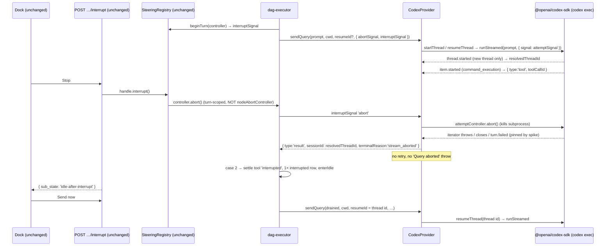

# Issue 184: interrupt and redirect a running Codex agent

## Goal and user outcome

An operator watching a live Codex-backed node can press `Stop`, see the turn end without the node failing, add a correction, and press `Send now` so the queued guidance runs as the next turn on the **same Codex thread**. The workflow node stays `running`; node Cancel, sibling execution, and normal DAG progression are untouched.

Codex has no native turn interrupt on the TypeScript SDK (`turn/steer` is app-server only — see `_bmad-output/specs/spec-agent-node-room/provider-steering-matrix.md:45-49`). Its interrupt is the universal **stream-abort**: abort the per-attempt signal handed to `thread.runStreamed()`, which kills the `codex exec` subprocess, then continue on `codex.resumeThread(threadId)`. Story 2.3 (#183, merged in `79ed773a`) built every engine, server, and web piece this story needs; the capability axis already reserves `'stream-abort'` (`packages/providers/src/types.ts:843-847`). This story is therefore **a provider seam, a real-SDK gate, executor conformance fixtures, and closeout** — not a new UI or route.

The successful flow is:

1. `Stop` reaches the live Codex turn through the executor's fresh per-pass `interruptSignal` (`packages/workflows/src/dag-executor.ts:2431-2435`), which the Codex provider now honours by aborting its per-attempt controller.
2. The provider ends its stream with a **normalized abort-marked `result` chunk** that carries the thread id and `terminalReason: 'stream_aborted'` — never a thrown `Query aborted` (that shape is reserved for node Cancel) and never a cold retry.
3. The executor's existing five-case classification (`dag-executor.ts:2683-2696`, `:3101-3113`) sees the marker on an operator-interrupted token, settles the open tool `interrupted` (rendered `⚠`), writes one `interrupted` status row, and enters `idle-after-interrupt`.
4. `Send now` drains earlier receipts plus the new message in receipt order and calls `sendQuery(..., resumeSessionId = <interrupted thread id>)`, which the provider turns into `codex.resumeThread(...)`.

## Authority and resolved conflicts

Authority order for this story:

1. Issue #184 and Story 2.4 acceptance criteria in `_bmad-output/planning-artifacts/epics-agent-node-room/epics.md:525-551`.
2. Ratified companions `provider-steering-matrix.md` (codex row and §codex) and `steering-test-plan.md` (§"Providers — interrupt conformance", codex bullet: "fixture pins its abort terminal shape (result vs throw vs clean end)").
3. Story 2.3's shipped contracts (`packages/providers/src/types.ts`, `dag-executor.ts`, `steering-registry.ts`) and its plan `plans/260919-0139-issue-183-interrupt-and-redirect-claude-agent/`.
4. Current source and tests.

Resolved conflicts and decisions:

- **Result vs throw on interrupt.** `steering-test-plan.md` lists both shapes as possible for Codex and the AC says "abort-shaped result or exception". The executor reads a session id **only** from a `result` chunk (`dag-executor.ts:2711`) and fails fast when an interrupted turn has neither a result id nor a resume id (`:3488-3496`). A Codex first turn on a new thread learns its id only from the `thread.started` event inside the stream generator (`packages/providers/src/codex/provider.ts:491-530`). Therefore the provider **must** end an operator-interrupted stream with a `result` chunk carrying `resolvedThreadId`; a throw would lose the id and fail the node. The throw shape (`'Query aborted'`) stays the node-Cancel contract only — a pure operator interrupt never produces it; the executor's case-3 tolerance for that string remains as provider-agnostic defence, not a Codex contract.
- **Retry suppression.** `SUBPROCESS_CRASH_PATTERNS` contains `'killed'` and `'signal'` (`provider.ts:313`), and `classifyAndEnrichCodexError` marks crashes retryable (`provider.ts:890`). Any error surfaced by killing the subprocess would otherwise trigger a **cold `startThread` retry** (`provider.ts:1073-1075`), silently replacing the interrupted thread. The provider checks `interruptSignal.aborted` before classification and exits the retry loop, and the backoff sleep (`:1180`) becomes interrupt-aware so a Stop during a genuine rate-limit/crash backoff is not delayed by up to `2000 · 2^attempt` ms.
- **Buffered completions are not dropped.** The interrupt takes effect at the stream's terminal branches only — never as a between-events short-circuit — so an `item.completed` the SDK already buffered for a command that finished just before the kill is still yielded as a successful `tool_result` instead of being mislabeled `⚠ interrupted` by the executor's settle pass.
- **Marker value.** Native providers forward the SDK's `terminal_reason` verbatim (`aborted_streaming`/`aborted_tools`). Stream-abort providers have no SDK marker, so the provider synthesizes a provider-neutral one, `'stream_aborted'`, exported as a constant from `@archon/providers/types` and consumed by both the provider and the executor's `INTERRUPT_TERMINAL_REASONS` set so the two cannot drift. Future stream-abort stories (Grok, OMP) reuse it.
- **Resume-after-kill fallback.** `codex.resumeThread()` is synchronous and its `startThread` fallback (`provider.ts:1005-1018`) only fires on a synchronous construction error; a rollout that cannot be resumed surfaces as a subprocess error during the redirect turn and, on retry (`attempt > 0`), lands on a cold `startThread`. This is pre-existing behaviour for every resumed Codex turn (persist_session, loops), not something this story introduces. Decision: **no new fail-loud path in this story**; instead the real-SDK gate (Phase 1) must prove — across **three** interrupt-then-resume repetitions, not one — that `resumeThread` after a mid-tool kill completes a turn with context retained, so the fallback is not exercised in practice. If any repetition fails, the gate blocks and the story stops. The red-team Security lens argued for a fail-loud redirect turn under AGENTS.md's Fail-Fast principle; that is a legitimate user decision to revisit (see the unresolved question in the handoff) and is recorded as an accepted gap in Phase 3.
- **Early Stop before `thread.started`.** If the operator aborts before the SDK emits `thread.started` on a new thread, the abort-marked result has no `sessionId` and the executor fails the node explicitly with its existing "returned no session id to resume" message (`dag-executor.ts:3489-3496`). This is the accepted behaviour (identical rule to Claude's first-turn case, `dag-executor.test.ts:27615`); the spike records how early `thread.started` arrives so the window is documented, not guessed.
- **Natural end wins a race.** A `turn.completed` that arrives despite an abort keeps its normal result (no marker) — the executor's case 1 rule ("a natural result keeps flowing even when Stop raced it", `dag-executor.ts:2686-2688`). Every other terminal branch (`turn.failed`, iterator throw, clean close, pre-loop check) yields the abort-marked result when the interrupt signal is aborted and the node Cancel signal is not.

## Scope

In scope:

- `CODEX_CAPABILITIES.interrupt: 'stream-abort'`;
- Codex provider honours `interruptSignal`: aborts the per-attempt controller, swallows the abort's terminal shape, yields the normalized abort-marked result with the thread id, never retries, keeps node-Cancel behaviour byte-for-byte;
- shared `STREAM_ABORT_TERMINAL_REASON` constant and the executor set gaining it;
- a real-SDK spike script + sanitized report pinning Codex's abort terminal shape, iterator settlement, unhandled-rejection safety, `thread.started` timing, and resume-after-kill;
- Codex conformance fixtures in the executor test matrix for direct, AI-loop, and loop-group paths, asserting the same transcript order, status rows, sub-state projection, and node state as the Claude fixtures;
- capability matrix regeneration, companion doc citations, sprint status.

Out of scope (owners preserved):

- server route or schema changes — `POST …/nodes/:nodeId/interrupt` is provider-agnostic (`packages/server/src/routes/api.ts:5464-5551`); sub-state projection keys off the registry's `interruptible` flag which is derived from `interrupt !== false` (`dag-executor.ts:3196-3205`, `:5964-5973`);
- web changes — `steering-dock.ts` derives `queue-only` vs `generating` solely from the projected sub-state (`packages/web/src/lib/steering-dock.ts:119-123`) and reads no provider capability (verified by grep: no `capabilities.interrupt` read anywhere in `packages/web/src`); the `⚠` tool rendering keys off `toolOutcome: 'interrupted'` rows the executor already writes;
- new Playwright coverage — the dock does not change; e2e runs use the `e2e-fake` provider, not real Codex;
- soft-inject (`turn/steer`), delivery confirmation, Grok/OMP/DeepSeek interrupt (Stories 2.5–2.7), 30-minute idle expiry (2.12), withdraw/cross-tab (2.2, 2.8–2.11);
- SDK upgrade (`@openai/codex-sdk` stays at the `^0.144.5` pin);
- migrations, durable state, new event kinds.

## Repository evidence inspected

| Area | Evidence |
| --- | --- |
| Capability axis | `packages/providers/src/types.ts:839-847` — `interrupt: 'native' \| 'stream-abort' \| false`; comment says `'stream-abort'` is "reserved; no provider declares it yet". `packages/providers/src/codex/capabilities.ts:25` — `interrupt: false`. |
| `interruptSignal` contract | `types.ts:601-609` — documented for `'native'` providers only; must be widened. |
| Executor gating | `dag-executor.ts:3196-3205` (direct) and `:5964-5973` (loop): `providerInterruptible = getProviderCapabilities(provider).interrupt !== false`; registry handle registered `interruptible`, fresh controller per pass at `:2431-2435` / `:6322-6325`. |
| Five-case classification | `dag-executor.ts:457-484` (`INTERRUPT_TERMINAL_REASONS`, `isAbortLikeStreamError` already includes `'Query aborted'`), `:2683-2696` (abort-marked result), `:2764-2778` (marker beats `isError`), `:3101-3113` (abort-like throw). |
| Session id capture | `dag-executor.ts:2711` (`result.sessionId` only), `:3488-3496` (fail-fast without id). No `session`-typed chunk exists in `MessageChunk` (`types.ts:315-…`). |
| Codex stream pump | `provider.ts:474-514` (abort checks throw `'Query aborted'`), `:491-530` (`thread.started` → `resolvedThreadId`), `:585-596` (`turn.failed` → `codex_turn_failed`), `:833-838` (`turn.completed` result), `:851-860` (clean close → `codex_stream_incomplete`). |
| Codex retry loop | `provider.ts:1048-1069` (fresh `attemptController` per attempt; caller `abortSignal` chained), `:1093-1108` (`runStreamed` + generator), `:1160-1185` (outer catch → `classifyAndEnrichCodexError` → retry), `:1186-1196` (`finally` listener removal + #1735 note). |
| Crash classifier | `provider.ts:313` `SUBPROCESS_CRASH_PATTERNS = ['exited with code','killed','signal','codex exec']`; `:871-891` crash ⇒ `shouldRetry: true`. |
| Existing abort tests | `packages/providers/src/codex/provider.test.ts:2446-2473` (abort throws), `:2537-2580` (fresh signal per retry), `:2583-2614` (caller abort forwards). |
| Claude precedent | `packages/providers/src/claude/interrupt-resume-spike.ts`, `reports/claude-interrupt-resume-spike.md`, `packages/providers/package.json:39` (`spike:interrupt:claude`). |
| Executor conformance matrix | `packages/workflows/src/dag-executor.test.ts:27068-27800` (#183 describe: 23 scenarios; harness pins `getType: () => 'claude'` + `mockClaudeCapabilities`), `:318-334` (`mockCodexCapabilities` lacks `interrupt`), `:27667` (queue-only pin uses **Pi**, so it survives this story). |
| Matrix generator | `scripts/generate-capability-matrix.ts:155` already bolds `stream-abort`; `packages/docs-web/src/content/docs/reference/provider-capabilities.md:60` Codex cell is ❌ today. |
| Sprint state | `_bmad-output/implementation-artifacts/agent-node-room/sprint-status.yaml:71` — `2-4-…: backlog`. |

## Architecture



## Phases

| #   | Phase | Depends on | Detail level |
| --- | --- | --- | --- |
| 1 | [Codex stream-abort seam and real-SDK gate](./phase-01-codex-stream-abort-seam-and-real-sdk-gate.md) | — | Full (deep mode) |
| 2 | [Executor marker and Codex conformance fixtures](./phase-02-executor-marker-and-codex-conformance.md) | 1 | Outline + test matrix; scout before execution |
| 3 | [Closeout: capability matrix, companion docs, sprint status](./phase-03-closeout-matrix-docs-sprint-status.md) | 1–2 | Outline |

Deep-mode rule: Phase 1 must complete (including a **passing** real-SDK gate) before Phase 2 starts; each later phase gets a dedicated scout pass against the then-current tree before execution, because Phase 1's spike may change the exact terminal shapes the fixtures pin.

## Acceptance criteria (mapped to Story 2.4)

- [ ] **AC1 — Stop aborts the stream, node stays running, `idle-after-interrupt`, no failure.** With Codex generating, the interrupt route returns `idle-after-interrupt`; the provider aborted only the per-attempt signal (node `abortSignal` untouched), the executor wrote exactly one `interrupted` status row, emitted no `node_failed`/`dag_node_failed`, ran no validation/re-ask, and the node remains `running`.
- [ ] **AC2 — Send now resumes the same thread; interrupted tool shows `⚠`.** After `Send now`, `sendQuery` receives the interrupted thread id as `resumeSessionId` and the provider calls `codex.resumeThread(thatId)`; the still-open `command_execution` tool row is settled with `toolOutcome: 'interrupted'` (the `⚠` source), and queued + new messages arrive in receipt order as one turn.
- [ ] **AC3 — Executor classification is provider-agnostic (conformance with Claude on direct and loop paths).** The Codex fixtures (abort-marked result on a new thread and on a resumed thread) produce the same transcript row order, the same `interrupted` status row count, the same sub-state projection sequence (`generating` → `idle-after-interrupt` → `generating`), and the same node/run terminal state as the Claude fixtures on direct AI, AI-loop, and loop-group body nodes. This proves the shared executor path; Codex-specific SDK behaviour is proven only by the Phase 1 spike report.
- [ ] **AC4 — Classification.** An operator-marked abort (marker result with the flag set) is interrupted; an unmarked exception (e.g. `Codex crash: … exited with code 1`) with or without the flag is a real failure; a natural `turn.completed` racing Stop stays natural, including when the interrupt lands after `endTurnStream`.
- [ ] **Gate** — `reports/codex-interrupt-resume-spike.md` records a passing protocol (`interrupt-turn-resume`) at the pinned SDK with resume-after-kill proven; `bun run check:capability-matrix`, `bun run type-check`, `bun run lint`, and `bun run validate` pass; `sprint-status.yaml` moved to `done` only after all of the above.

## Compatibility, operations, and rollback

- All changes are additive: one capability value flip, one optional generator parameter, one exported constant, one new set member. No wire, schema, or storage change. Calls without `interruptSignal` (chat, CLI, non-steerable surfaces) keep the exact existing `'Query aborted'` Cancel path and retry behaviour.
- An interrupted Codex turn reports no usage (the SDK emits usage only on `turn.completed`); the executor already tolerates an absent `tokens` field.
- Killing `codex exec` mid-tool leaves whatever the tool wrote on disk, possibly partially applied — the dock's disclosure copy describes the Claude "after the last completed tool call" semantics and is recorded as an accepted gap in Phase 3, not changed here.
- A mid-stream `attemptController.abort()` is the same path node Cancel already takes in production; the server's `handleUnhandledRejection` (`packages/server/src/index.ts:205-217`) exits the process on any rejection outside its `'operation aborted'` allowlist, so the spike's zero-unhandled-rejection probe is a hard gate and the allowlist is the named mitigation if one surfaces.
- Repeated Stop/Send-now cycles each spawn a fresh `codex exec`; no per-node cycle bound exists, the same as Claude under Story 2.3 on the same routes — accepted, not new.
- Rollback is a single slice: revert the capability to `false` and the provider seam; the executor constant and fixtures are inert without a declaring provider.

## Red Team Review

### Session — 2026-09-20
**Reviewers:** Assumption Destroyer (7), Failure Mode Analyst (5), Security Adversary (5) — all with Fact Checker + Contract Verifier roles (Standard tier).
**Findings:** 17 (16 accepted — 9 as modified, 1 rejected)
**Severity breakdown:** 2 Critical, 6 High, 9 Medium

| # | Finding | Severity | Disposition | Applied To |
|---|---------|----------|-------------|------------|
| 1 | Outer-catch marker reads `thread.id` before `thread.started` (unpinned value) | Critical | Accept (modified): `knownThreadId()` normalizes `null`; spike step 1b aborts pre-`thread.started` and records `threadIdPropertyBeforeStarted` | Phase 1 |
| 2 | Mid-stream abort adds a second path into the #1735 uncaught-rejection hazard; server exits on unknown rejections | Critical | Accept (modified): same path as existing node Cancel; zero-rejection probe is a hard gate; `handleUnhandledRejection` allowlist named as conditional in-scope mitigation | Phase 1, plan.md |
| 3 | "Mirrors Claude `:1728-1731`" citation is false — Claude throws, plan yields | High | Accept: documented as deliberate divergence | Phase 1 |
| 4 | `mockCodexCapabilities` edit is not the gate (real registry is unmocked) | High | Accept: reclassified as consistency-only; real gate named | Phase 2 |
| 5 | `.toEqual()` capability snapshot at `provider.test.ts:83-107` breaks at runtime, not via `tsc` | High | Accept: named explicitly in Files and test 1 | Phase 1 |
| 6 | Retry backoff sleep is not interrupt-aware (up to 8 s stall) | High | Accept: abortable delay + test 12 with non-zero delay | Phase 1, plan.md |
| 7 | Top-of-loop interrupt check drops buffered `item.completed`, mislabeling finished tools `⚠` | High | Accept: interrupt applies at terminal branches only; test 3 | Phase 1, plan.md |
| 8 | Silent `resumeThread`→`startThread` fallback contradicts Fail-Fast for the redirect turn | High | Accept (modified): 3/3 resume-after-kill gate + accepted-gap record; fail-loud left as a user decision | plan.md, Phase 1, Phase 3 |
| 9 | Orphaned subprocess descendants never checked | High | Accept: spike snapshots descendants; survivors block | Phase 1 |
| 10 | Two-run spike threshold is statistically weak | Medium | Accept (modified): three repetitions of interrupt+resume | Phase 1 |
| 11 | `withResumedOutcome` stamps every result; exact-shape tests would fail | Medium | Accept: `toMatchObject` mandated | Phase 1 |
| 12 | AC3 "parity with Claude" is a tautology over identical mocked inputs | Medium | Accept: AC3 reframed as executor provider-agnosticism | plan.md, Phase 2 |
| 13 | `runStreamed()` own rejection not listed in the precedence checklist | Medium | Accept: fifth terminal site listed | Phase 1 |
| 14 | `'Query aborted'` throw on pure interrupt has no producing path; Phase 2 test 3 tests dead code | Medium | Accept: test removed; plan.md bullet corrected | plan.md, Phase 2 |
| 15 | Sticky `operatorInterrupted` flag relies solely on marker gate; late-window untested | Medium | Accept: Phase 2 test 10 (post-`endTurnStream` interrupt on natural end) | Phase 2 |
| 16 | Dock disclosure copy misdescribes a mid-tool kill | Medium | Accept (modified): recorded as accepted gap for the design owner; no copy change | Phase 3, plan.md |
| 17 | Stop/Send-now cycles are an unbounded subprocess-respawn surface | Medium | Reject: pre-existing characteristic shared with Story 2.3 on the same routes; noted in Compatibility, no new bound | plan.md (note only) |

### Whole-Plan Consistency Sweep
Decision deltas: (a) interrupt precedence moved from between-events to terminal branches; (b) `knownThreadId()` replaces bare `thread.id`; (c) interrupt-aware backoff; (d) the `'Query aborted'`-on-interrupt contract removed; (e) AC3 reframed; (f) three-repetition spike gate; (g) accepted gaps listed in Phase 3. Swept `plan.md` (Goal step 2, Authority bullets, AC3/AC4, Compatibility), Phase 1 (contract, tests 2–3/8/12, gate steps 1b/6, risks), Phase 2 (files, fixture design, tests 3/10, steps), Phase 3 (accepted gaps). No stale "between-events" short-circuit, "mirrors Claude", or throw-on-interrupt claims remain (verified by grep across the four files). No unresolved contradictions.

## Validation Log

### Verification Results
- Claims checked: 70 (34 + 22 + 14 across the three reviewers)
- Verified: 61 | Failed: 2 (both corrected — findings 3 and 5) | Unverified: 7 (all runtime SDK behaviour the Phase 1 spike exists to pin; `node_modules` is unreadable in this session)
- Tier: Standard (Fact Checker + Contract Verifier)

### Decision points (auto-resolved with the recommended option; revisit on request)
1. **Interrupt terminal shape** — result chunk with thread id (recommended) vs throw. Chosen: result; a throw loses the new-thread id (`dag-executor.ts:2711`, `:3488-3496`).
2. **Marker value** — provider-neutral shared constant `'stream_aborted'` (recommended) vs reusing Claude's `aborted_streaming`. Chosen: shared constant, so Grok/OMP stories reuse it and the executor set cannot drift.
3. **Redirect-turn resume failure** — keep pre-existing fallback + 3/3 spike gate (recommended for scope) vs new fail-loud path. Chosen: keep; flagged as an open user decision.
4. **Buffered completions** — yield them (recommended) vs short-circuit on interrupt. Chosen: yield; relies on the kill ending the iterator (spike `iterator_hung` gate).
5. **Web/dock changes** — none (recommended); disclosure copy gap recorded for the design owner.

### Whole-Plan Consistency Sweep
Performed together with the red-team sweep above; no contradictions.

## Validation sequence

Run each phase's focused commands, then:

```bash
bun run generate:capability-matrix && bun run check:capability-matrix
bun run type-check
bun run lint
bun run validate
```

Never run root `bun test`; always the per-package form. Do not move `sprint-status.yaml` to `done` until the spike report and every gate above are green.
