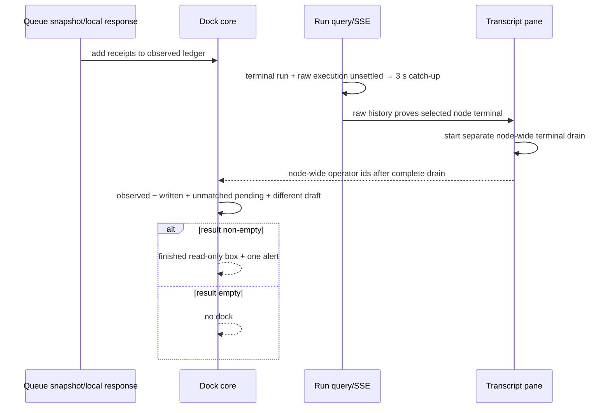

# Issue 191: recover messages that were never sent when the node ends

## Outcome

After the client observes the selected node's actual terminal evidence, both
the Legacy and Console node rooms compare every steering receipt previously
shown by the shared node queue (plus successful receipts returned directly to
this tab) with the executor's persisted operator rows. Evidence is either a
persisted lifecycle terminal or the server's exact-scope terminal projection
of a transactionally purged Ask interaction. Unmatched messages return in the
draft area as a read-only `NEVER SENT · n` box, retaining their exact text and
`message_id`. A still-pending submission and any different half-typed draft
are folded in last. The disclosure is announced once with `role="alert"`.

The comparison must not run when only the workflow run is terminal. In the
Cancel path, the run becomes `cancelled` and the steering handle is discarded
before the executor writes `node_failed`; an operator row may still be written
in that interval. The browser therefore keeps refreshing terminal runs whose
raw node execution remains unsettled and reconciles only after the raw
`node_completed`/`node_failed` event is visible. A parked Ask has no remaining
executor, so its transactionally purged scoped interaction is the one explicit
terminal-evidence exception.

This is Story 2.11 from
`_bmad-output/planning-artifacts/epics-agent-node-room/epics.md`. Its data
dependencies, Story 2.8 operator rows with `message_id` and Story 2.9 shared
queue snapshots, are already marked `done` in the sprint tracker.

## Acceptance criteria

| ID      | Measurable result                                                                                                                                                                                                                                                                                                                                                            | Evidence                                                                             |
| ------- | ---------------------------------------------------------------------------------------------------------------------------------------------------------------------------------------------------------------------------------------------------------------------------------------------------------------------------------------------------------------------------- | ------------------------------------------------------------------------------------ |
| AC1     | On actual node terminal evidence, every receipt ever shown by a generation-valid queue snapshot (including the read-only finished-iteration view) or returned by this tab, except ids this tab confirmed withdrawn, is compared with node-wide persisted operator `message_id`s; every unmatched receipt is restored once in original observation order.                     | Phase 1 state tests, Phase 2 component tests, Phase 3 pane tests, Phase 4 Cancel E2E |
| AC2     | A live refetch, a workflow-level terminal status with raw execution still `running`/`awaiting`, and a transcript drain begun before terminal evidence never populate reconciliation input; cancelling a scoped parked Ask projects only its proven execution(s) terminal, answered resume retires only proven superseded segments, and unscoped/ambiguous data fails closed. | Phase 3 server/model/parent/pane tests                                               |
| AC3     | A pending submission that has neither been observed nor written is restored; a different current draft follows it verbatim; unchanged text is not duplicated.                                                                                                                                                                                                                | Phase 1 and Phase 2 tests                                                            |
| AC4     | The finished box contains exact text and identities, has the accessible name `Never sent, n`, contains exactly one assertive alert with `node finished · none of this was sent`, and exposes no field or controls.                                                                                                                                                           | Phase 2 tests and Phase 4 visual/accessibility E2E                                   |
| AC5     | If every observed receipt has a written operator row and there is no unsent input, the finished dock is absent.                                                                                                                                                                                                                                                              | Unit, component, and natural-drain E2E                                               |
| AC6     | A new execution attempt for the same node clears terminal reconciliation state even if it starts and finishes between client refreshes or the prior reconciliation never completed; late queue/send/withdraw/interrupt/drain results from the prior attempt are inert; draft text remains, the old retry UUID is cleared, and the next submission mints a new id.            | Phase 2 and Phase 3 tests                                                            |
| Tracker | Focused evidence is recorded and the Story 2.11 tracker entry moves to `done` only after all gates pass.                                                                                                                                                                                                                                                                     | Phase 4                                                                              |

## Repository evidence and resolved decisions

Evidence was checked at worktree `915e0593`; its production parent is
`0d935ef2`.

1. **Product authority.** The issue and Story 2.11 require comparison on the
   node terminal event, not merely a terminal workflow status. The story also
   requires identity preservation and an assertive announcement.
2. **UX authority.** `EXPERIENCE.md` specifies the exact disclosure, list name,
   lowercase DOM text with CSS uppercase, read-only result, one announcement,
   and focus returning to the last transcript row. `DESIGN.md` specifies the
   existing elevated-band tokens, top rule, single-line/elided items, maximum
   height `33vh`, and no controls or new color. The authoritative dock width is
   460 px; the Console host is additionally checked at 1440 px. No repository
   authority supports the draft plan's 1280 px dock target.
3. **Copy conflict.** The mockup says `these never left this tab`, while
   `EXPERIENCE.md` says `none of this was sent`. Shared queue observations can
   originate in another tab, so the experience copy is correct. Phase 4
   updates the mockup. Story 2.11's explicit `role="alert"` overrides the
   experience prose that compares the announcement register to the polite
   stop status.
4. **The queue is lossy; observation history is not.**
   `NodeSteeringHandle.drain()` removes pending items immediately, and
   `applyQueueSnapshot()` currently replaces the visible `sent` array. The
   executor writes the operator row only on the guidance turn's first
   successful stream yield. A receipt can therefore disappear from a later
   snapshot before any row exists. A tab-local-success-only ledger is also
   insufficient: an observer tab may see a shared receipt and later see an
   empty queue. The core needs an **observed ledger** populated by both valid
   snapshots and local successes; snapshots add but never delete history.
5. **Cancel is not the node event.** `cancelWorkflowRun()` commits run status
   `cancelled` and calls `discardRunSteeringHandles()` immediately. The
   executor later detects cancellation and records `node_failed`; meanwhile it
   can persist an operator row. The API's settled `nodeStates` projection is
   not proof of the event: raw `nodeExecutions` remains `running` until the
   event exists. Reconciliation on `!live` would create a false `NEVER SENT`
   result, so it is forbidden.
6. **A parked Ask needs a read-side terminal closure.** Cancelling or failing a
   paused run transactionally changes its pending interaction to `purged` and
   records `interaction_resolved`, but no executor remains to emit
   `node_failed`. The run-detail query already supplies all interaction rows,
   including their server-minted `execution_scope`, to
   `projectWorkflowExecutionHistory()`. That projection must mark only the
   scoped matching execution as failed at `resolved_at`, with the same
   unambiguous occurrence fallback already used for a re-asked pending
   interaction. An unscoped, unmatched, or ambiguous purge remains unresolved.
   When the scope has `loop_ancestry`, the projection must also close every
   unambiguously matched pre-resolution loop-owner execution represented by
   those ancestry prefixes (the owning iteration and a normal loop's open
   container); otherwise an ancestor remains falsely running after the parked
   execution is closed. Ambiguity is evaluated per owner and fails closed.
   This is a read-model fix, not autonomous lifecycle mutation, and it prevents
   both a missing result and an endless terminal catch-up loop.
   The same projection must also retire a pre-pause open segment after an
   answered Ask's matching persisted `interaction_resolved` event says
   `resumed:true` and a later lifecycle start proves execution resumed;
   otherwise an eventual real terminal pairs with the resumed segment while
   the pre-pause segment remains falsely `running`. For loop Ask scopes, the
   interaction's `loop_ancestry` identifies all provable owner segments. Exact
   scope, tool identity, persisted resolution time, and corresponding later
   starts are required; ambiguity fails closed.
7. **Terminal catch-up is necessary.** Legacy polling currently stops at a
   terminal run. Console SSE invalidation can miss the later node event during
   reconnect, and its live heartbeat also stops. Both parents must continue a
   mounted-view 3 s refresh only while the run is terminal and any raw node
   execution has a nonterminal status (including `running`/`awaiting`); stop as
   soon as all raw executions settle. If the event never arrives, fail safe by
   not claiming a message was unsent. This is read-only observation and does
   not mutate run lifecycle.
8. **Pending submission and edited draft are distinct inputs.** The textarea
   remains editable while a request is in flight. If the user changes it, the
   submitted `pendingRetry` and current draft must both survive. If the
   pending id was observed or written, it must not be added again.
9. **Retry/resume keeps the same run/node storage key.** A boolean
   terminal-to-live transition is not a sufficient reset signal: a short retry
   can start and finish between two client refreshes. Modern `node_started`
   events carry a server-minted `occurrence_id`. A prompt Ask resume reuses its
   occurrence, while a loop Ask resume starts a new outer occurrence even
   though it is the same logical execution. Derive the logical execution key
   by folding ordered events: an `interaction_resolved` for the same Ask with
   `resumed:true` makes the next same-node `node_started` retain the prior key;
   every other new start adopts its occurrence id (or persisted event id for a
   legacy unscoped row). The prior attempt's ambiguous `pendingRetry` UUID must
   also be cleared: the node-wide transcript legitimately contains
   prior-attempt operator rows, so reusing that UUID could falsely classify a
   new-attempt submission as already delivered. Preserve its draft text and
   mint a new id only if the user submits again. The folded logical key, not
   the raw occurrence id, is the reset contract for Ask continuations.
10. **Existing infrastructure is sufficient.** Both panes already serialize
    transcript drains and expose `NodeMessageState.complete`. Operator rows are
    text rows whose metadata has `origin: 'operator'` and `message_id`. The
    existing interruptible `e2e-queue-guidance` fixture and web test helpers
    cover the real executor path. Apart from the server's existing execution
    history read projection, no schema, engine, route, or API change is needed.
11. **Finished-iteration is an observer, not an exclusion.** Story 2.10 lets a
    selected completed loop occurrence mirror the live node's shared queue.
    Story 2.11 therefore applies if that node later ends. Its displayed
    occurrence transcript is not a safe delivery set because operator rows can
    belong to the live occurrence. Terminal reconciliation must use a separate
    node-wide message drain (no occurrence filter) and the dock mode that last
    showed the queue is eligible even when it was read-only.
12. **Transcript scope and steering-history scope differ.** Both panes currently
    key the dock with the occurrence-scoped transcript key. That remount would
    discard an already observed receipt when the operator changes occurrences,
    even though all those views show the same node registry queue. Keep
    transcript pagination occurrence-scoped, but key the dock and terminal
    reconciliation by run/node so observation history survives occurrence
    selection. A run or node change still resets it.
13. **An in-flight own withdraw must settle first.** A confirmed withdraw is
    the operator intentionally cancelling that receipt, but its response can
    race the terminal drain. Reconciliation must wait while
    `withdrawingMessageId` is non-null. Success removes the id before the
    one-shot comparison; failure clears the transient but preserves the id, so
    the comparison recovers it. Guessing either outcome would lose intent.
14. **Attempt reset is also an async ownership boundary.** The current dock
    continuations apply responses directly to component state. Resetting that
    state without invalidating requests would let an old send, withdraw,
    interrupt, or queue-read response repopulate the new attempt. Each dock
    needs a local attempt generation captured by every async operation; a
    changed generation makes the old continuation inert. The pane applies the
    same rule to its abortable terminal drain. This does not cancel a server
    mutation that already happened; it prevents its obsolete client response
    from corrupting the next attempt.

## Scope

Included:

- Shared core: observed ledger, one-shot reconciliation, exact copy/labels,
  explicit terminal input, operator-id extraction, and finished mode.
- Both docks: eligibility tracking (including queue-observing
  finished-iteration mode), execution-generation reset, read-only finished box,
  announcement, focus, visual and responsive behavior.
- Exact-scope Ask pause/resume and purge closure in the server's existing
  execution-history read projection; raw-execution settlement helpers and
  terminal catch-up in both run-detail parents.
- Node-room wrappers and both transcript panes: a raw terminal-evidence signal,
  a complete node-wide post-terminal drain, and reset rules.
- Focused unit/component tests, real-executor Playwright coverage, evidence,
  current architecture/walkthrough/test/mockup correction, and tracker
  closeout. Historical review/memory records remain unchanged.

Excluded:

- Workflow engine, steering registry, database writes/schema, routes, OpenAPI,
  or generated API changes. The server change is limited to projecting an
  already-persisted scoped Ask state as accurate execution history.
- Durable/session storage of the observed ledger/finished box,
  resend/dismiss controls, and cross-reload recovery. Existing draft/retry
  storage key and record shape remain unchanged; retry reset clears only the
  prior attempt's UUID while retaining draft text. Observation history is
  mounted state.
- Story 2.12's idle-expiry timer/copy and Story 2.13 ordering work.
- Changes to transcript rendering, `agent-history.ts`, or node-room routing.

## Design

### 1. Framework-free state

Add to `SteeringDockState`:

```ts
readonly observedLedger: readonly LocalSentReceipt[];
readonly neverSent: readonly NeverSentEntry[] | null;
```

`observedLedger` is ordered by first observation and deduplicated by
`messageId`. `resolveGuidanceSuccess` and `resolveSendNowSuccess` add local
receipts. Every generation-valid `applyQueueSnapshot` adds all snapshot rows
before replacing the visible queue. Stale snapshots change neither. A
successful withdraw by this tab removes the id because the user deliberately
cancelled it; snapshots, failures, interrupts, and queue omission never remove
history. Scope/retry reset clears it.

`reconcileNeverSent(state, { writtenMessageIds, draft })` runs once:

1. Append observed-ledger rows whose ids are not written.
2. Append `pendingRetry` only when its id is neither observed nor written.
3. Append the current raw draft only when `draft.trim()` is non-empty and its
   raw value differs from `pendingRetry.message`; use `messageId: null`.
4. Deduplicate ids, preserve raw message text and order, and set `neverSent` to
   the resulting array (including `[]`). Do not mutate draft, storage, queue,
   refusal, notice, or retry state. A repeated call returns the same object.

This order handles local and cross-tab receipts, drained snapshots, ambiguous
POST outcomes, an in-flight request followed by field edits, and replayed
responses without synthesizing delivery state.

`steeringDockMode` may return `finished` only when `neverSent` is non-empty
**and** an explicit `nodeTerminal` input is true. The input is derived from raw
event-backed execution history in Phase 3; neither selected-row status nor
`!live` is a substitute. A null/empty result follows the existing table.

### 2. Terminal projection and catch-up

Extend `projectWorkflowExecutionHistory()` before adding client gates. It
already receives every interaction row, not only pending rows. For a
`kind:'ask', status:'purged'` row with a complete `execution_scope`, first match node,
`occurrence_id`, and `attempt_id`. If a re-ask has advanced the interaction's
attempt without another node start, allow the existing projection precedent:
one unambiguous same-node/same-occurrence execution may adopt that scope, with
stale start timing cleared. Project that execution as `failed`, with
`ended_at` from a parseable non-null `resolved_at` (normalizing a `Date` to
ISO) and a duration only when retained endpoints parse and are ordered. Do not
close by node id alone, do not guess among multiple
occurrence matches, do not fabricate scope for legacy rows, and do not change
pending/permission interactions or an answered Ask without later resume
evidence. If the purged scope has `loop_ancestry`, use each ordered ancestry
prefix plus raw start kind/iteration to close every uniquely matched open
pre-resolution loop-owner execution: its loop iteration and, when present, the
normal loop's outer `node_started` container. Do not close a sibling or infer
ownership from node id alone; zero or multiple candidates for an owner leave
that owner open. This consumes committed state only; it writes no lifecycle
event or run status.

Also normalize answered-Ask resume gaps. Given a scoped answered Ask with a
valid `resolved_at`, require its matching `interaction_resolved` event
(`kind:'ask'`, same node/tool id, `resumed:true`) and a later corresponding
lifecycle start before retiring a matching open pre-resolution segment. For an
ordinary prompt, match the occurrence/attempt and later `node_started`. For a
loop scope, apply the same ancestry-prefix ownership rules and require a later
corresponding owner start before retiring each old owner. Keep all resumed/later
executions. Do not infer resume merely from `status:'answered'`, and fail closed
per segment on zero or multiple candidates.

Add pure raw-history helpers in `execution-room-model.ts`:
`hasUnsettledNodeExecutions(nodeExecutions)` treats every status other than
`completed`/`failed`/`skipped` as unsettled (including `running`, `awaiting`,
and future/unknown values), while `hasTerminalNodeEvidence(nodeExecutions,
nodeId)` is true only when the node has at least one execution and all its
executions have terminal raw-history statuses. Add
`latestNodeExecutionKey(events, nodeId)`, ordered by `event_order` with the same
timestamp/id fallback used by event projections. Fold exact-node events: a
normal `node_started` adopts its nonempty `data.occurrence_id` or persisted
event id; an Ask `interaction_resolved` with `resumed:true` arms one
continuation so the next exact-node `node_started` retains the prior key. Clear
an unused continuation marker on an exact-node terminal or retry request. The
helper ignores loop-iteration starts and sibling events. In Legacy
`WorkflowExecution`, retain the existing live 3 s poll and also poll every 3 s
when the run is terminal and raw executions are unsettled. In Console
`RunDetailPage`, retain SSE and the existing 30 s live heartbeat, plus a 3 s
terminal catch-up invalidation while raw executions are unsettled. Stop
catch-up once settled or unmounted.

Do not derive this from settled `nodeStates`. Do not alter lifecycle status or
invent a timeout that marks a node terminal.

### 3. Event-backed, node-wide terminal drain

The node-room wrappers derive `nodeTerminal` from raw `nodeExecutions` and
`nodeExecutionKey` from raw ordered events for the selected node, then pass both
through to the pane and dock. Terminality remains false for an
already-completed selected iteration while a later occurrence is still
running, and becomes true only after the live occurrence's terminal event.
For a parked Ask, the server read projection supplies the terminal failed
execution from its exact scoped purge instead.

When `nodeTerminal` becomes true, each pane starts a separate reconciliation
drain with a node-wide selection (no `occurrenceId`/`attemptId`). It does not
reuse or alter the displayed occurrence's transcript state. Only a drain that
started under `nodeTerminal === true` and completed with `error === null` and
`complete === true` may produce `writtenOperatorMessageIds`. Transient errors
retry on the existing 1 s transcript cadence while mounted; reset/abort on
run/node change, `nodeExecutionKey` change, or when `nodeTerminal` becomes
false. An execution-key change restarts the drain even if a short execution was
observed only after it had already become terminal. The dock and this drain
use run/node identity; the displayed transcript retains its existing
occurrence-scoped identity. No pre-event display drain can populate this
state.

The dock reconciles only when that set is non-null and this mounted run/node
attempt previously rendered a queue-observing mode: `composer`, `blocked`, or
`finished-iteration`. A room that was detached from the outset never
qualifies because it observed no queue; a room that observed the queue and
later becomes detached keeps that history. Its own `withdrawingMessageId`
must also be null; the effect waits for an in-flight withdraw to settle before
taking the one-shot snapshot.

### 4. Finished dock

DOM order:

1. Existing elevated band surface with a top rule.
2. Lowercase source heading `never sent · n`, visually uppercased with the
   existing tracking style.
3. `<ul aria-label="Never sent, n">` with one single-line/elided item per
   entry and `data-message-id` only for identified entries.
4. One `<p role="alert">node finished · none of this was sent</p>`.

There is no textarea, badge, delete action, Stop/Queue/Send-now control, or
`role="status"`. The alert node remains the same DOM node across ordinary
rerenders so it is announced once. The band uses existing colors/tokens, is
at most `33vh`, and cannot introduce horizontal overflow. Existing focus
handoff targets the last transcript row/scroller and never leaves focus on
`body`.

### 5. Attempt reset

Track the explicit `nodeExecutionKey` and `nodeTerminal` inputs. When a non-null
execution key replaces another for the same run/node, create fresh dock state;
this is authoritative even when both old and new renders are terminal because
the attempt ran between refreshes. Keep terminal true-to-false as a fail-safe
for an incomplete legacy history that cannot yet supply a key. Retain the
current draft text, but set `pendingRetry` to null in state and that run/node's
existing session-storage record so the next submission mints a new UUID.
Clear observed history, `neverSent`, and the pane's written-id snapshot even
when the prior terminal reconciliation failed or stayed `null`. A resumed Ask
retains the folded logical execution key even when a loop resume mints a new
outer `occurrence_id`, so it does not reset. Changing the displayed occurrence
for the same node is not an attempt reset: it must preserve the
node-wide observation ledger and any terminal drain in progress. Increment a
local attempt generation on reset. Queue polling and every Queue, Send-now,
withdraw, and interrupt continuation capture that generation and perform no
state, draft, focus, or storage work after it changes. The pane likewise
aborts its old drain and rejects late completion before publishing ids.

## Behavior flow



## Phases

| #   | Phase                                                                                                       | Effort | Depends on |
| --- | ----------------------------------------------------------------------------------------------------------- | -----: | ---------- |
| 1   | [Shared core: observed ledger and reconciliation](./phase-01-shared-core-ledger-and-reconciliation.md)      |     4h | —          |
| 2   | [Read-only NEVER SENT box in both docks](./phase-02-never-sent-box-both-docks.md)                           |     6h | 1          |
| 3   | [Actual-terminal catch-up and node-wide transcript gate](./phase-03-post-terminal-drain-gate-both-panes.md) |    10h | 1, 2       |
| 4   | [E2E evidence, authority sync, tracker closeout](./phase-04-e2e-evidence-authority-sync-closeout.md)        |     6h | 3          |

Tests are written red before implementation within each phase. A skipped
`test.fixme` is not a red test and is not used. Use package/per-file Bun test
commands; never run root `bun test`.

## Validation

```bash
bun test packages/web/src/lib/steering-dock.test.ts
bun test packages/server/src/routes/workflow-execution-history.test.ts
NODE_ENV=development bun test packages/web/src/components/workflows/ComposerDock.test.tsx
NODE_ENV=development bun test packages/web/src/experiments/console/components/ConsoleComposerDock.test.tsx
NODE_ENV=development bun test packages/web/src/components/workflows/NodeTranscriptPane.test.tsx
NODE_ENV=development bun test packages/web/src/experiments/console/components/ConsoleNodeRoom.test.tsx
NODE_ENV=development bun test packages/web/src/components/workflows/WorkflowExecution.test.tsx
NODE_ENV=development bun test packages/web/src/experiments/console/routes/RunDetailPage.test.tsx
NODE_ENV=development bun test packages/web/src/components/workflows/LegacyGraphLogsPane.test.tsx
NODE_ENV=development bun test packages/web/src/components/workflows/LegacyNodeRoom.test.tsx
NODE_ENV=development bun test packages/web/src/experiments/console/components/ConsoleInspectPane.test.tsx
bun test packages/web/src/experiments/console/console-isolation.test.ts
bun --filter @archon/web test
bun --filter @archon/server type-check
bun --filter @archon/web type-check
bun x eslint packages/server/src/routes/workflow-execution-history.ts packages/server/src/routes/workflow-execution-history.test.ts packages/web/src/lib/steering-dock.ts packages/web/src/lib/steering-dock.test.ts packages/web/src/components/workflows/ComposerDock.tsx packages/web/src/components/workflows/ComposerDock.test.tsx packages/web/src/components/workflows/NodeTranscriptPane.tsx packages/web/src/components/workflows/NodeTranscriptPane.test.tsx packages/web/src/components/workflows/WorkflowExecution.tsx packages/web/src/components/workflows/WorkflowExecution.test.tsx packages/web/src/components/workflows/LegacyGraphLogsPane.tsx packages/web/src/components/workflows/LegacyGraphLogsPane.test.tsx packages/web/src/components/workflows/LegacyNodeRoom.tsx packages/web/src/components/workflows/LegacyNodeRoom.test.tsx packages/web/src/lib/execution-room-model.ts packages/web/src/lib/execution-room-model.test.ts packages/web/src/experiments/console/components/ConsoleComposerDock.tsx packages/web/src/experiments/console/components/ConsoleComposerDock.test.tsx packages/web/src/experiments/console/components/ConsoleNodeRoom.tsx packages/web/src/experiments/console/components/ConsoleNodeRoom.test.tsx packages/web/src/experiments/console/components/ConsoleInspectPane.tsx packages/web/src/experiments/console/components/ConsoleInspectPane.test.tsx packages/web/src/experiments/console/routes/RunDetailPage.tsx packages/web/src/experiments/console/routes/RunDetailPage.test.tsx --max-warnings 0
bun run build:web
cd e2e && npm run typecheck && npx playwright test -c playwright.config.ts ui/agent-never-sent.spec.ts ui/agent-queue-guidance.spec.ts ui/agent-finished-iteration.spec.ts
cd .. && bun run validate
```

`@archon/web` has no package `lint` script; the focused command uses the root
ESLint binary, and `bun run validate` remains the final repository gate.

## Risks, operations, compatibility, and rollback

| Risk                                                                                          | Handling                                                                                                                                                                                                                                                                               |
| --------------------------------------------------------------------------------------------- | -------------------------------------------------------------------------------------------------------------------------------------------------------------------------------------------------------------------------------------------------------------------------------------- |
| Terminal evidence never arrives after a terminal run.                                         | Do not render a potentially false box. Catch-up remains mounted-view-only and stops on unmount; no lifecycle mutation.                                                                                                                                                                 |
| A cancelled/failed parked Ask has no later executor event.                                    | The existing scoped purged interaction closes its exact execution and every uniquely proven loop-owner execution in the read projection; ambiguous legacy scope/owners fail closed.                                                                                                    |
| Node-wide terminal transcript request fails.                                                  | Keep reconciliation input null and retry the read-only drain at 1 s only while the terminal room remains mounted; do not guess.                                                                                                                                                        |
| Every observing same-node dock closes, reloads, or navigates to another node before terminal. | Observation history is intentionally component-memory under NFR4; a later remount cannot reconstruct a destroyed in-memory queue. Occurrence-only selection keeps the dock mounted.                                                                                                    |
| Another tab withdraws a receipt after this tab observed it.                                   | This tab may show it as never sent; the statement is true and read-only. This tab's own confirmed withdraw removes it.                                                                                                                                                                 |
| Queue history grows during a long node.                                                       | Ledger memory is O(receipts observed by one mounted run/node attempt), preserves exactness, and clears on run/node change or retry; it does not accumulate globally.                                                                                                                   |
| A terminal node has a large transcript or many observers.                                     | Each mounted observer performs one existing sequential 100-row paginated drain to a captured high-water mark; requests do not overlap and no new route or unpaginated read is added.                                                                                                   |
| Duplicate alert announcements.                                                                | Mount one alert node only on transition to a non-empty result and preserve node identity on rerender; component tests pin this.                                                                                                                                                        |
| Operator text is untrusted content.                                                           | Render it through ordinary React text nodes with existing CSS elision; never use HTML injection or parse prose. Exactness tests inspect text content.                                                                                                                                  |
| Extra reads broaden access.                                                                   | Reuse the existing authenticated run-detail and node-message loaders with the same run/node scope; add no route, grant, or client-supplied identity.                                                                                                                                   |
| Public/API compatibility.                                                                     | The run-detail schema and routes are unchanged. `nodeExecutions` intentionally stops reporting a proven superseded/purged scoped Ask segment as running; old scoped rows improve on first read, while unscoped history remains unchanged. No persisted data or generated type changes. |
| Read-projection cost.                                                                         | Build file-local scope/occurrence/ancestry indexes and process events, interactions, and their already-loaded ancestry entries once; add no query or payload. The client adds only the bounded reads described above.                                                                  |

Rollback is a plain revert of the server read-projection and client changes,
plus authority/test artifacts. There is no migration or data rollback;
historical rows are never rewritten. The terminal catch-up is independently
reversible because it changes only query invalidation cadence.

## Definition of done

- [ ] AC1–AC6 pass in both Legacy and Console surfaces.
- [ ] Cross-tab observation is proven: a receipt seen from another tab remains
      recoverable after a later empty snapshot.
- [ ] A receipt observed from a completed iteration's read-only shared band is
      reconciled against node-wide rows after the overall node event.
- [ ] Cancel E2E waits for the actual `node_failed` event before asserting the
      box; natural delivery proves written ids and absence of the box.
- [ ] Visual evidence covers a 460 px dock in both shells and Console at a
      1440 px host, including `33vh`, overflow, focus, accessible naming, and
      contrast ≥ 4.5:1.
- [ ] Focused tests, web suite/typecheck/lint, E2E typecheck/specs, build, and
      `bun run validate` pass.
- [ ] AD-11, its visual walkthrough, steering test plan, and mockup copy match
      implemented behavior; tracker changes to `done` only after the gates
      pass.

## Remaining assumptions and blockers

No design blocker remains in repository evidence. The accepted scope assumes
at least one same-run/node dock remains mounted from receipt observation through
terminal evidence; occurrence-only selection preserves that dock, while a
reload, closing every observer, or navigating each observer to another node
does not. Durable/cross-remount recovery would expand the steering feature's
current in-process/NFR4 contract and is explicitly excluded. Implementation
must retain the fail-safe rule: absence of real terminal evidence or a
complete terminal transcript drain means absence of a NEVER SENT claim, not a
guessed result. A legacy parked Ask without a complete execution scope therefore
remains visibly unsettled and may keep the mounted view's 3 s catch-up active;
the plan intentionally prefers that bounded read-only cost over inventing a
terminal execution or a false recovery result.
