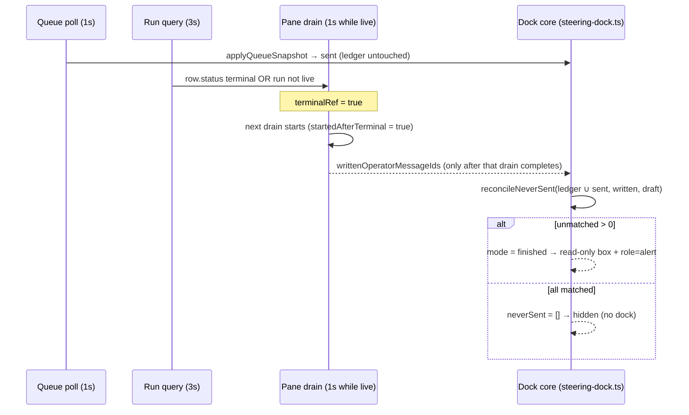

# Issue 191: recover messages that were never sent when the node ends

## Outcome

When a steered node ends for any reason — natural finish, workflow Cancel,
node failure, or (once Story 2.12 ships) the 30-minute idle-await expiry — no
operator guidance disappears silently. Both node-room shells (Legacy
`ComposerDock` and Console `ConsoleComposerDock`) compare every message id
that was shown as queued (plus every receipt this tab itself received) with
the operator rows the executor actually wrote, and restore every unmatched
message to a **read-only draft box** headed `NEVER SENT · n`, each item
keeping its original text and `message_id`. A half-typed unsent draft folds
in as the last item. The restoration is announced once through an assertive
`role="alert"`. The comparison runs **only after the node is terminal and
only against transcript rows fetched after that fact was observed**, so a
live refetch can never mark a message prematurely.

Issue #191 names Story 2.11 in
`_bmad-output/planning-artifacts/epics-agent-node-room/epics.md` as the
acceptance authority. Its blockers (Story 2.8 operator rows with
`message_id`, Story 2.9 shared live queue) are `done` in
`_bmad-output/implementation-artifacts/agent-node-room/sprint-status.yaml`.

## Acceptance criteria (from Story 2.11, restated as testable claims)

| # | Claim | Proven by |
|---|-------|-----------|
| AC1 | On the node terminal event the client compares every queued `message_id` shown by the node queue with written operator rows; unmatched ones return to the draft area as `NEVER SENT`. | Phase 1 unit (`reconcileNeverSent`), Phase 2 dock component tests, Phase 3 pane tests, Phase 4 E2E Cancel case |
| AC2 | A live refetch before terminal state, with operator-row persistence still in flight, never runs reconciliation and cannot mark prematurely. | Phase 1 unit (`steeringDockMode` precedence), Phase 2 dock guard (T2.8), Phase 3 pane tests (prop stays `null` on live drains; only a drain started after terminal populates it), Phase 4 natural-drain E2E (no box) |
| AC3 | One or more restored messages are announced through an assertive `role="alert"`, and each keeps its original text and identity. | Phase 2 dock component tests (alert copy, `data-message-id`, verbatim text), Phase 4 E2E |
| Tracker | Focused tests / characterization evidence recorded; `sprint-status.yaml` entry moved to `done`. | Phase 4 |

## Verified authority and conflict resolution

Checked against the working tree at `0d935ef2` (branch `archon/thread-18fe51fd`).

1. **Story 2.11** (`epics.md` §"Story 2.11") is the acceptance authority.
2. **UX authority** is `_bmad-output/planning-artifacts/ux-designs/ux-Archon-agent-node-room-2026-09-09/DESIGN.md`
   (`draft-box` token block: "On a FINISHED node the same block renders
   read-only and is the only part of the dock left standing — no field, no
   controls. Same tokens, no new colour") and `EXPERIENCE.md` ("Node finishes
   on its own, dock removed" row; Accessibility Floor: list name
   `Never sent, 2`; header lowercase DOM under CSS uppercase; announcement
   copy `node finished · none of this was sent`).
3. **Steering architecture** is `_bmad-output/planning-artifacts/architecture/architecture-Archon-live-agent-steering-2026-09-12/ARCHITECTURE-SPINE.md`
   AD-11 ("Every terminal cause surfaces the undelivered queue — the row is
   how, and the terminal event is when") and AD-6 (`message_id` on the
   operator row exists for exactly this reconciliation).
4. `_bmad-output/specs/spec-agent-node-room/control-states.md` "finished" row
   and `steering-test-plan.md` line 61 restate the same rule.

Three conflicts/gaps were found and are resolved as follows (recorded in the
spine by Phase 4):

- **Terminal trigger vs. Cancel timing.** AD-11 says reconciliation keys on
  the `node_completed`/`node_failed` event. Verified: `cancelWorkflowRun`
  (`packages/core/src/db/workflows.ts` → `discardRunSteeringHandles`)
  discards the registry queue **synchronously in the same commit** that makes
  the run `cancelled`, while the executor writes `node_failed` up to ~10 s
  later (`CANCEL_CHECK_INTERVAL_MS = 10_000`). The web run query
  (`WorkflowExecution.tsx`, `refetchInterval` → `false` on terminal) stops
  polling the moment it sees `cancelled`, so the client may **never** observe
  that `node_failed` event. The API also settles running node states to
  `failed` in the same response (`settleApiWorkflowNodeStatesForRunStatus`).
  **Decision:** the client's terminal trigger is *"the node row is terminal
  (`completed | failed | skipped`) or the run is no longer live"*, followed by
  **one transcript drain that started after that observation**. For natural
  finish/failure this is exactly the `node_completed`/`node_failed` event
  projected onto the row (the executor writes those after its last operator
  row). For Cancel the queue was already discarded before the status became
  visible, so nothing can drain after the trigger; the only residual is an
  already-in-flight guidance turn's first-yield row landing after the final
  drain, which would show a delivered-into-a-cancelled-turn message as
  `NEVER SENT` in a read-only box — harmless (no resend is possible on a
  finished node) and preferable to silent loss.
- **Drained-but-unwritten messages.** Verified: `NodeSteeringHandle.drain()`
  empties `pending` immediately; the executor records the operator row only
  at the guidance turn's first successful stream yield
  (`dag-executor.ts` "Delivery seam"). A queue snapshot polled in that window
  replaces `sent` wholesale (`applyQueueSnapshot`), so a message whose
  guidance turn fails before its first yield would vanish from the client
  before any row exists. **Decision:** the dock keeps a **tab-local accepted
  ledger** — every receipt this tab received a 200 for, removed only by this
  tab's own successful withdraw — and reconciles the **union** of the ledger
  and the last shown queue. Trade-off accepted: a message withdrawn by
  *another* tab after this tab queued it is restored here as `NEVER SENT`
  (true statement, read-only, no duplicate request).
- **Disclosure copy.** `mockups/key-steering-dock.html` shows
  `node finished · these never left this tab`; `EXPERIENCE.md` specifies
  `node finished · none of this was sent`. Since Story 2.9 the box can hold
  other tabs' messages, so "this tab" is inaccurate. **Decision:**
  `EXPERIENCE.md` wins; Phase 4 aligns the mockup line. The mockup's
  30-minute variant copy belongs to Story 2.12 and is untouched.

- **Announcement register.** `EXPERIENCE.md` says the finish is "announced
  once, in the same register the stop wait is" — the stop wait uses the
  polite `role="status"` region. Story 2.11's AC and NFR8 require an
  **assertive `role="alert"`**. **Decision:** the story AC wins; the finished
  box carries exactly one `role="alert"` and no `role="status"` region.
- **Retry / resume of the same node.** `workflow retry-node` and
  `/workflow resume` re-run a failed node under the **same run id and row id**
  (`retryEpoch` increments), so the dock stays mounted under the same `key`.
  A sticky `finished` mode would hide the composer for the retried node and
  re-restore the first attempt's ledger ids when it ends. **Decision:**
  `finished` mode requires the row to still be terminal (or the run non-live);
  when a reconciled dock sees its row return to `running`/`awaiting` on a live
  run it resets through the same path as a scope change (fresh state, ledger
  cleared, draft re-hydrated), and the panes reset the written-ids prop to
  `null` whenever the node is no longer terminal.

No server, engine, schema, or API change is required. Story 2.11 is entirely
a client concern built on data that already exists (AD-11: "not a new event").

## Current behavior traced end to end

- `packages/web/src/lib/steering-dock.ts` is the framework-free core both
  shells consume. `SteeringDockState.sent` holds `LocalSentReceipt`s; local
  200s append (`resolveGuidanceSuccess`, `resolveSendNowSuccess`), the 1 s
  `startQueuePolling` loop replaces `sent` wholesale via `applyQueueSnapshot`
  (generation-guarded), and `steeringDockMode` returns
  `hidden | blocked | detached | composer | finished-iteration`. A non-live
  run or a non-`running`/`awaiting` row → `hidden`.
- `ComposerDock.tsx` / `ConsoleComposerDock.tsx` render `null` in `hidden`
  mode. When the node ends, `rowStatus` leaves `running`, `pollingEnabled`
  becomes false (the last snapshot stays in `sent`), the controls unmount, the
  existing focus effect moves focus to the last transcript row — and the
  receipts vanish from view silently. This is the defect Story 2.11 fixes.
- The queue route (`GET …/nodes/:nodeId/queue`) returns `409 node_finished`
  when the run is terminal or the handle is `closed`; the poller stops on any
  non-retryable 4xx without touching `sent`.
- Both panes own a serial transcript drain (`drainNodeMessages` in
  `NodeTranscriptPane.tsx` ~L222-L280 and `ConsoleNodeRoom.tsx` ~L578-L636):
  one drain per effect run, re-armed every 1 s while the run is live, and the
  effect re-runs on `row`/`runStatus` (`isLive`) change so a terminal
  transition always starts one more drain. `NodeMessageState.complete` is true
  after a full drain to the high-watermark.
- Operator rows reach the web as `kind: 'text'` rows with
  `metadata.origin === 'operator'` and `metadata.message_id` (Story 2.8;
  `buildAgentHistory` already maps them to `kind: 'operator'` items with
  `messageId`).
- `LogRow.status` is the server's node state, already settled to
  `failed`/`completed` for every running node when the run is terminal.
  Loop-occurrence rows take their status from `nodeExecutions`; the plan
  therefore ORs the run-liveness check into the trigger so Cancel is terminal
  for every row shape.
- The Story 2.10 `finished-iteration` mode mirrors the queue read-only and
  loads only that occurrence's rows; its `finishedIteration` descriptor
  resolves to `null` once the node is no longer `running`/`awaiting`.

## Scope

Included:

- `steering-dock.ts`: accepted ledger, `neverSent` state, `reconcileNeverSent`,
  `finished` mode precedence, copy/label helpers,
  `collectWrittenOperatorMessageIds`, `isTerminalNodeRowStatus` — tests first.
- Both panes: post-terminal drain gate that produces
  `writtenOperatorMessageIds: ReadonlySet<string> | null` and passes it to the
  dock — tests first.
- Both dock renderers: the read-only `NEVER SENT` box, the draft fold-in, the
  assertive alert, focus safety, exact copy and accessible names — tests
  first; visual acceptance in both shells at 460 px and 1280 px.
- Outside-in Playwright coverage for Cancel-with-queued, Stop→queue→Cancel,
  draft fold-in, and the natural-drain negative case, on both surfaces.
- Authority sync (AD-11 clarification, test-plan wording, mockup copy) and the
  tracker move to `done`.

Excluded (explicit non-goals):

- Any server, executor, registry, schema, or OpenAPI change; no new event,
  route, or `delivered` state (G1).
- Story 2.12's 30-minute timer and its dock disclosure; Story 2.13 ordering.
- Durable/`sessionStorage` persistence of the `NEVER SENT` box. Steering
  state is in-process and non-durable (NFR4); the box lives for the mounted
  dock and is announced once. A later "dismiss/resend" affordance is out of
  scope.
- Reconciling from the Story 2.10 finished-iteration band: its rows are
  occurrence-scoped (delivered rows live in the live iteration), so comparing
  there would mis-mark. The band already clears on `409`; the live dock (any
  tab) owns restoration.
- Any change to `agent-history.ts`, `NodeRoom.tsx`, or the transcript row
  renderers.

## Design and technical decisions

### 1. State model (framework-free, `steering-dock.ts`)

```ts
export interface NeverSentEntry {
  /** Original caller-stamped id; null only for the folded unsent draft without a retry id. */
  readonly messageId: string | null;
  readonly message: string;
}

export interface SteeringDockState {
  // …existing fields unchanged…
  /**
   * Tab-local accepted ledger: every receipt this tab received a 200 for, in
   * acceptance order. Snapshots never touch it; only this tab's successful
   * withdraw removes an id; a scope reset clears it.
   */
  readonly acceptedLedger: readonly LocalSentReceipt[];
  /** null = not reconciled; [] = reconciled, nothing to restore; non-empty = finished box. */
  readonly neverSent: readonly NeverSentEntry[] | null;
}
```

`reconcileNeverSent(state, { writtenMessageIds, draft })`:

- idempotent — returns the identical state object when `neverSent !== null`;
- candidates, in order: ledger entries **not** in `sent` (acceptance order —
  these were drained or withdrawn before anything still queued), then `sent`
  (last shown server receipt order), deduplicated by `messageId`;
- drops every candidate whose id is in `writtenMessageIds`;
- appends the trimmed non-empty `draft` as the last entry with
  `messageId = pendingRetry.messageId` when `pendingRetry.message === draft`,
  otherwise `null` — **unless** that retry id is already among the candidates
  (an ambiguous POST may have been accepted server-side; never list one
  message twice);
- covers a terminal that lands while a `Send now` batch is in flight
  (`sent === []`, `inFlightBatch` non-null): the batch's earlier ids are in
  the ledger and the new draft is still `pendingRetry`, so nothing is lost;
- leaves `draft`, `pendingRetry`, `sent`, `refusal`, `notice`, and storage
  untouched (the server has no opinion on them; nothing here is a request).

Ledger transitions: `resolveGuidanceSuccess` and `resolveSendNowSuccess`
append the resolved receipt when absent (replay-safe); `resolveWithdrawSuccess`
removes the id; `applyQueueSnapshot`, failures, `beginSendNow`, and interrupt
transitions never touch it; `createSteeringDockState` starts it empty.

`steeringDockMode` gains an optional `neverSent` input and returns the new
`'finished'` mode **before every other check** when `neverSent` is non-empty
**and** the row is still terminal or the run is non-live
(`!live || isTerminalNodeRowStatus(rowStatus)`). A reconciled box therefore
survives `live === false` and a terminal row, but a row that returns to
`running`/`awaiting` on a live run (retry/resume) falls straight back into the
existing table. `SteeringDockMode` gains `'finished'`;
`controlsMounted('finished')` is false in both renderers.

Copy and names (lowercase DOM text; renderers apply CSS uppercase):

```ts
export const STEERING_NEVER_SENT_DISCLOSURE = 'node finished · none of this was sent';
export function neverSentBandHeader(count: number): string   // `never sent · ${count}`
export function neverSentListLabel(count: number): string    // `Never sent, ${count}`
export function isTerminalNodeRowStatus(status: string): boolean // completed | failed | skipped
export function collectWrittenOperatorMessageIds(rows: readonly NodeMessageRow[]): ReadonlySet<string>
```

### 2. Post-terminal drain gate (both panes — Phase 3)

Each pane computes `nodeTerminal = isTerminalNodeRowStatus(rowStatus) || !live`
every render into a ref. Inside `runDrain`, the drain samples
`terminalRef.current` **when it starts**; when a drain that started after the
trigger completes with `error === null && complete === true`, the pane stores
those rows as the reconciliation snapshot and derives
`writtenOperatorMessageIds = collectWrittenOperatorMessageIds(rows)`. A drain
that started before the trigger — however late it settles — never populates
the prop. The prop resets to `null` on scope change and whenever the node is
no longer terminal (retry/resume). Note that both drain effects list `row`
and the run-liveness value in their deps, so a terminal transition also
**aborts** the straddling drain and starts a fresh one; the
`startedAfterTerminal` sample is defense in depth for any future dep change,
not the primary mechanism. This is what makes AC2
mechanical: the value is `null` for every live refetch and for the in-flight
drain that straddles the terminal transition.

Because the Legacy drain effect re-runs on `row`/`runStatus` and the Console
effect on `row`/`isLive`, a terminal transition always begins at least one
qualifying drain; a still-live run keeps ticking at 1 s so a node that
finishes mid-run also gets one. If the post-terminal drain fails, the prop
stays `null` and the pane's existing error/retry surface is the recovery path
(no guessing, no timer-based fallback — fail-safe rather than mis-mark).

### 3. Dock behavior (Phase 2)

- New optional prop `writtenOperatorMessageIds?: ReadonlySet<string> | null`
  (default `null`) on both docks.
- Eligibility: the dock records the last mode it rendered before going
  `hidden`; reconciliation runs only when that mode was `composer` or
  `blocked` (an `awaiting` node parked at an Ask still has a parked queue and a
  send-capable dock). A dock last in `finished-iteration` or `detached` never
  reconciles (see non-goals).
- Effect: when the prop is non-null, `neverSent === null`, and the dock is
  eligible → `setDock(current => reconcileNeverSent(current, { writtenMessageIds, draft }))`.
  Idempotent under StrictMode replays.
- `finished` render, in DOM order: `<section aria-labelledby={bandHeaderId}>`
  reusing the queue band classes → `<h3>` `never sent · n` (same
  `uppercase tracking-[0.07em]` treatment as the queue band) →
  `<ul aria-label="Never sent, n">` → one `<li data-message-id={id}>` per entry
  containing only the elided text (no `sent` badge, no delete button; the
  folded draft omits `data-message-id` when its id is null) → the disclosure
  `<p role="alert">node finished · none of this was sent</p>` in the position
  the stop-disclosure occupies. No textarea, no Stop/Queue/Send now, no
  `role="status"` region. Same tokens, no new colour, no dimmed fill.
- Focus: the existing "controls left the DOM" effect already moves focus to
  the last transcript row; the finished box adds no focusable element, so
  nothing lands on `<body>`. The `role="alert"` is inserted with its content
  when the box mounts, matching the existing refusal-alert pattern.
- Nothing undelivered → `neverSent` is `[]` → mode falls through to `hidden`
  → no dock at all (control-states "finished" row, mockup state 6).
- Retry/resume: when `dock.neverSent !== null` and the row is back to
  `running`/`awaiting` on a live run, the dock resets exactly as on a scope
  change (fresh `createSteeringDockState(subState)`, `pendingRetry`
  re-hydrated from storage) so the composer, an empty ledger, and a fresh
  reconciliation slot return.

### 4. Why no server change

The queue snapshot, the operator rows with `message_id`, and the settled node
status already exist and are already consumed by both shells. Adding a
"drained" list to the queue route or a terminal steering event would widen
the API for a purely client concern and contradict AD-11's "data that already
exists". The ledger covers the only real gap (drained-but-unwritten) inside
the tab that owns those receipts.

## Architecture (data flow)



## Phases

| # | Phase | Status | Effort | Depends on |
|---|-------|--------|--------|------------|
| 1 | [Shared core: ledger, reconciliation, finished mode](./phase-01-shared-core-ledger-and-reconciliation.md) | pending | 3h | — |
| 2 | [Read-only NEVER SENT box in both docks](./phase-02-never-sent-box-both-docks.md) | pending | 4h | 1 |
| 3 | [Post-terminal drain gate in both panes](./phase-03-post-terminal-drain-gate-both-panes.md) | pending | 3h | 1, 2 |
| 4 | [E2E evidence, authority sync, tracker closeout](./phase-04-e2e-evidence-authority-sync-closeout.md) | pending | 4h | 3 |

Deep mode: Phase 1 is fully specified. Phases 2–4 are specified to the file
and test level but each opens with a **scout checklist** that the executor
must re-verify against the tree before editing (line numbers drift; anchors
are text). Docks (Phase 2) come before panes (Phase 3) on purpose: the pane
tests already stub the dock's queue `fetch`, so the gate is proven
end-to-end through the real dock instead of through a test-only seam.

## Test strategy (`--tdd`)

Every phase writes the failing tests first, runs them red, implements, runs
green, then runs the package suite. Commands:

```bash
# Phase 1
bun test packages/web/src/lib/steering-dock.test.ts
# Phase 2 (docks)
NODE_ENV=development bun test packages/web/src/components/workflows/ComposerDock.test.tsx
NODE_ENV=development bun test packages/web/src/experiments/console/components/ConsoleComposerDock.test.tsx
bun test packages/web/src/experiments/console/console-isolation.test.ts
# Phase 3 (panes)
NODE_ENV=development bun test packages/web/src/components/workflows/NodeTranscriptPane.test.tsx
NODE_ENV=development bun test packages/web/src/experiments/console/components/ConsoleNodeRoom.test.tsx
# Package + repo gates
bun --filter @archon/web test && bun --filter @archon/web type-check
bun run validate
# Phase 4 (needs `bun run build:web` once)
cd e2e && npx playwright test -c playwright.config.ts ui/agent-never-sent.spec.ts ui/agent-queue-guidance.spec.ts
```

`bun test` from the repo root is forbidden (AGENTS.md); use the per-file
forms above or `bun --filter @archon/web test`.

## Risks and rollback

| Risk | Mitigation |
|------|------------|
| A post-terminal drain that fails leaves the prop `null` and the box never appears. | Pane's existing error + retry re-runs the drain; documented; no timer fallback (fail-safe > mis-mark). |
| A remote withdraw shows up here as `NEVER SENT`. | Accepted, documented in AD-11 clarification; read-only, no request. |
| Cancel: an in-flight guidance turn writes its row after the final drain. | Message shows as `NEVER SENT` on a finished node; no resend path exists, so no duplicate correction. |
| Loop-occurrence row status not settled on Cancel. | Trigger ORs `!live`; unit-tested. |
| `finished` mode precedence hides a live composer by mistake. | `neverSent` is only ever set by reconciliation, which requires the terminal trigger; tests assert `null` on every live path. |

Rollback: the change is additive and client-only. Reverting the four phases
restores today's silent hide; no data or API surface changes.

## Validation log

- 2026-09-20 — `ak plan validate` passed (structure, front matter, links).
- 2026-09-20 — Advisor red-team (assumptions / failure / scope / security):
  confirmed the settled-status trigger for Cancel and the ledger ∪ shown-queue
  set; **blocker found and fixed** — sticky `finished` mode across
  retry/resume of the same row (now gated on terminal row status, with dock
  and pane resets, tests T1.18, T2.18, T3.9); sharpened the draft fold-in
  dedupe (T1.19), the in-flight `Send now` terminal edge (T1.20), the T3.2
  claim (abort path vs. flag), and replaced the "run E2E red against an
  older build" step with a `test.fixme` skeleton written in Phase 1.
- Critical questions: every phase names disjoint files (Phase 1 lib; Phase 2
  docks; Phase 3 panes; Phase 4 e2e/docs), every test has a runnable
  command, no mock/placeholder implementation is prescribed, no secrets or
  data changes are involved, rollback is a plain revert per phase.
- Task hydration: no live task-management tool is available in this session;
  the `ak-feature` workflow hydrates phases into the co-located Ralph PRD
  (`prd.md` / `prd.json`) in its next step, which is the durable work-item
  mapping for this plan.

## Success criteria

- [ ] All AC1–AC3 tests listed in the phase matrices pass in both shells.
- [ ] `bun --filter @archon/web test`, `type-check`, and `bun run validate` pass with zero warnings.
- [ ] Playwright `agent-never-sent.spec.ts` passes on both surfaces; evidence captured under `reports/evidence/`.
- [ ] AD-11 clarification, test-plan wording, and mockup copy are aligned; `sprint-status.yaml` shows `2-11-…: done`.

## Unresolved questions

None blocking. Two judgment calls are recorded above (settled-status trigger
for Cancel; ledger union including remote-withdrawn ids) and will be reviewed
by the advisor pass; if reversed, only Phase 1's `reconcileNeverSent` inputs
and Phase 3's trigger predicate change.
